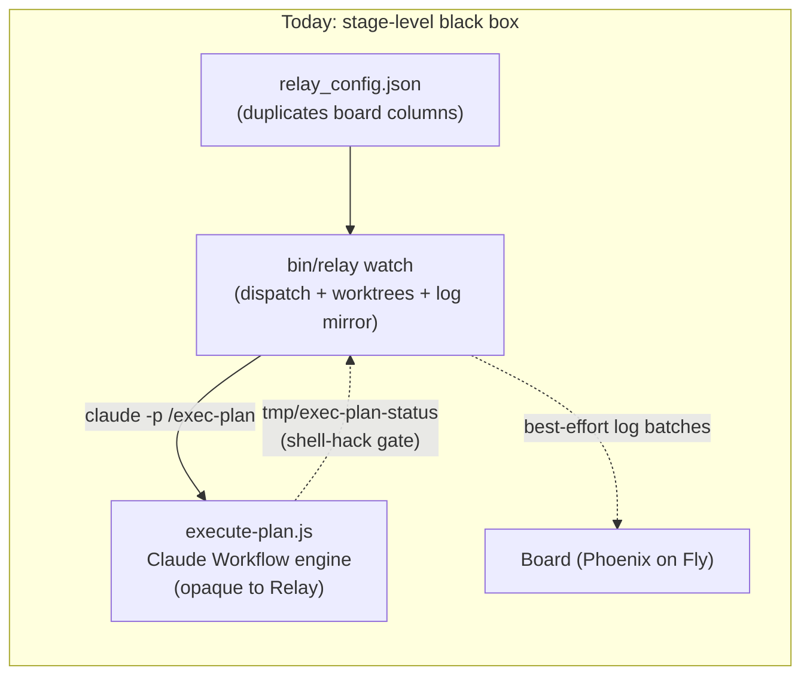
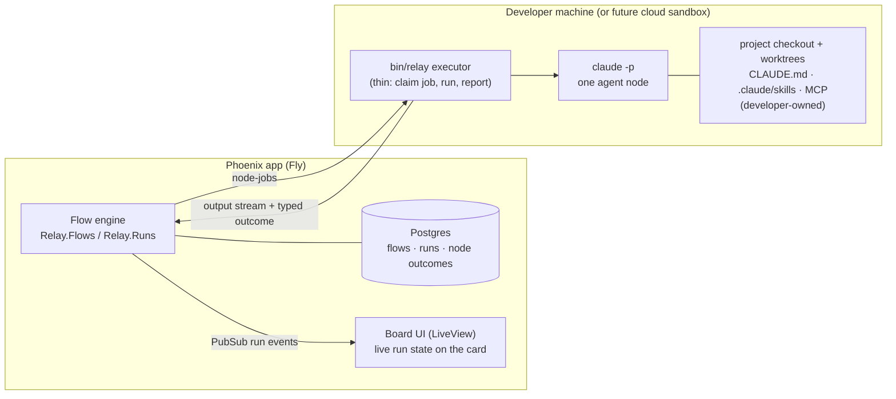
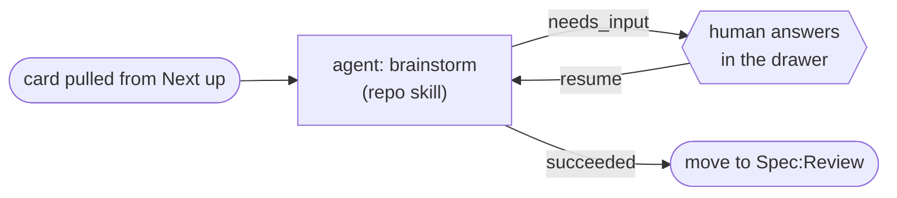

# ADR 0006 — Workflow orchestration: Relay owns the graph, developers own the nodes

**Status:** Proposed (2026-07-16)

## Context

Today the runner (`bin/relay watch`, Python, ~1,000 lines) drives cards through a pipeline
defined in `relay_config.json`, but the heart of the Code stage is a **black box**: one
`claude -p "/exec-plan {ref}"` call that internally runs the Claude Workflow engine
(`execute-plan.js`). Relay sees stage-level granularity only, gates the merge with a
scratch-file hack (`tmp/exec-plan-status`), and inherits harness quirks
(`CLAUDE_CODE_PRINT_BG_WAIT_CEILING_MS`, StructuredOutput retry flakes). Setting up a new
project means copying skills, `execute-plan.js`, prompts, and config — each a drift surface.



[Fabro](https://fabro.sh/) validates the product thesis (a graph of agents, shell steps, and
human gates driving long-horizon coding work, projected onto a kanban board) and offers a
reference design: workflows in Graphviz DOT, four typed node outcomes routing
condition-labeled edges, git-based checkpoint/resume, and — critically — **its own agent
loop** (it calls model APIs directly rather than wrapping Claude Code). Fabro's graph is its
source of truth and its board is a derived view; Relay is inverted — the board *is* the
graph and the humans manipulate it directly.

### Requirements

1. **Visibility.** Per-node progress, verdicts, cost, and logs on the card, live — not a
   best-effort log mirror around an opaque stage.
2. **Shared across projects.** The workflow should ship with Relay. A new project should
   need near-zero setup, and workflow improvements should reach every project at once.
3. **Fewer moving parts.** Gates enforced by the engine ("don't merge unless review
   passed"), not by prompt-pleading plus shell hacks. Typed outcomes, retries, resume.
4. **Developers own their process.** A developer must be able to talk to their agent,
   adjust their skills, and shape how a node does its work — in their repo, with their
   tools — without forking Relay or asking it for permission. They must also be able to
   take the baton and work a card themselves (the claim rule, ADR 0004).
5. **Execution locality.** Agent steps need the checkout, git worktrees, and the `claude`
   CLI — today that means the developer's machine, while the app deploys to Fly. Cloud
   sandboxes are a possible future, not a premise.

Requirements 2 and 4 pull in opposite directions: centralizing the workflow serves 2;
developers owning their skills serves 4. The decision below resolves the tension by
splitting **orchestration** (Relay's) from **node behavior** (the developer's).

## Decision

**Relay owns the workflow graph; each node stays a black box the developer controls.**



1. **Own the flow, not the agent loop.** Relay orchestrates between nodes — sequencing,
   outcome routing, retries, gates, fan-out, logging. Each agent node remains one headless
   `claude -p` invocation; Claude Code keeps owning tools, permissions, and context inside
   a node. (Fabro crossed this line and rebuilt the agent harness; we deliberately do not.)

2. **The engine lives in the Phoenix app.** A new domain context (e.g. `Relay.Flows` /
   `Relay.Runs`, per ADR 0002 boundaries) holds flow definitions, executes runs as
   supervised state machines, persists every node's outcome/cost/duration in Postgres, and
   broadcasts progress on PubSub — so LiveView renders run state natively (requirement 1)
   and interrupted runs resume from durable state (requirement 3). The executor speaks the
   same authenticated REST surface agents already use, extended with node-job endpoints —
   a deeper agent API, not a parallel client, consistent with ADR 0001.

3. **`bin/relay` shrinks to a thin local executor.** It claims node-jobs from the server,
   runs `claude -p <prompt>` or a shell step in the named worktree, streams output up, and
   reports a typed outcome. Dispatch logic (`find_all_ready`, WIP counting, pool budgets)
   and the pipeline definition move server-side — eliminating the duplication where
   `relay_config.json` mirrors board columns. Python remains the right language for what is
   now a small, dumb program (requirement 5). Worktree pools and concurrency are
   **executor-local**: a flow declares only the *isolation requirement* a node needs
   (`shared_clean` read-only vs `exclusive` writable); each executor maps requirements onto
   its own worktrees and advertises its capacity — the server never knows any machine's
   filesystem layout. **Exclusive runs have executor affinity**: every node-job of a run
   goes to the machine holding its worktree; if that machine disappears, the run parks
   until it returns. A cloud-sandbox executor later is a second implementation of the
   same protocol, not a redesign.

4. **Flows are declarative graph data, not DOT and not code.** Typed nodes (`agent`,
   `shell`, `gate`, `parallel`, `human`), a closed outcome set
   (`succeeded / failed / partial / needs_input`), outcome-routed edges, retry counts, and
   hard gates — stored in Relay with a shipped default library (Spec, Plan, Code flows).
   **Stages are places; flows are the AI transitions between them**: an AI-enabled stage
   *has* (at most) one enabled flow working cards through it, and a flow references
   exactly three stages by id (pulls-from / works-in / lands-on). At most one enabled
   flow may pull from a given stage, or two dispatchers race for the same card. The
   board's review gate stays a human action *between* flows; a deterministic check like
   `mix precommit` is a `gate` node *inside* one; needs-input is an outcome that parks
   the run. **Flows are versioned**: every save bumps the version and a run snapshots the
   version it started on, so editing never mutates in-flight work. Flows are *edited on
   the board* (decided 2026-07-16) and can be rendered as a graph — Fabro's best
   visibility idea — without DOT as an authoring format.

   A sketch of a Code flow in this model (edges labeled with the outcome that routes them):

   ```mermaid
   flowchart LR
       start([start]) --> impl["agent: implement task<br/>(runs repo skills)"]
       impl -- succeeded --> review["agent: spec + quality review"]
       review -- failed --> impl
       review -- succeeded --> pre{"gate: mix precommit"}
       pre -- failed --> impl
       pre -- succeeded --> smoke["agent: smoke test"]
       smoke -- needs_input --> human{{"human answers<br/>(implicit pause — card blocked)"}}
       human --> smoke
       smoke -- succeeded --> merge["shell: push · PR · squash-merge"]
       merge -- succeeded --> done([done])
   ```

5. **Developers own node behavior (requirement 4), three ways:**
   - **Agent nodes execute in the project checkout**, so the repo's `CLAUDE.md`,
     `.claude/skills/`, MCP config, and permissions all apply. A developer editing their
     brainstorm skill changes what the Spec node does — no Relay change involved.
   - **Layered flow resolution.** Relay's default flows are defaults, not law: a project
     can override a flow, a node's prompt, or point a node at a repo skill
     (`/brainstorm {ref}`). Zero-setup projects run the stock library; opinionated teams
     override per node. Defaults deliver requirement 2; overrides deliver requirement 4.
   - **The baton still passes.** A human can claim any card and work it interactively with
     their own agent session; the engine treats human-owned cards as off-limits, exactly as
     the runner does today. Claiming a card **mid-run** cancels the active node-job and
     parks the run at its last checkpoint; a review **rejection** re-enters the flow with
     the CHANGES REQUESTED context, the way the runner's resume mode works today.

### Illustrative sketches

Everything in this section is **illustrative, not final** — the commitment is the model
(typed nodes, a closed outcome set, outcome-routed edges), not these exact field names.

**Node types**

| Type | Executes | Outcomes it can emit | Key attributes |
| --- | --- | --- | --- |
| `agent` | one headless `claude -p` in the project checkout (repo skills/CLAUDE.md/MCP apply) | all four | `run` (prompt or `/skill`), `model`, `timeout`, `max_retries`, `foreach` |
| `shell` | a shell command in the job's worktree | `succeeded` / `failed` (exit code) | `run` |
| `gate` | a deterministic check whose failure must reroute or fail the run — "tests are gates, not suggestions" | `succeeded` / `failed` | `run` (predicate command); no silent override |
| `parallel` | fan-out of a sub-flow per item | `succeeded` / `partial` / `failed` | `join`: `wait_all` / `first_success`, `max_parallel` |
| `human` | pauses the run and hands the baton | resumes the flow with the answer | `question` / `questions` (renders the needs-input drawer stepper) |

**Outcomes** (closed set; every edge routes on one)

| Outcome | Emitted when | Engine action | Card effect |
| --- | --- | --- | --- |
| `succeeded` | node completed normally | follow the `succeeded` edge | timeline note |
| `failed` | error, non-zero exit, review refuted | retry up to `max_retries`, then follow `failed` edge — or fail the run if none | card flagged with the node's actual output |
| `partial` | retries exhausted but usable output, node opted in | follow `partial` edge | noted on card |
| `needs_input` | agent asked the human a question | checkpoint + park the run | card → `needs_input`, drawer stepper; the answer re-enters the same node with its agent session resumed (`claude -p --resume`) |

**Default flow library** (what Relay ships; each row replaces a `relay_config.json` entry)

| Flow | Pulls from | Works in | On success → | Nodes |
| --- | --- | --- | --- | --- |
| Spec | Next up | Spec | Spec:Review | `brainstorm` (agent) |
| Plan | Spec:Done | Plan | Plan:Done | `write-plan` (agent) |
| Code | Plan:Done | Code | Review | branch → implement ⇄ review loop → precommit gate → smoke → merge |

**Example flow definition** — the Spec flow, the simplest one and the first to build:

```jsonc
{
  "key": "spec",
  "trigger": { "from": "Next up", "stage": "Spec", "done": "Spec:Review" },
  "isolation": "shared_clean",   // requirement only — worktrees/concurrency are executor-local
  "nodes": {
    "brainstorm": { "type": "agent", "run": "/brainstorm {ref}", "max_retries": 1 }
  },
  "edges": [
    { "from": "start", "to": "brainstorm" },
    { "from": "brainstorm", "to": "done", "on": "succeeded" }
    // needs_input requires no edge: the engine checkpoints, blocks the card,
    // and re-enters the same node when the human answers.
  ]
}
```



**Example flow definition** — the Code flow (abbreviated; matches the diagram above):

```jsonc
{
  "key": "code",
  "trigger": { "from": "Plan:Done", "stage": "Code", "done": "Review" },
  "isolation": "exclusive",
  "nodes": {
    "branch":    { "type": "shell", "run": "git checkout -B {branch} origin/main" },
    "implement": { "type": "agent", "run": "Implement the next unchecked plan task, strict TDD…", "foreach": "plan.tasks" },
    "review":    { "type": "agent", "run": "Review the task against its spec and the repo's standards…" },
    "precommit": { "type": "gate",  "run": "mix precommit" },
    "smoke":     { "type": "agent", "run": "Drive the new behavior end-to-end in the running app…" },
    "merge":     { "type": "shell", "run": "git push -u origin {branch} && gh pr create --fill && gh pr merge --squash" }
  },
  "edges": [
    { "from": "branch",    "to": "implement", "on": "succeeded" },
    { "from": "implement", "to": "review",    "on": "succeeded" },
    { "from": "review",    "to": "implement", "on": "failed", "max_loops": 3 },
    { "from": "review",    "to": "precommit", "on": "succeeded" },
    { "from": "precommit", "to": "implement", "on": "failed" },
    { "from": "precommit", "to": "smoke",     "on": "succeeded" },
    { "from": "smoke",     "to": "merge",     "on": "succeeded" }
  ]
}
```

**Example per-project override** — how a developer owns their process without forking
Relay. Decided 2026-07-16: flows are **edited on the board** (versioned rows, full
editor UI). Still open: whether a repo file like the sketch below *additionally* layers
on top, for customization that versions with the code:

```jsonc
// .relay/flows.json — this repo's adjustments to the shipped library
{
  "code": {
    "nodes": {
      "implement": { "run": "/exec-task {ref}" },          // use this repo's own skill
      "smoke":     { "run": "/verify {ref}", "model": "sonnet" }
    }
  }
}
```

### Setup & maintenance inventory — everything a board flow is made of

The complete parts list for standing up and maintaining the board flow. In every table:
**Today** = the system running right now; **Tomorrow** = after the W-cards land. The authored
default flow definitions live in [`docs/designs/flows/`](../designs/flows/README.md), and
the **literal contents of every file and database row — plus the domain-object ER diagram
and a mid-flight snapshot — are in
[`docs/designs/flows/worked-example.md`](../designs/flows/worked-example.md)**.

**1. Files in the project repo** (downloaded/scaffolded once, hand-customizable forever —
this is the developer-owned layer):

| Artifact | Today | Tomorrow | Who customizes it |
| --- | --- | --- | --- |
| `bin/relay` | 995-line CLI + watcher, copied by hand | same file, smaller: CLI + executor (`relay execute`); `relay init` scaffolds a new project (lands with RLY-135) | nobody — it's generic |
| `relay_config.json` | 42 lines: pipeline (stages/prompts) + pools + poll interval | **gone** — pipeline moves into server-side flows; executor keeps a small local config (worktree namespace, capacity per isolation class) | developer (capacity only) |
| `.claude/skills/` (brainstorm, systematic-debugging, TDD, verification…) | node behavior + process discipline | **unchanged** — agent nodes run in the checkout, so these keep working | developer, freely |
| `.claude/commands/` (write-plan, exec-plan, finish, worktree) | stage entry points the runner prompts into | write-plan stays (Plan node calls it); **exec-plan retires with RLY-139**; finish/worktree stay (human use) | developer |
| `.claude/workflows/execute-plan.js` | 485 lines — the entire Code orchestration | **gone** — became [`code.jsonc`](../designs/flows/code.jsonc)'s nodes + edges | — |
| `.claude/agents/*.md` (8: plan-implementer, spec/quality/final reviewers, final-fixer, smoke, acceptance, rebaser) | subagent types execute-plan.js spawns | optional — their prompts become flow-node `run` prompts; keep the files if a repo wants richer per-node system prompts and point node overrides at them | developer |
| `.relay/flows.json` | n/a | per-project flow overrides (RLY-140) | developer |
| `CLAUDE.md` / `AGENTS.md` | project instructions every agent reads | unchanged | developer |

**2. Domain objects on the server — all Tomorrow** (new contexts `Relay.Flows` /
`Relay.Runs`; nothing corresponds today — this is where the weight moves). Relationships
and literal example rows: see the
[worked example](../designs/flows/worked-example.md)'s ER diagram and mid-flight snapshot.

| Object | Key fields | Values for today's flow |
| --- | --- | --- |
| `Flow` | `key`, `board_id`, `trigger` (from/stage/done as stage ids), `isolation`, `enabled`, `origin` (default \| override), nodes, edges | 3 rows: `spec` (Next up → Spec → Spec:Review, `shared_clean`), `plan` (Spec:Done → Plan → Plan:Done, `shared_clean`), `code` (Plan:Done → Code → Review, `exclusive`); all `enabled: false` until their cutover |
| `Flow.Node` (embedded) | `id`, `type` (agent\|shell\|gate\|parallel\|human), `run`, `model`, `effort`, `timeout`, `max_retries` | per [`docs/designs/flows/`](../designs/flows/README.md) — e.g. code's `implement` = agent/sonnet/high, `precommit` = gate/`mix precommit` |
| `Flow.Edge` (embedded) | `from`, `to`, `on` (outcome), `max_loops` | e.g. `quality_review --failed→ implement, max_loops 3` |
| `Run` | `card_id`, flow key + version snapshot, `status` (running \| parked \| done \| failed \| cancelled), `current_node`, timestamps | one per card per flow traversal; `parked` = today's `needs_input` wait |
| `NodeExecution` | `run_id`, `node_id`, `attempt`, `outcome`, `detail`, `git_sha`, `session_id`, duration, cost | the per-node history RLY-137 renders; `session_id` powers `--resume` re-entry |
| `Executor` | `name`/host, `last_heartbeat`, capacity per isolation class, status | e.g. `jeremy-mbp: {shared_clean: 3, exclusive: 1}` — replaces the pools block of `relay_config.json` |
| `NodeJob` | `run_id`, `node_id`, state (queued \| claimed \| running \| done \| revoked), `executor_id`, payload (rendered `run`, isolation, vars) | the unit the executor claims; `revoked` = human took the baton |

**3. Everything else** (one-time or per-machine setup):

| Item | Today | Tomorrow |
| --- | --- | --- |
| Board stages (Next up, Spec ± Review/Done, Plan ± Done, Code, Review, Done; `ai_enabled`, WIP limits, reject-to) | configured in board settings | unchanged — triggers validate against them |
| Board API key + `RELAY_URL` env | required for CLI + runner | unchanged (executor uses the same credential) |
| Fly deploy | app has no workflow knowledge | migrations + default flows seeded per board + per-flow enable flags |
| Runner/executor process on a dev machine | `bin/relay watch` in a terminal | `relay execute` in a terminal (or launchd); registers itself, advertises capacity |
| Worktrees | `.claude/worktrees/{clean,work-N}` per config | executor-owned namespace (`exec-*`), auto-created |
| `claude` CLI, `gh` auth, git push rights | required on the runner machine | unchanged, required on every executor machine |
| `CLAUDE_CODE_PRINT_BG_WAIT_CEILING_MS` env hack | required for /exec-plan | **gone** |

Maintenance story in one line: **developers edit files in their repo (table 1); Relay
maintains the objects (table 2); machines need table 3 once.**

### Convergences and divergences with Fabro (read from its source, 2026-07-16)

We read the Fabro codebase (`../fabro`), not just its docs. Notable correction to the
marketing picture: Fabro's shipped scheduler dispatches runs to **local subprocess
workers on the same machine as the server** — it does not solve the distributed
brain/hands problem we are taking on. What we adopt and where we deliberately diverge:

**Adopt (cheap, addresses real agent-loop pathologies):**

- **Session resume on needs-input re-entry.** Fabro's human-question tool blocks
  *inside* the agent session, so the agent continues with full working context. We can't
  hold a process open across days, but we get the same effect: the executor records the
  `claude -p` session id in the node-job, and re-entry after an answer resumes that
  session (`claude -p --resume`) instead of starting cold. (Cards 04/05.)
- **Failure-signature circuit breaker + per-node visit caps.** Fabro tracks failure
  signatures and trips a breaker when the same failure repeats (default 3), plus caps
  visits per node — precisely the "agent loops on the same error forever" pathology.
  `max_retries`/`max_loops` alone don't catch a loop that fails *differently* each lap or
  the same way across different edges. (Card 02.)
- **A code-state anchor per node.** Fabro commits the worktree after every node (run
  branch) with metadata linked (meta branch). We keep run state in Postgres, but each
  node outcome records the worktree's git SHA so resume/debugging can correlate engine
  state with code state. (Cards 02/04.)

**Diverge, deliberately:**

- **Blocking vs parking on human input.** Fabro's engine thread awaits the interviewer
  in-process; a blocked run holds a worker. Our runs must survive laptop sleep and
  days-long answers, so `needs_input` checkpoints and *parks* the run — nothing is held
  open. Session resume (above) recovers most of what parking loses.
- **The card is the context bus.** Fabro passes prior-node output via an ephemeral
  context KV store and generated "preamble" summaries sized by a fidelity knob. Our
  equivalent is the card itself: spec, plan, timeline, and node outputs land on the card,
  and the next node's prompt starts from the card. Less tunable — but durable,
  human-readable, and identical to what the human sees (requirement 4: the developer can
  read and edit the agent's working context directly). Within a run there are exactly two
  more channels: the **worktree** (all of a run's nodes share one; the diff is the
  reviewers' context) and **edge-borne output** — a node's outcome `detail` is its return
  value, injectable into the next node's prompt as `{prior.detail}` (or
  `{nodes.<id>.detail}`), which is how a refuted review's findings reach the implement
  re-entry. Sessions stay fresh per node *on purpose* (a reviewer must judge the diff,
  not inherit the implementer's rationalizations); `--resume` is used only when a node
  re-enters itself after needs-input.
- **Distributed by design.** Fabro is server + subprocess workers on one box; our engine
  (Fly) and executors (dev machines) are split by necessity, which is why the node-job
  protocol, heartbeats, and job reclaim exist at all. Accepted cost, already carded.
- **No `skipped` outcome yet — but parallel's design is settled (Fabro's, adopted).**
  When `parallel` arrives it works by **fork-and-join on git**: commit the run worktree
  (`parallel_base`), fork N *ephemeral* worktrees at that SHA (scratch, not pool slots;
  bounded by `max_parallel` and a per-machine scratch budget; all on the run's executor
  per affinity), each child commits, then join by policy — **map** (disjoint work:
  merge all; conflicts route to a rebase agent) or **ensemble** (N attempts at one
  thing: pick a winner, fast-forward to its SHA, losers recorded as `skipped` with
  their SHAs inspectable). Ensemble (a review judge-panel) is the expected first
  customer, in or after RLY-139. Until then: YAGNI — cold build caches make ephemeral
  forks expensive on a laptop, so this waits for proven value.

### Design pass (2026-07-17) — what the artboards decided

Hi-fi artboards for this work now live in `docs/designs/` and are the UI source of truth:
**Relay Flows** (RLY-142), **Relay Flow Editor** (RLY-143), **Relay Card Run Panel** +
**Relay Board Run Affordances** (RLY-137), **Relay Runners** (RLY-141) — plus three companion
explorations: **Relay Value Stream Map** (per-stage working-vs-waiting analytics, RLY-146),
**Relay Rework Loop** (the rework model, RLY-147/149), **Relay Card Activity** (committed
activity/health spec, RLY-148). Decisions and corrections out of the pass:

- **Placement**: Runners lives under board settings › *Engine*, not the board header.
  The run panel is a drawer tab (*Detail | Run | Activity*).
- **New card state**: *queued* — flow enabled, waiting for executor capacity.
- **Session-resume discrepancy**: the run panel shows the implement session resumed on a
  review-failed loop; the ADR rule stands — fresh session per attempt, `--resume` only
  for needs-input re-entry (a refuted implementation shouldn't re-inherit its own
  rationalizations). Mockup copy to fix, not the rule.
- **Requeue nuance** (Runners artboard copy to sharpen): a stale executor's
  `shared_clean` jobs requeue elsewhere; `exclusive` runs park — affinity is absolute.
- **Mockup stage names are exemplary, not canonical** ("In progress", "Deploy",
  "Complete"). On a real board, triggers pull from *Done* substages — a flow pulling
  from a *Review* substage would race the approve gate.
- **Rework model** (from the Rework Loop exploration): *re-entering the pipeline is a
  human gesture, never an inference*. The engine never interprets backward movement; a
  **Reopen** action (the default) or a **sub-card** (when the fix warrants its own
  tracking) simply places a card where an enabled flow's trigger sees it, and the
  scheduler does what it always does. Review stages route rejects declaratively:
  substage reviews reject to their parent; top-level review stages reject to a
  configured stage. No new engine knowledge in any of this — which is the point.

## Consequences

**Positive**

- Run state is data in Relay's own database: live per-node visibility, cost/duration per
  node, resume after a crash, and gates enforced by the engine rather than by prompts.
- New projects get the full pipeline by registering a repo and running the executor;
  workflow fixes ship to all projects at once.
- The local footprint gets *smaller* than today's runner — less to set up and less to go
  wrong on each machine.
- The workflow engine becomes part of the product rather than a script beside it — every
  improvement compounds into Relay itself, and the board/engine unification removes the
  config-vs-board drift surface.

**Negative / accepted trade-offs**

- We re-implement exec-plan's *orchestration* (fan-out, review loops, resume) as flow
  definitions plus engine features, and give up the Claude Workflow engine's internal
  journal/caching/StructuredOutput machinery. Per-node structured output becomes our own
  outcome contract. This is the bulk of the build cost (weeks, not days).
- A server↔executor protocol (job dispatch, log streaming, heartbeat) must be designed and
  maintained — though `bin/relay` already has primitive versions of all three, so this is
  consolidation, not greenfield.
- Declarative flows are less expressive than `execute-plan.js`. Accepted: the lesson of
  execute-plan is that flows need loops, fan-out, and outcome routing — not
  Turing-completeness. `shell` nodes are the escape hatch.
- While agents run on developer machines, a run pauses when that machine sleeps. Accepted
  today; a cloud executor is the documented remedy if it starts to hurt.

**Sequencing (to de-risk)**

1. Engine + executor protocol with the **Spec** flow only (a single agent node), Code
   staying a black box.
2. Move **Plan**.
3. Decompose **Code** node-by-node last — it holds all the complexity, and the old path
   keeps working until the new one is proven.

## Alternatives considered

- **Keep the black box, fix setup with a Claude Code plugin.** Shipping the skills as a
  plugin (or user-level skills) solves cross-project sharing with near-zero work — but does
  nothing for visibility, typed gates, or the harness quirks. Worth doing as an interim
  measure; insufficient as the destination.
- **Grow `bin/relay` (Python) into the engine.** Cheapest next step and it validates the
  node contract, but it builds the engine outside the product — invisible to the board
  except through log forwarding, per-machine instead of shared — and would be rewritten in
  Elixir the moment run state should render on cards. Building the engine twice is the real
  cost; rejected.
- **Own the agent loop too (full Fabro).** Maximum control, and independence from Claude
  Code releases — but it means maintaining our own agent harness (tools, permissions,
  context management) and abandoning the skills ecosystem developers already own, directly
  violating requirement 4. Rejected.
- **DOT as the flow language.** Diffable and renderable, but conditions live in string
  attributes, it needs a parser, and authoring in it is worse than data + a UI. We keep the
  render-the-graph idea and drop the syntax. Rejected as an authoring format.
- **Flows as per-project code** (today's `execute-plan.js` pattern). Maximum expressiveness,
  but it *is* the per-project setup and drift burden requirement 2 eliminates. Rejected as
  the default; repo skills remain the sanctioned way to customize node behavior.
- **Rust/Go single-binary engine.** Fabro's zero-dependency distribution matters when
  shipping to strangers; Relay's executor ships to its own users and stays trivial in
  Python. Rejected for now.
