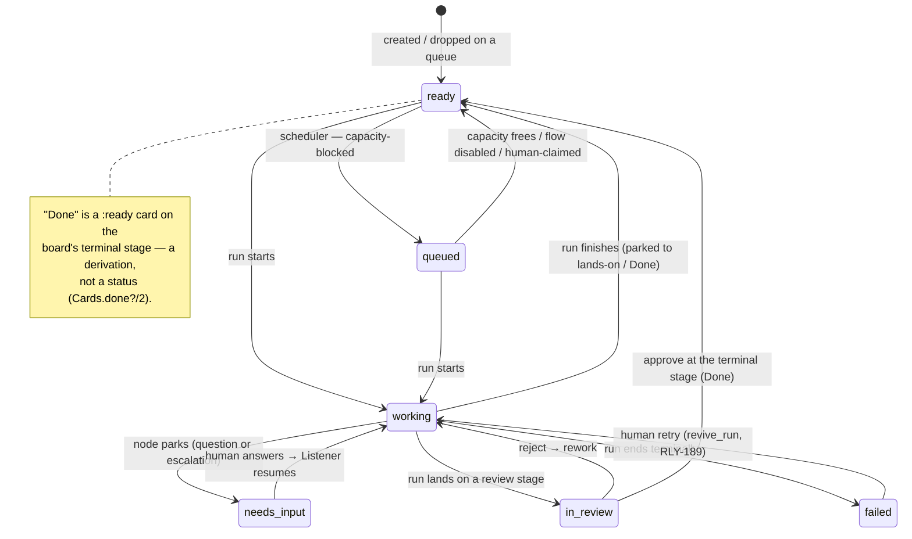
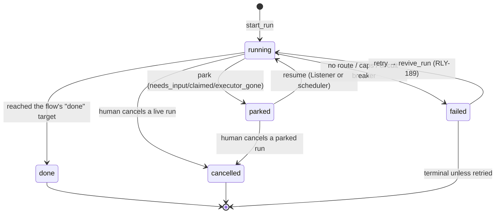
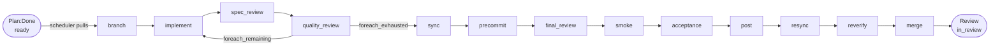
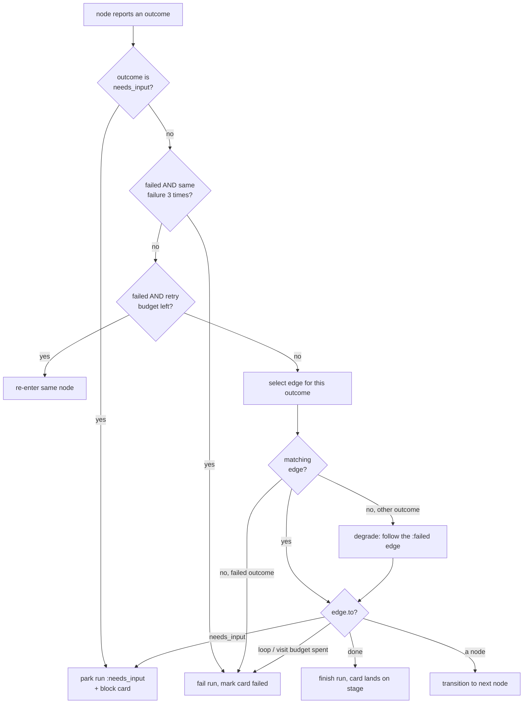

# ADR 0007 — Card lifecycle: the happy path and every failure mode

## Status
Proposed (2026-07-22)

## Context

A card moving through Relay is driven by **four coupled state machines** and a scheduler that
places work on executors. When any one of them fails, the card can end up blocked, failed,
parked, or — worse — silently stuck in a state no single document explains. Almost every engine
incident we've hit reduces to *"two of the machines disagreed and nobody had written down how the
disagreement is supposed to resolve."* Recent live examples, all from the same week:

- a plan whose task headings used an em-dash parsed to zero tasks and parked the card
  `needs_input` with a machine string as the "question" (RLY-206 / RLY-209);
- a restart bounced straight back to `needs_input` because no exclusive slot was free — a
  capacity condition wearing a human-question costume (RLY-232);
- an exclusive run was terminally `failed` by the circuit breaker after a **worktree collision**
  repeated 8× — an infrastructure condition, not a code bug (RLY-231);
- a `smoke` node **passed**, but the success outcome was lost when the executor restarted
  mid-report, leaving the run wedged `:running` forever (RLY-230);
- runs outlived their cards — zombie `:running` rows on Done cards, and a parked run holding an
  exclusive slot it wasn't using (RLY-157 / RLY-233).

This ADR writes down, in one place: the machines and their vocabularies, the **happy path**, and
**how each known failure mode is handled** — with `file:line` anchors so it can be kept honest.
It builds on [ADR 0003](0003-card-state-stage-type-validity.md) (card state × stage type),
[ADR 0004](0004-card-ownership-and-the-claim-rule.md) (ownership / the baton), and
[ADR 0006](0006-workflow-orchestration.md) (Relay owns the graph). The authoritative per-state
tables live in [`docs/architecture/state.md`](../architecture/state.md); this ADR is the *why*
and the failure-handling map that sits above them.

## Decision

Adopt this document as the reference map for a card's life. It is **descriptive of current
behavior** (with source anchors) plus a **Known gaps** section we commit to tracking and closing.
Where behavior and this map diverge, the code is the truth and this ADR is a bug — fix one or the
other.

### The four coupled machines (+ the baton)

| Machine | Values | Owner |
| --- | --- | --- |
| **Card status** | `ready` · `queued` · `working` · `needs_input` · `in_review` · `failed` | `Relay.Cards` (`lib/schemas/card.ex:41`) |
| **Run status** | `running` · `parked` · `done` · `failed` · `cancelled` | `Relay.Runs.Transitions` (`lib/relay/runs/transitions.ex`) |
| **Node-job state** | `queued` · `claimed` · `running` · `done` · `revoked` | `Relay.Runs.Dispatcher` |
| **Node outcome** | `succeeded` · `failed` · `partial` · `needs_input` | reported by the executor |

Two derived facts sit on top: **the baton** — `active_owner_type/1` is `:human`, `:ai`, or `nil`,
derived from owners (`lib/relay/cards.ex:627`), and ADR 0004 makes it exclusive and permanent
(provenance, never handed back); and **Done** — not a status but a *derivation*: a `:ready` card on
the board's terminal stage reads as Done (`Cards.done?/2`, `lib/relay/cards.ex:704`). A `:ready`
card in a mid-board `:done` sub-lane (Spec:Done, Plan:Done) is merely *parked waiting to be
pulled* — **this distinction is load-bearing and is where Gap 1 lives.**

Two nuances worth pinning down now, because they cause the most confusion:

- **`queued` ≠ WIP-blocked.** `queued` means *capacity*-blocked: a flow would pull the card but no
  executor slot is free. A WIP-blocked card stays `:ready`. Only the scheduler sets `queued`, and
  only in stages a flow pulls from (`Relay.Runs.Policy`, ADR 0003 RLY-133 update).
- **`failed` is a real card status**, set only by `Cards.mark_failed/3` (never by a human), and it
  counts toward "needs you" even though it stamps no `blocked_since` and carries no question
  (`lib/relay/cards.ex:737`).

#### Card status

#### Run status — the 7 legal edges

Every run-status write goes through one guarded conditional `UPDATE … WHERE id = ? AND status IN
from_states` (`Transitions.transition/4`, `lib/relay/runs/transitions.ex:61`); a 0-row update logs
a warning and returns `{:error, :not_in_expected_state}` rather than silently clobbering. The legal
graph is *data* (`@transitions`, `transitions.ex:26`) and is mirrored into `state.md` by
`mix relay.gen_state` (drift fails `mix precommit`).

`parked_reason` has exactly **three** values (`lib/schemas/run.ex:28`): `needs_input` (waiting on a
human), `claimed` (waiting on the executor that claimed the job to report an outcome), and
`executor_gone` (the executor stopped heartbeating; the reaper parked it for re-dispatch). One
authority owns each reason (RLY-200): the **Listener** resumes `needs_input`/`claimed`; the
**scheduler** resumes `executor_gone` only.

### The happy path

A card is *pulled* by the scheduler when it's `:ready`/`:queued`, agent-owned (baton ≠ human), has
no active run, and sits in an enabled flow's `pulls_from` stage with WIP room and a free isolation
slot (`fresh_eligible?`, `lib/relay/runs/scheduler.ex:152`; `Policy.pullable?/1`,
`lib/relay/runs/policy.ex:24`). A run is inserted `:running`, the card moves to the flow's
`works_in` stage and goes `:working`, and the engine walks nodes until it reaches `done` (card
lands on the flow's `lands_on` stage) or a review gate (card `:in_review`, waiting for a human).

The three flows (`lib/relay/flows/default_library.ex`), each a mirror of
`docs/designs/flows/*.jsonc`:

- **spec** (`shared_clean`): `Next up → brainstorm → Spec:Review`.
- **plan** (`shared_clean`): `Spec:Done → write_plan → Plan:Done`.
- **code** (`exclusive`, 18 nodes): `Plan:Done → … → Review`.

The code flow's happy path, with the `foreach` loop over the plan's tasks:

`implement → spec_review → quality_review` repeats once per plan task; `quality_review` checks off
the just-reviewed task, and the `:foreach_exhausted` guard (`remaining == 0`) advances to `sync`
(`lib/relay/runs/run_server.ex:250`, `engine.ex:177`). Tasks come from
`PlanTasks.parse/1` — `## Task N: <name>` headings, now tolerant of `:`, `—`, `–`, or `-`
separators (`lib/relay/runs/plan_tasks.ex:23`, per the fix merged this week).

### How an outcome routes — the engine decision order

Every node outcome runs through `Engine.decide/4` (`lib/relay/runs/engine.ex:72`), a pure function.
**Order matters** — the checks are a `cond`, and earlier rules win:

Caps and their defaults (all `+ run.retries` as a bonus — one human retry buys one extra of
*everything*, `engine.ex:15`): circuit-breaker threshold **3** (`engine.ex:28`), `max_retries`
per node (0 unless set), `max_loops` per edge (unlimited unless set), visit cap **20**
(`engine.ex:29`). The breaker's signature is a SHA-1 of the normalized failure detail
(`engine.ex:104`) and counts across the **full** history, so it catches same-error loops even when
budgets remain.

### Failure modes and how each is handled

Grouped by which machine detects the failure. "Ends as" is the resting state absent human action.

#### A. Node / engine failures

| # | Failure | Trigger | Handling | Ends as |
| --- | --- | --- | --- | --- |
| A1 | **Genuine human question** | node reports `needs_input` | park run `:needs_input`, block card; Listener resumes on answer with the stored `claude --resume` session (`listener.ex:108`) | `parked/needs_input` |
| A2 | **Recoverable node failure** | node reports `failed`, retry budget left | re-enter the same node (`{:retry}`, `engine.ex:85`) | continues |
| A3 | **Routed failure → fixer** | `failed` with a `:failed` edge to a fix node | follow it (`precommit→final_fix`, `smoke→smoke_fix`, `sync→sync_fix`, …) | continues |
| A4 | **Escalated failure** | `failed` with a `:failed → needs_input` edge (RLY-194: `implement`, `*_fix`, `post`, `branch`) | park `:needs_input` for a human | `parked/needs_input` |
| A5 | **No route** | `failed` with no `:failed` edge, or budgets spent | `{:fail}` → run `failed` → `mark_failed` → card `failed` | `failed` |
| A6 | **Silent no-op** | `expects_commits` node reports `succeeded` but HEAD didn't move | rewritten to `failed` before finalize (`override_no_op_success/4`, `run_server.ex:337`) → routes as A2–A5 | as A2–A5 |
| A7 | **Same error looping** | 3 identical `failure_signature`s | circuit breaker `{:fail}` even with budget left (`engine.ex:82`) | `failed` |
| A8 | **Runaway** | `max_loops` on an edge, or 20 node visits, exceeded | `{:fail}` | `failed` |
| A9 | **Unrouted non-failed outcome** | outcome (e.g. `partial`) with no matching edge | `degrade_to_failed` — follow the node's `:failed` edge, spending *its* budget (`engine.ex:145`) | as A3–A5 |

#### B. Plan / foreach

| # | Failure | Trigger | Handling | Ends as |
| --- | --- | --- | --- | --- |
| B1 | **Empty plan** | flow has a `foreach` but `PlanTasks.parse` yields `[]` | **no run created**; `block_on_unusable_plan` calls `request_input` explaining the missing `## Task N:` headings (`runs.ex:653`) — prevents merging an empty branch as "done" | card `needs_input`, no run |

#### C. Scheduling & capacity (diagnostic — the card waits, no run fails)

`capacity_diagnosis/1` (`scheduler.ex:437`) classifies *why* a pull can't happen; these are
**verdicts**, not run states — the card sits `:ready`/`:queued` and is explained in the UI.

| # | Verdict | Condition |
| --- | --- | --- |
| C1 | `awaiting_capacity` | ≥1 live current executor, simply no free slot → card marked `:queued` |
| C2 | WIP-blocked | works-in stage at its `wip_limit` → flow halts, card stays `:ready` (does **not** queue) |
| C3 | `no_executor` | executor roster empty |
| C4 | `executor_gone` | roster non-empty but every executor's freshness is `:gone` |
| C5 | `executor_outdated` | every live executor is below `min_executor_version` (21) → claims get 409 `executor_outdated` (`node_job_controller.ex:37`) |

#### D. Executor lifecycle

| # | Failure | Trigger | Handling | Ends as |
| --- | --- | --- | --- | --- |
| D1 | **Executor died** | `last_heartbeat` older than `max(60s, 2×interval)` → `:gone` (`runs.ex:1172`) | reaper (30s) requeues `shared_clean` jobs to `:queued`; parks `exclusive` runs `:executor_gone` (keeps the pin) | `queued` / `parked/executor_gone` |
| D2 | **Executor returns** | scheduler sees capacity | `Policy.resumable?/2` resumes `executor_gone` parks onto the pinned executor (`scheduler.ex:85`) | `running` |
| D3 | **Human take-over mid-run** | owner becomes `:human` | Listener revokes the job and parks `:claimed`; resumes fresh if handed back to AI (`listener.ex:100`) | `parked/claimed` |
| D4 | **Outdated executor** | version < 21 | 409 on claim; heartbeat still 200 but returns `required_version` | card waits (C5) |
| D5 | **Two executors, one host** | second `relay execute` starts | singleton flock refuses it with the holder's pid (`bin/relay:1919`) | second process exits |

#### E. Worktree (exclusive runs)

| # | Failure | Trigger | Handling | Ends as |
| --- | --- | --- | --- | --- |
| E1 | **Branch mismatch** | exclusive worktree's HEAD ≠ the run's branch | executor **refuses to run** (would ship a subset / wrong branch, RLY-166); node fails (`bin/relay:1687`) → A2–A7 | `failed` after breaker |
| E2 | **Worktree contended** | a card's worktree is bound to another live run | `assign` refuses to steal it (`bin/relay:1111`) | job can't start |
| E3 | **Failed-run worktree retained** | exclusive run fails | worktree kept for retry (re-baselined on revive); evicted oldest-first past `max_retained_failed` (3) (`bin/relay:1144`) | retained |

Per-card worktrees (`<ns>-<ref>`) replaced the old reused `<ns>-work-N` slot pool (RLY-231);
`min_executor_version` was raised to 21 to enforce it.

#### F. Human review gate

| # | Path | Handling |
| --- | --- | --- |
| F1 | **Approve** | only on a `:review` stage; moves to the **next stage or substage** — the parent's Done sub-lane if one exists, else the next main stage; completes in place at the terminal stage (`Cards.approve/2`, `lib/relay/cards.ex:1234`) |
| F2 | **Reject** | requires a note; destination is *derived* (sub-lane → its parent; top-level → configured `reject_to_stage_id` or previous main stage); card forced `:ready` for rework, rejection embed set; Listener re-enters the flow with `changes_requested` context (`cards.ex:1252`, `listener.ex:141`) |

### Where the machines meet

A `needs_input` outcome moves **two** machines in one step: the run parks and the card blocks, with
self-healing reconciliation if they drift (`state.md:140`). A run reaching `failed` marks the card
`failed` via `mark_failed/3`. A retry (`revive_run`, RLY-189) revives the **same** run row
(`failed`/`parked → running`), never a new one, and raises every engine cap by one — buying exactly
one more move, not a reset (`runs.ex:1886`). `retry_run` is deliberately narrow: it accepts a clean
`:failed` run or a *died-agent* `needs_input` park (latest node outcome was `failed` — the RLY-179
"masquerade"), and **refuses** a genuine question, an `executor_gone` park, or a `:running` run
(`restartable?/1`, `runs.ex:1797`).

## Consequences

- **One map.** Reviewers can check a change against the invariants here instead of re-deriving them;
  "which of the four machines does this touch, and how does it fail?" becomes answerable.
- **It must be kept in sync.** `state.md` is already gated by `mix relay.gen_state`; this ADR is
  prose and can rot. Treat a contradiction between it and the code as a bug in whichever is wrong,
  and supersede rather than silently drift (ADR discipline).
- **The gaps below are now explicit debt**, not tribal knowledge rediscovered per incident.

## Known gaps — what we might still be missing or have wrong

These are hypotheses, ordered by how much they've already bitten us. Several are the *same* root
cause wearing different costumes: **the run lifecycle and the card's stage transitions are not
transactionally coupled.**

1. **Dispatch is non-atomic — the "active run in a `:done` stage" window.** `start_run/3` inserts
   the Run row `:running` while the card is *still* at its `pulls_from` stage, then moves it to
   `works_in`. The code/plan flows pull from Plan:Done / Spec:Done, which are `type: :done`. So there
   is a real, observable window where *"an active run exists AND the card is in a done-type stage"*
   is true although nothing finished. This is exactly what breaks RLY-233's terminal-close rule
   (it self-cancels fresh runs) and it falsifies the tempting invariant "card in a done stage ⇒
   done." **Fix: make dispatch atomic** (move the card *then* insert the run in one transaction),
   not a grace-window band-aid — this is the answer to the RLY-233 question currently open.

2. **Outcome delivery is neither durable nor idempotent.** When an agent finishes a node it POSTs
   the outcome via `bin/relay outcome`. If that report is lost — executor restarted mid-report
   (seen live: RLY-230's `smoke` passed, executor went 19→24, outcome vanished) or a network blip —
   the node execution keeps `outcome=nil` and the run stays `:running` **forever**. Nothing reclaims
   it: the reaper only acts on a *gone* executor, but here the executor is *fresh*; it's the single
   job's outcome that disappeared. Needed: (a) outcome reporting idempotent by execution id, so a
   re-report after restart is accepted; (b) a reaper for "job `claimed`, outcome overdue, executor
   fresh" that re-dispatches or parks; (c) operator tooling to re-accept a known-good outcome
   (`retry_run` refuses a `:running` run — see Gap 7).

3. **`needs_input` is overloaded across three unrelated meanings** — a genuine human question, an
   engine escalation after a node `failed` (A4), and a *system precondition failure* (empty plan B1;
   and RLY-232, where a capacity shortage bounces to `needs_input`). Retry/resume then has to *guess*
   which it is by sniffing the latest node outcome (`restartable?`, the RLY-179 masquerade), and the
   UI shows raw executor strings as "questions." Consider splitting the concept: reserve
   `needs_input` for real questions and add a distinct blocked reason for system failures, so the
   Listener, the UI, and retry stop disambiguating by heuristic. **RLY-232 is the concrete first
   instance to fix.**

4. **Server capacity accounting vs executor worktree-holding can diverge.** The scheduler debits a
   slot only for `:running` runs (`reserve_active_runs`), but the executor *retains* an exclusive
   worktree for a failed/parked exclusive run. So the server can think an exclusive slot is free
   while the executor still holds the worktree — the source of the "blackrock over-committed"
   confusion this week. Decide and document the single truth: does a parked/failed exclusive run
   reserve its slot, and make both sides agree.

5. **The circuit breaker counts environmental failures as code failures.** It trips on 3 identical
   signatures regardless of cause, so a worktree collision (E1) or a capacity refusal repeated 3×
   terminally `fail`s the run — conditions a retry-after-they-clear would fix, not code bugs. RLY-231
   died exactly this way. Consider excluding infra/precondition signatures (branch-mismatch,
   executor-unavailable, capacity) from the breaker, or giving them a park-and-wait path instead of
   counting them toward terminal failure.

6. **Runs leak past card completion.** A card reaching Done doesn't terminal-close its active run —
   we saw zombie `:running` rows on Done cards and a parked run holding an exclusive slot (RLY-157).
   RLY-233 is the fix, but it's blocked on Gap 1's race, which is the tell that the leak and the race
   are one problem: lands-on/Done transitions and run termination aren't transactionally coupled.

7. **Retry only works on `:failed`.** A run stranded `:running` (Gap 2), or a card a human wants to
   force-rerun, has no clean path except `cancel_run` + re-pull — which discards every node already
   passed. Consider a status-independent "resume from the last good node" operator action.

8. **Executor restart is a lossy event.** Restart revokes in-flight jobs and re-claims them; anything
   mid-report is lost (Gap 2), and re-claimed jobs can sit `claimed` without being re-run (seen live:
   RLY-230's re-claimed job never executed). A graceful drain (finish or checkpoint in-flight jobs
   before exit) plus idempotent re-report would make restarts safe — and bumping `EXECUTOR_VERSION`
   mid-flight (19→24) is precisely when this bites.

## Alternatives considered

- **Leave the vocabulary in `state.md` and skip an ADR.** Rejected: `state.md` documents *what each
  state is*, not *how failures are handled* or *where the model is wrong*. The failure map and the
  gap list have no home otherwise, and they're what reviews actually need.
- **Encode every failure mode as a formal transition table and generate it.** Attractive, and partly
  done for run status (`Transitions` → `gen_state`). But the cross-machine failures (Gaps 1, 2, 6)
  are *interactions*, not single-machine transitions — a table per machine can't express "run + card
  disagree during dispatch." Prose + the gap list is the right altitude until those are closed.
