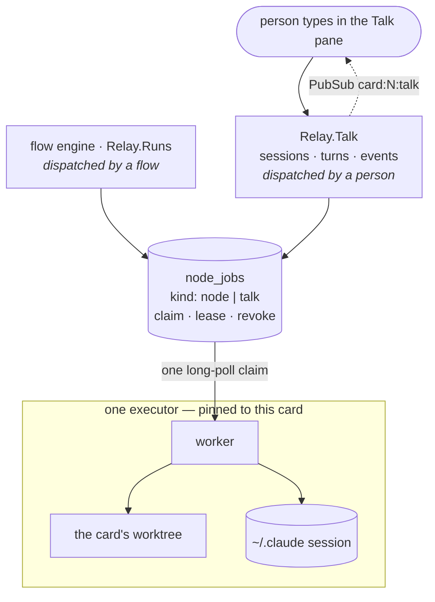
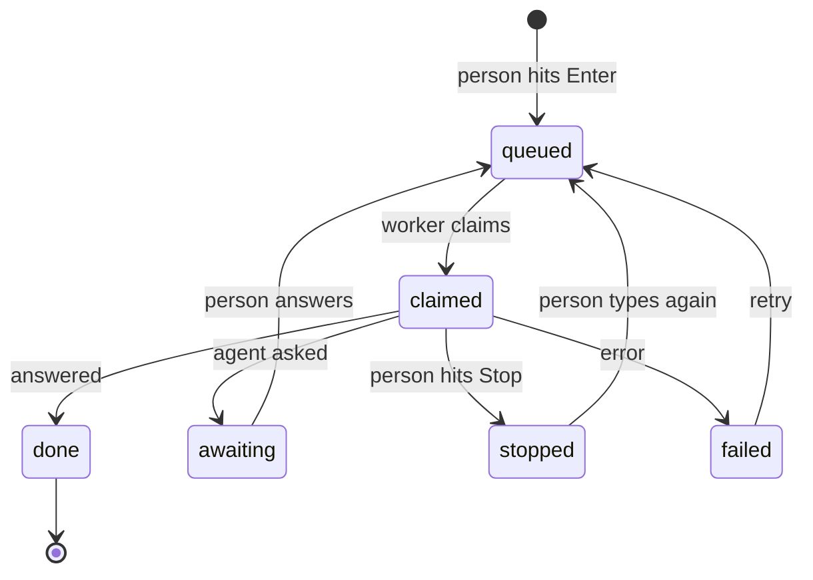
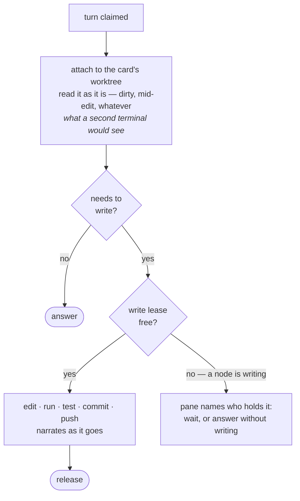
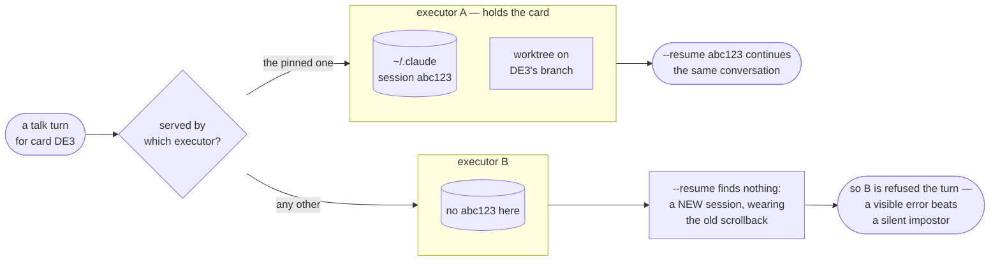
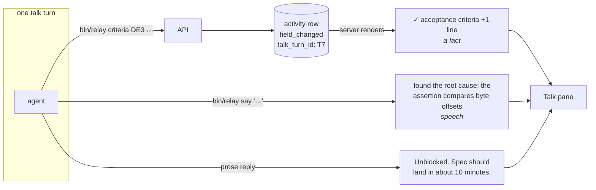

# ADR 0009 — Talk: a person-driven execution lane

## Status

Proposed (2026-08-04)

## Context

[RE268] adds **Talk**: a terminal session on any card, drawn in
[`docs/designs/Relay Card Detail v5.dc.html`](../designs/Relay%20Card%20Detail%20v5.dc.html).
Specifying it surfaced that it is not a drawer feature. It is a second way for an agent to run
against a card, sharing the engine's resources with the first way.

**What is true today.** The server holds no agent session. The executor is the only thing that
does: `bin/relay`'s `_stream_claude_job/6` runs `claude -p --dangerously-skip-permissions
--verbose --output-format stream-json`, captures the `session_id` off the stream-json
`init`/`result` events, and reports it back; a needs-input re-entry then passes it as
`--resume`. The server stores the *id* and brokers work over the long-poll claim
(`POST /api/node-jobs/claim`), which already carries claim leases, revocation, and an executor
version guard. Worktrees are leased from `ExecutorPool` under the `exclusive` / `shared_clean`
isolation classes.

**The goal.** Talk should be **as powerful as a Claude session run locally on the same repo**.
That is the design target, and most decisions below fall out of it: it sees the real working
tree, it can edit, run, commit and push, and it can be interrupted. Power is preferred over
throttling.

**The pressure.** Talk breaks assumptions that hold for every node job:

- A node job is dispatched by a flow. A talk turn is dispatched by **a person typing**, at any
  time, on a card in any stage — including one an agent is actively working.
- A node job's session is disposable. A talk turn must **continue** the previous turn, so its
  Claude session id is durable state living on one machine's disk.
- A node job runs to an outcome. A talk turn may need to **stop and ask the person** — without
  parking the card, because parking is what blocks a flow.
- A node job owns its worktree for its duration. A talk turn wants that same worktree, at the
  same time, and must not corrupt it.

**The constraint.** Talk must not **corrupt** flow execution — the working tree and the card's
data have to stay coherent. It is explicitly allowed to **contend** for time, worktrees and
model usage: a person asking a question may slow the pipeline down, and that is an accepted
trade, not a bug.

Two dispatchers, one pipeline, one machine, one working tree. Everything below follows.

## Decision

**A talk turn is a node job with `kind: :talk` and no run.** It reuses the existing dispatch
pipeline — claim, long-poll, lease, revocation, version guard — rather than standing up a
parallel one. What is genuinely new is the **transcript**: durable, ordered, never-dropping
session/turn/event tables, because the existing log path (`LogForwarder` → `Relay.AgentLog`) is
best-effort *by construction* and wrong for a record we promise to keep.

`run_id` is nullable and **no synthetic `Run` is created.** A Run would make every card with an
open conversation look like a card with an *active run*, corrupting scheduling, flow metrics,
and the board's baton signal. The job table is the right level of reuse; the Run is not.

### 1. The turn is the unit — with a lifecycle, and a stop button

`awaiting` is **turn state, never card state.** A talk turn that asks a question must not call
`Cards.request_input/3`: that parks the card and blocks its flow, so asking "should I do X or
Y?" would stop the pipeline as a side effect. The pane renders the options; answering posts the
choice as the next turn on the same session. The card is untouched.

**Cancellation is first-class.** While a turn is running the pane's send control becomes a
**Stop** button, as in the Claude Code UI. Stopping revokes the job, which terminates the
running `claude -p` — the same revocation path node jobs already use, which is a large part of
why reusing them is worth it. Partial output stays in the transcript; a stopped turn is a
normal, non-error end state.

**Closing the drawer does not stop the turn.** Detaching is not cancelling: the turn runs on and
its output is waiting when you come back. Only Stop stops it.

### 2. One mode, on the card's own worktree

A turn attaches to **the card's actual worktree** and reads it as it is — dirty, mid-edit,
whatever a node job has done and not yet committed. This is deliberate: a second terminal opened
on your own machine sees exactly that, and local parity is the target. An earlier draft gave
Talk a private clean checkout, which hid the very work-in-progress people would be asking about.

Only **writes** serialize. A turn that needs to change files takes the same write lease a node
job takes; if a node holds it, the pane names who has it and the turn either waits or answers
without writing.

**Which worktree, exactly.** "The card's worktree" is only well-defined for a card with a live
`exclusive` run, which is a minority of cards and a minority of the time even for those.
`isolation` is a property of the **flow**, not the card (`Relay.Runs`: it "comes from the live
flow row… with `isolation: nil` → undispatchable"), and `bin/relay`'s `ExecutorPool` creates an
exclusive worktree only "on the card's first job", tearing it down "when the run terminates".
So:

| The card's situation | What the turn uses |
| --- | --- |
| Live `exclusive` run — worktree exists | Attach to `<ns>-<ref>` as it is, dirty and mid-edit. **The parity case.** |
| `exclusive` flow, no live run (torn down, or never ran) | Create `<ns>-<ref>` — on the card's branch, or the base branch if it has none. |
| `shared_clean` flow | Its own `<ns>-<ref>`. **Never** the shared `<ns>-clean` tree. |
| No flow at all — Backlog, Someday | Same: `<ns>-<ref>` on the base branch. |

One rule covers all four: **a turn always uses the card's exclusive per-card worktree, attaching
to the live one when there is one.**

`shared_clean` is excluded deliberately. That tree is shared by concurrent jobs from *other
cards* and is never reset per job, so writing into it would corrupt work this card has nothing
to do with — the one thing this ADR forbids. It is also the class where, by its own definition,
"per-worktree isolation buys nothing", so there is nothing card-specific to observe in it.

Two consequences worth stating rather than discovering:

- **Talk creates worktrees for cards the engine would never dispatch.** A Backlog card has no
  flow and no run, and a turn on it still gets a checkout. That is new behaviour, not an
  extension of the job path.
- **Talk's worktree must outlive the run.** Today an exclusive tree is torn down on run
  termination; a session that spans runs cannot depend on it surviving. Recreate on demand — the
  tree is disposable, the *session* is the durable thing.

### 3. Talk runs where the card's other work runs

A Claude session lives in one machine's `~/.claude` and a worktree on one machine's disk, so
**all work on a card pins to one executor** — plan, code and talk alike. If that executor is
gone, the card is re-pinned and the next turn starts a fresh session.

A turn is never served by an executor that does not hold the card's session: resuming elsewhere
silently produces a *new* session wearing the old scrollback, which is worse than an error.

**The first turn is the exception, and it is what creates the pin.** A card nobody has talked to
yet has no session, so any executor may take that turn; whichever one does becomes the card's
holder. Every later turn follows it. A card whose pin is gone — executor retired or reaped — is
re-pinned the same way, starting a fresh session, and the pane says so rather than pretending
the conversation continued.

### 4. Receipts are recorded facts; narration is deliberate speech

Two channels into the transcript, and neither can forge the other:

- **Receipts** are generated by the server from its own audit rows. Every mutation made during a
  turn is stamped with that turn's id — the same nullable-string shape `run_id` and
  `node_job_id` already use on `Schemas.Activity` — and rendered as it is written. The agent is
  told *not* to narrate its own changes: a claim can drift from what happened, a row cannot.
  This needs a `:field_changed` activity type, which does not exist today — card field edits are
  currently unaudited for **anyone**, human or agent. Commits and pushes get receipts too.
- **Narration** is the agent choosing to speak (`bin/relay say "found the root cause…"`), keyed
  off the same turn id. It carries no authority and asserts no change.

The pane cannot show a change that did not happen, nor hide one that did. Transcripts roll off
under a per-card cap; **activity rows never do**, so the audit trail outlives the scrollback.

### 5. Full authority, and a product-owned prompt

Talk may read, edit, run, test, **commit, push, open a PR and merge** — everything a local
session on that repo can do. There is no accept/decline gate and no undo: it acts, and the
receipt reports. `--disallowedTools` is *not* used; an earlier draft's file-write guard is
dropped, because a guard that contradicts the design target is theatre.

The turn's prompt is built by the executor **in product code**, not from a `.claude/agents/*.md`
definition. This is a deliberate, recorded **exception to ADR 0006**, which gives repos
ownership of node behaviour: Talk is a property of Relay itself and must behave the same on every
board regardless of what the connected repo ships. Revisit if repos ask to customise it.

### 6. The baton does not move

A talk turn does **not** flip the card's baton. Ownership tracks who is responsible for the
card's progress through the flow, not who most recently touched it; a person asking a question —
even one that ends in an edit — has not handed the card to an agent. AGENTS.md makes the baton a
first-class card property, so leaving it undefined would have been a real gap. It is defined
here as: unchanged.

## Consequences

**Good.**

- Cancellation, leases, claim long-polling and the version guard come from machinery that
  already exists and is already exercised by every flow run.
- One coordination mechanism for the working tree. Talk and nodes serialize writes through the
  same lease, so there is no second scheme to keep consistent.
- Talk sees reality — the dirty tree, mid-edit — which is what makes "why is this stuck?"
  answerable at the moment it is asked.
- Receipts and the audit trail are the same rows, so what the pane showed and what Activity
  shows later cannot disagree. This matters precisely because there is no gate and no undo.
- `:field_changed` closes a gap unrelated to Talk: nothing currently records who rewrote a card's
  spec.

**Bad, or newly required.**

- Every query over `node_jobs` must now be `kind`-aware. This is the main bug surface of reusing
  the table, and the mitigation is the AGENTS.md rule: the kinds are a closed set defined once on
  `Schemas.NodeJob` and never re-typed at a call site.
- Card-level executor pinning must exist ([RE288 AC12]), and it is a bigger change than it
  sounds: the pin lives on the **run** row today and exists only for `exclusive` — "shared_clean
  runs are never pinned", deliberately, so any executor can take them. Moving it to the card
  newly constrains work that is free-floating by design.
- Every mutating `bin/relay` path must propagate the turn id, or its change lands with no
  receipt.
- Turns can be long. The transcript is the only progress signal, so narration is not decoration —
  a silent turn is indistinguishable from a hung one.
- **A text box can now reach `main`.** Commit, push, PR and merge from a chat input is the stated
  goal, and it is also the largest blast radius in this document. Nothing here constrains it; the
  record is the only safeguard.
- Talk and flow runs draw on the same model usage, so a busy conversation can slow the pipeline.
  Accepted deliberately: power over throttling.

**Kept in sync.** `docs/architecture/runner.md` (the talk kind on the job pipeline), `domain.md`
(the `Relay.Talk` context), `runtime.md` (the `card:<id>:talk` topic), and `state.md` (the new
tables).

## Testing

The seam is the executor. Everything server-side — post a turn, claim it, append events, render
the pane — is testable with a **fake executor**: a helper that claims a talk job and posts canned
event batches. No model involved, and it covers most of the surface.

Two narrower seams cover the rest:

- **Recorded stream-json.** Capture one real `claude -p` event stream and replay it in
  `bin/test_relay.py` to test the event mapping and the receipt path. Same idea as
  [RE210 Routing replay], and worth sharing machinery with it.
- **The wire contract.** The talk claim payload is pinned in
  `test/fixtures/executor_contract.json`, as AGENTS.md requires for anything crossing to
  `bin/relay`.

A genuinely live end-to-end turn stays a manual smoke test, not a CI job.

## Build order

Not shippable increments — there are no users yet, and only testers see the intermediate
states. This is the order that keeps each step **demonstrable by a person**, so no step is built
on a foundation nobody has watched work.

| Step | What lands | What you do to see it |
| --- | --- | --- |
| **1 · A session you can talk to** | transcript tables, `kind: :talk` on `node_jobs`, worker, Talk tab + pane, seed line, Stop | Type "why is this stuck?" on a parked card; watch it stream; hit Stop mid-answer and watch it actually stop. |
| **2 · It can change the card** | turn-id stamping, `:field_changed`, receipts | "Add a tag #perf" — the receipt prints and Detail shows it. |
| **3 · It can ask you something** | `awaiting` turns, options in the pane | Ask something ambiguous, get buttons, click one, the session resumes. |
| **4 · It can write code** | write lease, commit/push, `bin/relay say` | "Fix the failing test" while a node job is running on the same card. |

Cancellation lands in step 1 rather than last: the first time a turn runs away is the first time
you want it, and revocation is inherited rather than built.

## Deferred to their own cards

- **Presence in a shared session** — one session per card means two people can drive one agent
  in one worktree, with no indication of who else is attached or typing, and `/clear` blanks
  everyone's view. RE257 already built presence machinery for the story map.
- **Session growth.** `--resume` on a long-lived session gets slower and costlier every turn,
  and the transcript cap bounds our tables, not Claude's session file. Something should start
  fresh periodically and say so.
- **One session per card per person.** Adopted as *per card* for now; revisit once two people
  have actually collided.

## Alternatives considered

**A parallel claim lane, endpoint and worker for Talk.** The first draft. Rejected: it would
re-implement claim, long-poll, lease, revocation, reaping and the version guard — and
cancellation is required, so that machinery is not optional. Reusing `node_jobs` with a `kind`
discriminator gets all of it, at the cost of making every query over that table kind-aware.

**Synthesising a `Run` per turn.** Would reuse even more, but every card with an open
conversation would read as having an active run, corrupting scheduling, metrics and the baton.
Rejected.

**Talk in its own clean worktree.** The earlier draft, chosen to avoid two processes in one
tree. Rejected: it hides uncommitted work-in-progress, which is often exactly what is being
asked about, and it diverges from the local-session parity that is the design target. Writes
serialize on the lease instead.

**Refusing Talk while a run is in flight.** The original spec's answer to the same hazard.
Rejected: a card that looks stuck mid-run is precisely when someone wants to ask.

**A persistent `claude` process per session.** Lower per-turn latency. Rejected for now: it makes
the executor a session server, adds a second code path that must emit an identical event stream,
and dies with the executor. Revisit if one-shot `--resume` turns feel sluggish — a latency
problem with a known fix, not a design flaw.

**A `relay-card-talk` agent definition.** Would put the prompt in `.claude/agents/`. Rejected:
those are repo-owned, so Talk would behave differently per repo, or be missing entirely, and
every onboarded repo would need it seeded.

**An MCP server exposing typed card tools.** The better long-term shape: tool calls arrive with
schemas and arguments, so receipts come straight from the invocation with no turn-id propagation
and no inference from bash strings, and `ask` becomes a real typed tool that ends a turn. Not
adopted now because Talk would be its only consumer. The moment flow nodes want it too — they
also shell out to `bin/relay` today — it pays for itself and should be adopted for both at once.

**A custom agent harness against the API.** Maximum control over streaming, tool schemas,
interruption and cost accounting. Rejected outright: it would abandon Claude Code's skills,
subagents, permissions and session machinery, which the entire factory (`.claude/agents`,
skills, flows — ADR 0006) is built on. Relay's premise is that your Claude Code sessions work
the board; replacing the harness would contradict it.
