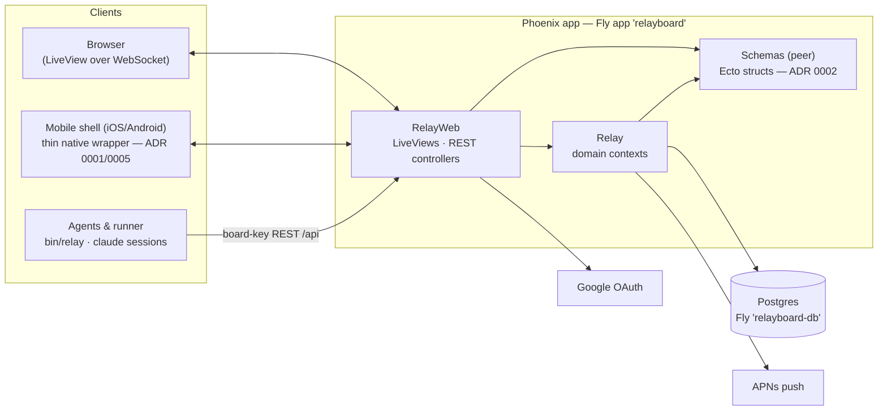

# Relay architecture — the system, today

The current-state map of how Relay is built: what the pieces are, how a request and a card
move through them, and where each piece's code lives. Start with the system map below, then
follow the page that covers the layer you care about — the domain contexts, the runtime and
its supervised processes, the executor, the state machines, or the dependencies.

The *why* behind these shapes lives in [`docs/adr/`](../adr/README.md); terms are defined in
[`../glossary.md`](../glossary.md); the product north star is [`../vision.md`](../vision.md);
UI truth is [`../designs/`](../designs/README.md); the agent-facing CLI/REST surface is
[`../../relay.md`](../../relay.md).

## System map

Three layers, enforced by the `boundary` compiler: **`RelayWeb`** (LiveViews + REST
controllers) may call the domain only through **`Relay`**'s exported contexts; contexts
never reach into the web layer; **`Schemas`** is a peer both may use (ADR 0002). One
LiveView UI serves web and mobile — the mobile apps are thin native shells around it
(ADR 0001, ADR 0005). Agents drive the same domain through the board-key REST API and the
`bin/relay` CLI/runner.

## Pages

| Page | Question it answers |
| --- | --- |
| [domain.md](domain.md) | What are the contexts and core schemas? What invariants govern them? |
| [runtime.md](runtime.md) | What processes run? What PubSub topics exist? How does real-time flow? |
| [runner.md](runner.md) | How does work physically get done by agents? |
| [deps.md](deps.md) | What do modules and the app depend on, internally and externally? |

- [State reference](state.md) — card status, run status, node-job state and the four node
  outcomes, with their transitions and the seams between them.

---
*Sources of truth: `lib/relay.ex`, `lib/relay_web.ex`, `lib/schemas.ex`,
`docs/adr/0001`, `docs/adr/0002`, `fly.toml`.*

## Keeping these pages current

**Keeping this current is a gate, not a virtue** (see `AGENTS.md`): adding a context,
PubSub topic, API endpoint, or supervised process means updating the matching page here in
the same branch. Each page is capped at roughly two pages and ends with the modules it
describes — if a page wants to grow past that, push detail into `@moduledoc` and link.
