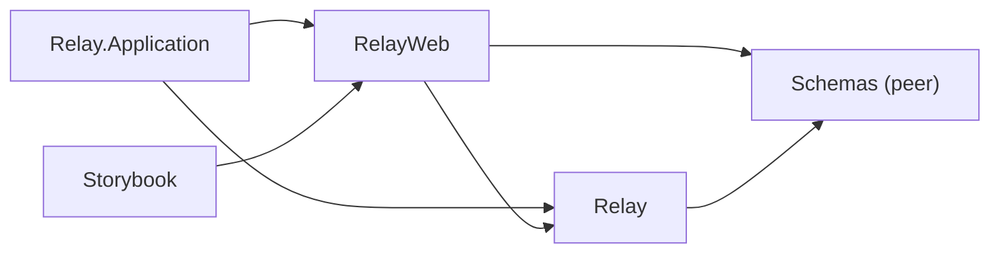
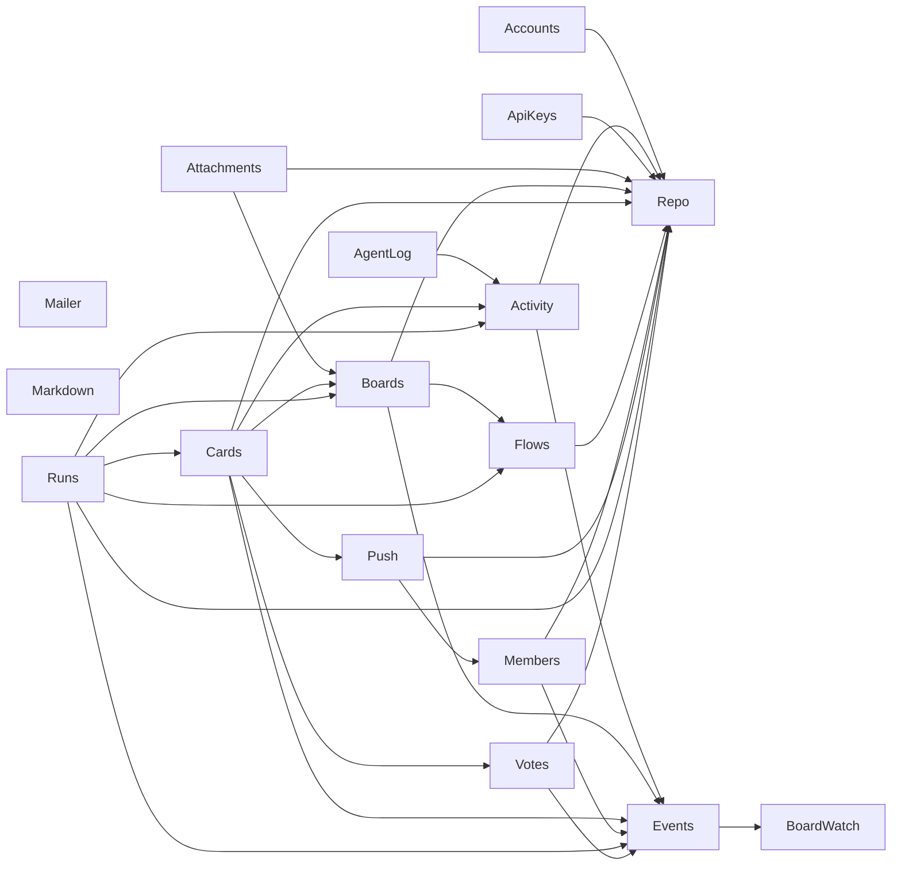

# Dependencies

## Module boundaries

Enforced at compile time by [`boundary`](https://hexdocs.pm/boundary) — a violation fails
the build. The macro view (each context is additionally its own sub-boundary inside
`Relay`; see [domain.md](domain.md) for the list):

Inside `Relay`, cross-context deps are declared per sub-boundary (e.g. `Events` depends on
`BoardWatch`; contexts that notify depend on `Events`). When adding a context: `use
Boundary`, add it to `Relay`'s `exports`, and update [domain.md](domain.md).

The graph below is generated from the `boundary` compiler by `mix relay.deps_graph` —
don't hand-edit between the markers; regenerate instead (`mix relay.deps_graph --check`
verifies it's current).

<!-- BEGIN generated: boundary-graph -->

<!-- END generated: boundary-graph -->

## Load-bearing hex deps

| Dep | Why we have it |
| --- | --- |
| `phoenix`, `phoenix_live_view` | the app; LiveView is the single UI (ADR 0001) |
| `ecto_sql` + `postgrex` | persistence |
| `bandit` | HTTP server |
| `boundary` | compile-time layer enforcement (ADR 0002) |
| `req` (+ its `finch`) | the only sanctioned HTTP client; a dedicated h2 Finch pool exists for APNs |
| `ueberauth` + `ueberauth_google` | Google sign-in |
| `swoosh` | mail |
| `esbuild`, `tailwind` (+ daisyUI in `assets/`) | asset pipeline; daisyUI is the component kit |
| `heroicons` | the `<.icon>` component |
| `lazy_html` | test-side HTML assertions |
| `phoenix_live_dashboard`, `telemetry_*` | ops visibility |
| `credo`, `styler`, `sobelow`, `mix_audit` | the `mix precommit` gate |

## External services

| Service | Role | Notes |
| --- | --- | --- |
| Fly.io | hosting: app `relayboard`, unmanaged Postgres `relayboard-db` | deploy target |
| Google OAuth | the only sign-in path (web + native token validation) | |
| APNs | iOS push | h2-only, hence the dedicated Finch pool |
| App Store / TestFlight | mobile shell distribution | crash-feedback fetch script (RLY-99) |
| GitHub (`gh`) | PRs + squash-merge in the Code stage | driven by the runner, not the app |
| Anthropic (`claude` CLI) | every agent node | runs on the developer machine, not on Fly |

---
*Sources of truth: `mix.exs`, `lib/relay.ex` / `lib/relay_web.ex` / `lib/schemas.ex`
(`use Boundary` declarations), `fly.toml`, `assets/css/app.css`.*
