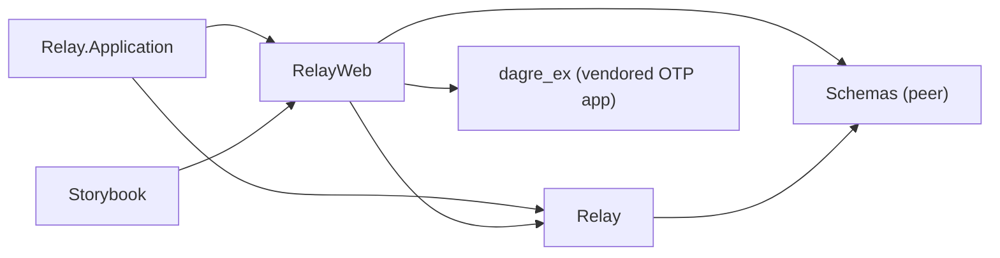
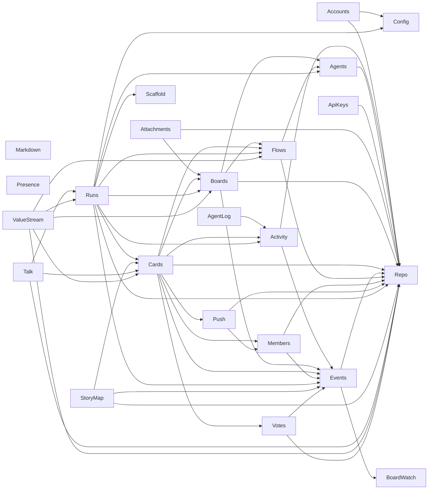

# Dependencies

## Module boundaries

Enforced at compile time by [`boundary`](https://hexdocs.pm/boundary) — a violation fails
the build. The macro view (each context is additionally its own sub-boundary inside
`Relay`; see [domain.md](domain.md) for the list):

```mermaid
flowchart LR
    App["Relay.Application"] --> Web["RelayWeb"]
    App --> Domain["Relay"]
    Web --> Domain
    Web --> Schemas
    Web --> Dagre["dagre_ex (vendored OTP app)"]
    Domain --> Schemas["Schemas (peer)"]
    Storybook["Storybook"] --> Web
```

Inside `Relay`, cross-context deps are declared per sub-boundary (e.g. `Events` depends on
`BoardWatch`; contexts that notify depend on `Events`). When adding a context: `use
Boundary`, add it to `Relay`'s `exports`, and update [domain.md](domain.md).

The graph below is generated from the `boundary` compiler by `mix relay.deps_graph` —
don't hand-edit between the markers; regenerate instead (`mix relay.deps_graph --check`
verifies it's current).

<!-- BEGIN generated: boundary-graph -->

```mermaid
flowchart LR
    Markdown
    Presence
    Accounts --> Config
    Accounts --> Repo
    Activity --> Events
    Activity --> Repo
    AgentLog --> Activity
    Agents --> Repo
    ApiKeys --> Repo
    Attachments --> Boards
    Attachments --> Repo
    Boards --> Agents
    Boards --> Events
    Boards --> Flows
    Boards --> Repo
    Cards --> Activity
    Cards --> Boards
    Cards --> Events
    Cards --> Flows
    Cards --> Members
    Cards --> Push
    Cards --> Repo
    Cards --> Votes
    Events --> BoardWatch
    Events --> Repo
    Flows --> Agents
    Flows --> Repo
    Members --> Events
    Members --> Repo
    Push --> Members
    Push --> Repo
    Runs --> Activity
    Runs --> Agents
    Runs --> Boards
    Runs --> Cards
    Runs --> Config
    Runs --> Events
    Runs --> Flows
    Runs --> Repo
    Runs --> Scaffold
    StoryMap --> Cards
    StoryMap --> Events
    StoryMap --> Repo
    Talk --> Cards
    Talk --> Repo
    Talk --> Runs
    ValueStream --> Boards
    ValueStream --> Cards
    ValueStream --> Flows
    ValueStream --> Repo
    ValueStream --> Runs
    Votes --> Events
    Votes --> Repo
```
<!-- END generated: boundary-graph -->

## Load-bearing hex deps

| Dep | Why we have it |
| --- | --- |
| `phoenix`, `phoenix_live_view` | the app; LiveView is the primary UI (ADR 0001/0005) |
| `ecto_sql` + `postgrex` | persistence |
| `bandit` | HTTP server |
| `boundary` | compile-time layer enforcement (ADR 0002) |
| `req` (+ its `finch`) | the only sanctioned HTTP client; a dedicated h2 Finch pool exists for APNs |
| `ueberauth` + `ueberauth_google` | Google sign-in |
| `jose` | APNs JWT signing; Apple identity-token verification |
| `esbuild`, `tailwind` (+ daisyUI in `assets/`) | asset pipeline; daisyUI is the component kit |
| `heroicons` | the `<.icon>` component |
| `lazy_html` | test-side HTML assertions |
| `phoenix_live_dashboard`, `telemetry_*` | ops visibility |
| `credo`, `styler`, `sobelow`, `mix_audit` | the `mix precommit` gate |

## Vendored libraries

| Library | Path | Why we have it |
| --- | --- | --- |
| `dagre_ex` (`Dagre`) | `vendor/dagre_ex` | Layered (Sugiyama) graph layout — a dependency-free Elixir port of [dagre](https://github.com/dagrejs/dagre). Consumed only by `RelayWeb`, for the flow diagram's layout (`FlowLayout`, wired in RE333). |

`dagre_ex` is a **separate OTP app**, not a context: its own `mix.exs`, `LICENSE`, tests,
`.formatter.exs` and `precommit` alias, which the root `mix precommit` runs
(`cmd --cd vendor/dagre_ex env MIX_ENV=test mix do deps.get + precommit`). It is **dependency-free and bound for
extraction** as a hex package, so it must never reference a Relay module or concept. It sits
outside the `boundary` graph — `boundary` governs modules inside this project — so it has no
`use Boundary` and is not in `Relay`'s exports. If `boundary` ever flags a `RelayWeb` call into
`Dagre`, the fix is a `deps` entry on `RelayWeb`, not a change to the library.

## External services

| Service | Role | Notes |
| --- | --- | --- |
| Fly.io | hosting: app `relayboard`, unmanaged Postgres `relayboard-db` | deploy target |
| Google OAuth | web sign-in + native token validation | |
| Sign in with Apple | native iOS sign-in; identity tokens verified against Apple's JWKS (appleid.apple.com/auth/keys) | iOS only, no caching |
| APNs | iOS push | h2-only, hence the dedicated Finch pool |
| App Store / TestFlight | mobile shell distribution | crash-feedback fetch script (RLY-99) |
| GitHub (`gh`) | PRs + squash-merge in the Code stage | driven by the runner, not the app |
| Anthropic (`claude` CLI) | every agent node | runs on the developer machine, not on Fly |

---
*Sources of truth: `mix.exs`, `vendor/dagre_ex/mix.exs`, `lib/relay.ex` / `lib/relay_web.ex` / `lib/schemas.ex`
(`use Boundary` declarations), `fly.toml`, `assets/css/app.css`.*
