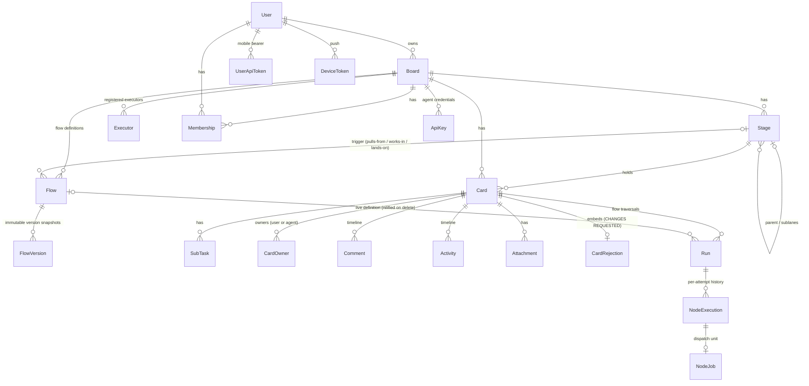

# Domain model

Every context is a `Boundary` sub-boundary declared in `lib/relay.ex` and listed in
`Relay`'s `exports` — that list is the authoritative context inventory; this page annotates
it. Schemas live in the `Schemas` peer (ADR 0002) so web and domain share structs without
sharing behavior.

## Contexts

- **Boards** — boards and their stage tree (stages, sub-lanes, review gates, WIP limits,
  `ai_enabled`). Stage/config semantics: [ADR 0003](../adr/0003-card-state-stage-type-validity.md).
- **Flows** — workflow definitions as declarative graph data (ADR 0006 / RLY-131): per-board
  rows in the `flows` table (`key`, `enabled`, `isolation`, `version`, three trigger stage FKs
  stored as ids with nilify-on-delete) with the node/edge graph embedded as jsonb; `"start"`/
  `"done"` are edge sentinels; nodes carry an optional `timeout_minutes` (validated `> 0`).
  `Relay.Flows.seed_default_flows!/1` idempotently seeds the default spec/plan/code library
  (from `Relay.Flows.DefaultLibrary`, the compiled translation of `docs/designs/flows/*.jsonc`)
  — `Boards.create_board/2` calls it after enabling the `Spec:Review`/`Spec:Done`/`Plan:Done`
  sub-lanes so every trigger resolves. Flows seed disabled; at most one enabled flow may pull
  from a stage (partial unique index). Nothing executes yet — the engine is the Runs card (02).
  **Versioning (RLY-152, absorbed into the flow editor card):** every flow's definition
  (nodes, edges, isolation) is versioned — `flows.version` holds the current number, and each
  version is snapshotted immutably into `flow_versions` (`belongs_to :flow`, `version`,
  `isolation`, embedded `nodes`/`edges`; no `updated_at`, never edited after insert). A flow
  always has a snapshot row for its current version — created on `create_flow/2`,
  `duplicate_flow/1`, and `seed_default_flows!/1`, and on every bump — the invariant a future
  Runs pin-to-version feature relies on. `save_definition/2` is the one path that changes a
  flow's definition after creation: it validates like `update_flow/2`, then bumps `version` to
  n+1 and writes a new snapshot **only if** the definition changed; a trigger-only change
  (including a stage rename) saves with no bump, since triggers are per-board wiring and not
  part of the versioned definition. `get_version/2` fetches an immutable snapshot by number;
  `mid_run_count/1` is a stub returning `0` until the Runs schema pins a card to a version
  (RLY-132 makes it real). The Flows settings tab (RLY-142) is backed by `customized?/1`
  (normalized nodes/edges/isolation comparison against the library — trigger wiring never
  counts), `default_key?/1`, `duplicate_flow/1` (disabled `<key>-copy` clone),
  `unique_key/2` (the `base`/`base-2`/… generator behind both `-copy` and the create form's
  prefilled key), create-from-scratch (RLY-158 — the tab's "+ New flow" panel collects a key,
  all three trigger stages and isolation, then calls `create_flow/2` with an empty
  `start → done` skeleton and hands off to the editor; the flow is created disabled, so
  creation can never breach the one-enabled-flow-per-stage rule), and
  `reset_to_default/1` (restores the shipped definition via `save_definition/2`, so a reset
  bumps the version and snapshots like any other save; triggers and `enabled` untouched).
  `diff_from_default/1` structurally diffs a customized default flow against its shipped
  default (`nil` for a non-library key) — nodes grouped added/removed/changed (changed lists
  the differing fields), edges as `{from, to, on}` tuples grouped added/removed.
  **Editor (RLY-143):** `RelayWeb.FlowEditorLive`, a full-page LiveView at
  `/board/:slug/flows/:key`, edits a flow's working copy (nodes/edges/isolation/triggers) with
  inline validation against `Schemas.Flow.changeset/2`, saves through `save_definition/2`
  behind a "Save as v(n+1)" confirm modal, and offers the diff-vs-default / reset-to-default
  affordance for customized library flows. The graph is rendered by the shared
  `RelayWeb.FlowGraphComponents.flow_graph/1` function component (absolutely-positioned node
  divs + an SVG edge layer, `interactive?` toggles `phx-click`, accepts `node_states` for a
  later read-only reuse by the run panel) laid out by the pure, unit-tested
  `RelayWeb.FlowLayout.layout/2` (a deterministic serpentine layout derived from graph
  structure alone — no stored coordinates, no dragging).
  **Requirements (RLY-182):** `Flows.node_requirements/1` is a pure graph read — the agent
  and skill names a flow's nodes name, with no executor knowledge. It lives here rather than
  in Runs because `Flows` may not depend on `Runs` (a boundary cycle the compiler rejects);
  `Runs` reads it to answer whether anyone can actually satisfy it.
- **Runs** — the workflow execution engine (ADR 0006 card 02 / RLY-132): a run executes a
  flow graph against a card as a supervised, Postgres-backed state machine. Outcome routing
  on `succeeded/failed/partial/needs_input`, per-node `max_retries`, per-edge `max_loops`, a
  per-node visit cap and a failure-signature circuit breaker (both
  `config :relay, Relay.Runs`), needs-input parking, restart resume, and baton interplay
  (claim parks, hand-back resumes, rejection re-enters with the note — via
  `Relay.Runs.Listener` on the Events firehose). A run points at the LIVE flow row (no
  snapshot; versioning is RLY-152). Node execution goes through the
  `Relay.Runs.Dispatcher` behaviour (`config :relay, :runs_dispatcher`; default
  `NoopDispatcher` — jobs sit `:queued` for card 04's pull transport). All card writes go
  through `Relay.Cards`, so ADR 0003/0004 rules apply automatically.
  **Read side (RLY-137):** `list_runs_for_card/1` (newest-first, node executions
  preloaded chronologically) and `latest_run/1` back the card drawer's Run tab;
  `run_summaries_for_board/1` batches every card's latest-run summary
  (`status`, `flow_key`, `current_node`, `node_index`/`node_count` on the flow's
  happy path, `duration_s`/`cost`/`nodes`/`attempts` totals) in three queries for
  the board card face. `happy_path/1` linearizes a flow's `:succeeded`-edge chain
  from `start` to `done`. `queued_flow/4` and `face_summary/4` are pure
  derivations over a card + flows + summaries — no scheduler/NodeJob read — that
  decide what the board card face shows (`{:run, summary}`, `{:queued, flow}`, or
  `nil` → legacy strip). Callers refetch via the coarse
  `{:run_changed, card_id}` event on `board:<id>:runs`
  (`Relay.Runs.broadcast_run_changed/2`) rather than patching state from the
  engine's fine-grained events — see [runtime.md](runtime.md). `duration_s` is
  derived (summed `finished_at - started_at`) since `NodeExecution` stores no
  duration column; `flow_version` in a summary is always `nil` today (`Run`
  points at the live flow row, no version column yet — RLY-152).
  **Server-side dispatch (ADR 0006 / RLY-133):** the same `Relay.Runs` boundary also owns
  the scheduler brain — the server-side heir to `bin/relay`'s `find_all_ready`. The pure
  core `Relay.Runs.Scheduler.plan/1` takes a `Snapshot` (stages/cards/flows/runs/capacity
  as plain maps — no DB, no processes) and returns an ordered `Plan` of `{:start, ...}` /
  `{:resume, ...}` dispatches plus the pulls-from `ready ↔ queued` reconciliation
  (rightmost-works-in-stage-first flow priority, resume-before-fresh, WIP counted across
  sub-lanes, named-executor capacity with exclusive-isolation affinity — no over-dispatch
  in one pass). A per-board `Relay.Runs.Scheduler.Server` GenServer (registered in
  `Relay.Runs.SchedulerRegistry`, supervised by the `Relay.Runs.SchedulerSupervisor`
  `DynamicSupervisor`) assembles the snapshot, calls `plan/1`, and delegates each decision
  to the injectable `Relay.Runs.Scheduler.Engine` behaviour (`active_runs/1`,
  `start_run/3`, `resume_run/2` — `config :relay, :runs_engine`; default
  `Relay.Runs.Scheduler.RunsEngine`, the adapter onto `Relay.Runs.start_run/3` /
  `resume_run/2` (`NoopEngine` remains for tests that inject it)). The scheduler writes no
  `Run` rows and moves no cards into works-in — it owns only the `ready ↔ queued`
  marking; the engine owns the rest. It reacts to the board's `Relay.Events` topic
  and `Relay.Runs.Capacity`'s `runs:capacity` topic (an executor-keyed ETS store of
  advertised capacity per isolation class, fed by the executor heartbeat's `name` +
  `capacity` branch (`BoardController.heartbeat/2`); the scheduler's snapshot subtracts
  each in-flight `:running` run's isolation class before planning, so a running run holds
  its slot across reconciles), with a slow ~60s tick as backstop. Cross-board
  capacity is global by executor — a stale/contended view can over-assign; the
  executor's own live capacity is the final backstop (YAGNI: no multi-board reservation
  yet). `Relay.Runs.SchedulerSupervisor.start_all/0` boot-starts one scheduler per board
  only when `:runs_auto_start` is on (dev/prod; off in test).
  **Budget accounting is per `foreach` iteration; the breaker is global (RLY-139).** Inside a
  `foreach` loop, `max_loops`, `max_retries` and the per-node visit cap are counted over
  the history filtered to the current iteration's `sub_task_id`, so `max_loops: 3` means
  "3 laps per task" and a churny early task cannot spend a later task's budget. The
  failure-signature circuit breaker deliberately keeps the FULL, unfiltered history:
  per-iteration budgets exist to bound *productive* churn, while the breaker catches
  *unproductive* repetition — the identical failure recurring across task boundaries is
  more alarming, not less. Outside a `foreach` there is no `sub_task_id`, the filter is
  the identity function, and every budget is whole-run exactly as before (RLY-139).
  **Preflight (RLY-182):** `Relay.Runs.preflight_flow/1` (`Relay.Runs.Preflight`) is the
  read-only readiness snapshot behind the Flows enable confirm — a single fresh executor must
  satisfy capacity *and* inventory (the agents/skills `Flows.node_requirements/1` names) for
  the flow to be reported ready; a union across executors is deliberately not readiness, since
  a run dispatches to one machine. A null `capabilities` on an executor is unknown, not
  missing — it is surfaced as its own caveat rather than a false "missing agent" alarm. Both
  seams are one-way, Runs → Flows, never the reverse.
- **Cards** — the card lifecycle: create/edit/move/archive, status (`working`,
  `needs_input`, `failed`, …), sub-tasks, spec/plan/branch/pr fields, approve/reject,
  needs-input questions. `failed` (RLY-179) is set only by `Relay.Cards.mark_failed/3` when a
  run ends terminally — a separate path from `needs_input`'s genuine question. Card state ×
  stage validity is governed by
  [ADR 0003](../adr/0003-card-state-stage-type-validity.md); ownership and the claim rule
  by [ADR 0004](../adr/0004-card-ownership-and-the-claim-rule.md); derived agent health
  (`Cards.health/1`, 90s `STALE_AFTER`) and the four-bucket needs-you rollup
  (`needs_input` / `in_review` / `awaiting_human` / `agent_stalled` — RLY-148) surfaced by
  `GET /api/board` and the boards-home badges.
- **Members** — board membership; who can see and act on a board.
- **Accounts** — users and Google sign-in (`GoogleTokenValidator` verifies native mobile
  tokens); user API tokens for `/api/all`.
- **ApiKeys** — per-board agent credentials for the `/api` scope.
- **Activity** — the card timeline: comments, activity entries, and runner log rows.
  `Activity.LogSink` batches ref-tagged runner lines into one insert per burst;
  `Activity.Pruner` ages `:action` chatter out after 14 days (RLY-112).
- **AgentLog** — stateless live relay of runner feed lines to the board's log sheet
  (subscribe-only; no server buffer, no backfill — RLY-55).
- **Events** — the realtime seam: contexts broadcast semantic domain events after each
  successful mutation (never controllers/LiveViews), so LiveView and REST mutations share
  one notification path. See [runtime.md](runtime.md) for the topic/event vocabulary.
- **BoardWatch** — per-board monotonic version counter in ETS; bumped on every
  `Events.broadcast/2`, polled by the CLI to cheaply detect change (RLY-12).
- **Attachments** — file uploads onto cards, served by `AttachmentController`.
- **Push** — APNs notifications, dispatched off-caller via a `Task.Supervisor` so a status
  change never waits on Apple (RLY-81).
- **Markdown**, **Mailer**, **Repo** — rendering, mail, and Ecto plumbing.

Planned by [ADR 0006](../adr/0006-workflow-orchestration.md): the trigger scheduler (03), the
REST node-job transport + Executor table (04), the real executor (05), and the run UI (07).
The engine itself (card 02, above) is live.

## Core schemas

A `Stage` may point at a `parent` (sub-lanes like `Spec:Review`) and a `reject_to_stage`
(where a rejection sends the card). `Scope` (not shown) is the per-request authorization
context threaded through web and API entry points.

---
*Sources of truth: `lib/relay.ex` (`exports`), `lib/schemas/*.ex`, ADRs 0002–0004, 0006.*
