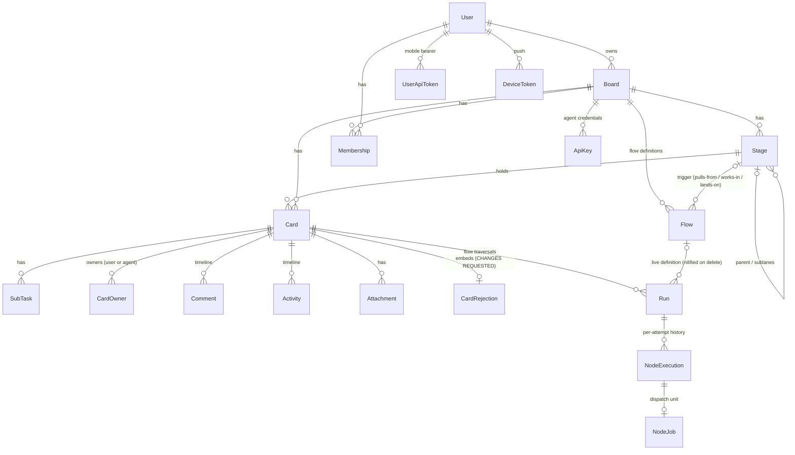

# Domain model

Every context is a `Boundary` sub-boundary declared in `lib/relay.ex` and listed in
`Relay`'s `exports` — that list is the authoritative context inventory; this page annotates
it. Schemas live in the `Schemas` peer (ADR 0002) so web and domain share structs without
sharing behavior.

## Contexts

- **Boards** — boards and their stage tree (stages, sub-lanes, review gates, WIP limits,
  `ai_enabled`). Stage/config semantics: [ADR 0003](../adr/0003-card-state-stage-type-validity.md).
- **Flows** — workflow definitions as declarative graph data (ADR 0006 / RLY-131): per-board
  rows in the `flows` table (`key`, `enabled`, `isolation`, three trigger stage FKs stored as
  ids with nilify-on-delete) with the node/edge graph embedded as jsonb; `"start"`/`"done"`
  are edge sentinels. `Relay.Flows.seed_default_flows!/1` idempotently seeds the default
  spec/plan/code library (from `Relay.Flows.DefaultLibrary`, the compiled translation of
  `docs/designs/flows/*.jsonc`) — `Boards.create_board/2` calls it after enabling the
  `Spec:Review`/`Spec:Done`/`Plan:Done` sub-lanes so every trigger resolves. Flows seed
  disabled; at most one enabled flow may pull from a stage (partial unique index). Nothing
  executes yet — the engine is the Runs card (02); versioning is RLY-152.
  The Flows settings tab (RLY-142) is backed by `customized?/1` (normalized
  nodes/edges/isolation comparison against the library — trigger wiring never counts),
  `default_key?/1`, `duplicate_flow/1` (disabled `<key>-copy` clone), and
  `reset_to_default/1` (restores the shipped definition; triggers and `enabled` untouched).
- **Runs** — the workflow execution engine (ADR 0006 card 02 / RLY-132): a run executes a
  flow graph against a card as a supervised, Postgres-backed state machine. Outcome routing
  on `succeeded/failed/partial/needs_input`, per-node `max_retries`, per-edge `max_loops`, a
  per-node visit cap and a failure-signature circuit breaker (both
  `config :relay, Relay.Runs`), needs-input parking, restart resume, and baton interplay
  (claim parks, hand-back resumes, rejection re-enters with the note — via
  `Relay.Runs.Listener` on the Events firehose). A run points at the LIVE flow row (no
  snapshot; versioning is RLY-152). Node execution goes through the
  `Relay.Runs.Dispatcher` behaviour (`config :relay, :runs_dispatcher`; default
  `NoopDispatcher` — jobs sit `:queued` for card 04's pull transport). All card writes go
  through `Relay.Cards`, so ADR 0003/0004 rules apply automatically.
  **Read side (RLY-137):** `list_runs_for_card/1` (newest-first, node executions
  preloaded chronologically) and `latest_run/1` back the card drawer's Run tab;
  `run_summaries_for_board/1` batches every card's latest-run summary
  (`status`, `flow_key`, `current_node`, `node_index`/`node_count` on the flow's
  happy path, `duration_s`/`cost`/`nodes`/`attempts` totals) in three queries for
  the board card face. `happy_path/1` linearizes a flow's `:succeeded`-edge chain
  from `start` to `done`. `queued_flow/4` and `face_summary/4` are pure
  derivations over a card + flows + summaries — no scheduler/NodeJob read — that
  decide what the board card face shows (`{:run, summary}`, `{:queued, flow}`, or
  `nil` → legacy strip). Callers refetch via the coarse
  `{:run_changed, card_id}` event on `board:<id>:runs`
  (`Relay.Runs.broadcast_run_changed/2`) rather than patching state from the
  engine's fine-grained events — see [runtime.md](runtime.md). `duration_s` is
  derived (summed `finished_at - started_at`) since `NodeExecution` stores no
  duration column; `flow_version` in a summary is always `nil` today (`Run`
  points at the live flow row, no version column yet — RLY-152).
- **Cards** — the card lifecycle: create/edit/move/archive, status (`working`,
  `needs_input`, …), sub-tasks, spec/plan/branch/pr fields, approve/reject, needs-input
  questions. Card state × stage validity is governed by
  [ADR 0003](../adr/0003-card-state-stage-type-validity.md); ownership and the claim rule
  by [ADR 0004](../adr/0004-card-ownership-and-the-claim-rule.md); derived agent health
  (`Cards.health/1`, 90s `STALE_AFTER`) and the four-bucket needs-you rollup
  (`needs_input` / `in_review` / `awaiting_human` / `agent_stalled` — RLY-148) surfaced by
  `GET /api/board` and the boards-home badges.
- **Members** — board membership; who can see and act on a board.
- **Accounts** — users and Google sign-in (`GoogleTokenValidator` verifies native mobile
  tokens); user API tokens for `/api/all`.
- **ApiKeys** — per-board agent credentials for the `/api` scope.
- **Activity** — the card timeline: comments, activity entries, and runner log rows.
  `Activity.LogSink` batches ref-tagged runner lines into one insert per burst;
  `Activity.Pruner` ages `:action` chatter out after 14 days (RLY-112).
- **AgentLog** — stateless live relay of runner feed lines to the board's log sheet
  (subscribe-only; no server buffer, no backfill — RLY-55).
- **Events** — the realtime seam: contexts broadcast semantic domain events after each
  successful mutation (never controllers/LiveViews), so LiveView and REST mutations share
  one notification path. See [runtime.md](runtime.md) for the topic/event vocabulary.
- **BoardWatch** — per-board monotonic version counter in ETS; bumped on every
  `Events.broadcast/2`, polled by the CLI to cheaply detect change (RLY-12).
- **Attachments** — file uploads onto cards, served by `AttachmentController`.
- **Push** — APNs notifications, dispatched off-caller via a `Task.Supervisor` so a status
  change never waits on Apple (RLY-81).
- **Markdown**, **Mailer**, **Repo** — rendering, mail, and Ecto plumbing.

Planned by [ADR 0006](../adr/0006-workflow-orchestration.md): the trigger scheduler (03), the
REST node-job transport + Executor table (04), the real executor (05), and the run UI (07).
The engine itself (card 02, above) is live.

## Core schemas

A `Stage` may point at a `parent` (sub-lanes like `Spec:Review`) and a `reject_to_stage`
(where a rejection sends the card). `Scope` (not shown) is the per-request authorization
context threaded through web and API entry points.

---
*Sources of truth: `lib/relay.ex` (`exports`), `lib/schemas/*.ex`, ADRs 0002–0004, 0006.*
