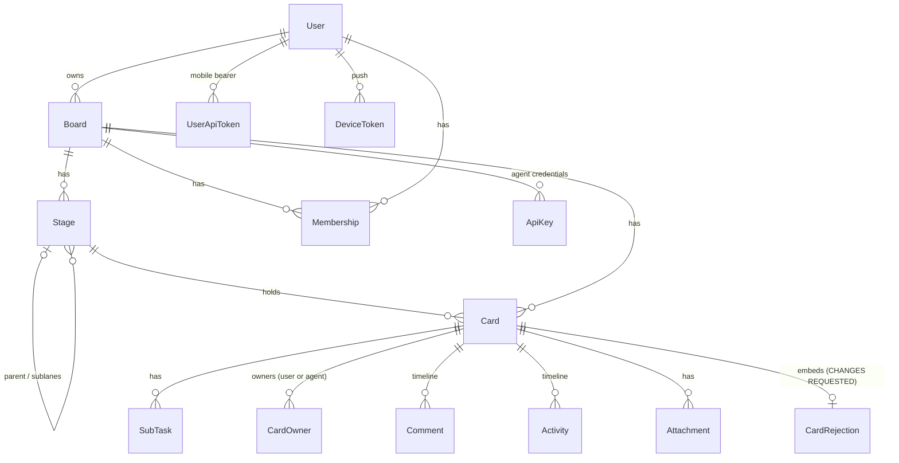

# Domain model

Every context is a `Boundary` sub-boundary declared in `lib/relay.ex` and listed in
`Relay`'s `exports` — that list is the authoritative context inventory; this page annotates
it. Schemas live in the `Schemas` peer (ADR 0002) so web and domain share structs without
sharing behavior.

## Contexts

- **Boards** — boards and their stage tree (stages, sub-lanes, review gates, WIP limits,
  `ai_enabled`). Stage/config semantics: [ADR 0003](../adr/0003-card-state-stage-type-validity.md).
- **Cards** — the card lifecycle: create/edit/move/archive, status (`working`,
  `needs_input`, …), sub-tasks, spec/plan/branch/pr fields, approve/reject, needs-input
  questions. Card state × stage validity is governed by
  [ADR 0003](../adr/0003-card-state-stage-type-validity.md); ownership and the claim rule
  by [ADR 0004](../adr/0004-card-ownership-and-the-claim-rule.md); derived agent health
  (`Cards.health/1`, 90s `STALE_AFTER`) and the four-bucket needs-you rollup
  (`needs_input` / `in_review` / `awaiting_human` / `agent_stalled` — RLY-148) surfaced by
  `GET /api/board` and the boards-home badges.
- **Members** — board membership; who can see and act on a board.
- **Accounts** — users and Google sign-in (`GoogleTokenValidator` verifies native mobile
  tokens); user API tokens for `/api/all`.
- **ApiKeys** — per-board agent credentials for the `/api` scope.
- **Activity** — the card timeline: comments, activity entries, and runner log rows.
  `Activity.LogSink` batches ref-tagged runner lines into one insert per burst;
  `Activity.Pruner` ages `:action` chatter out after 14 days (RLY-112).
- **AgentLog** — stateless live relay of runner feed lines to the board's log sheet
  (subscribe-only; no server buffer, no backfill — RLY-55).
- **Events** — the realtime seam: contexts broadcast semantic domain events after each
  successful mutation (never controllers/LiveViews), so LiveView and REST mutations share
  one notification path. See [runtime.md](runtime.md) for the topic/event vocabulary.
- **BoardWatch** — per-board monotonic version counter in ETS; bumped on every
  `Events.broadcast/2`, polled by the CLI to cheaply detect change (RLY-12).
- **Attachments** — file uploads onto cards, served by `AttachmentController`.
- **Push** — APNs notifications, dispatched off-caller via a `Task.Supervisor` so a status
  change never waits on Apple (RLY-81).
- **Markdown**, **Mailer**, **Repo** — rendering, mail, and Ecto plumbing.

Planned by [ADR 0006](../adr/0006-workflow-orchestration.md): **Flows** (workflow
definitions as data) and **Runs** (the execution engine + scheduler).

## Core schemas

A `Stage` may point at a `parent` (sub-lanes like `Spec:Review`) and a `reject_to_stage`
(where a rejection sends the card). `Scope` (not shown) is the per-request authorization
context threaded through web and API entry points.

---
*Sources of truth: `lib/relay.ex` (`exports`), `lib/schemas/*.ex`, ADRs 0002–0004.*
