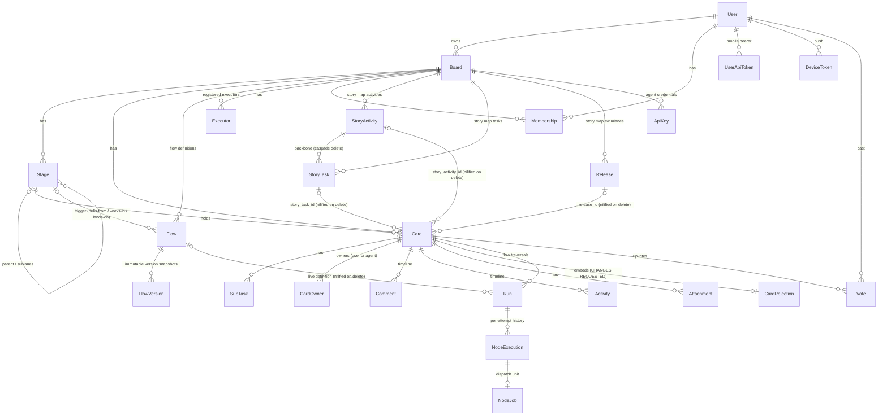

# Domain model

Every context is a `Boundary` sub-boundary declared in `lib/relay.ex` and listed in
`Relay`'s `exports` — that list is the authoritative context inventory; this page annotates
it. Schemas live in the `Schemas` peer (ADR 0002) so web and domain share structs without
sharing behavior.

## Contexts

- **Boards** — boards and their stage tree (stages, sub-lanes, review gates, WIP limits,
  `ai_enabled`). Stage/config semantics: [ADR 0003](../adr/0003-card-state-stage-type-validity.md).
  Also holds the RLY-69 public-board settings (`public_enabled` + `public_intake_stage_id`,
  written via `update_public_settings/2`) and `list_public_cards/1`, the public roadmap's
  card query (non-archived, stage category in `Stage.public_categories/0`).
- **Flows** — workflow definitions as declarative graph data (ADR 0006 / RLY-131): per-board
  rows in the `flows` table (`key`, `enabled`, `isolation`, `version`, three trigger stage FKs
  stored as ids with nilify-on-delete) with the node/edge graph embedded as jsonb; `"start"`/
  `"done"`/`"needs_input"` are edge sentinels (`"needs_input"` is `to`-only and parks the run —
  RLY-194); nodes carry an optional `timeout_minutes` (validated `> 0`) and an agent-only
  `expects_commits` boolean (default `false`, RLY-194) marking a node whose reported success
  `RunServer` may override if it produced no commits.
  Every node also carries a `reads`/`writes` **card-field contract** (RE244; vocabulary
  `Schemas.Card.contract_fields/0`) — `writes` is enforced at run time by
  `RunServer.override_missing_writes/4`, `reads` is advisory.
  The invariant that no `:agent`/`:gate`
  node in any shipped flow leaves `:failed` unrouted is enforced by
  `default_library_test.exs`.
  `Relay.Flows.seed_default_flows!/1` idempotently seeds the default spec/plan/code library
  (from `Relay.Flows.DefaultLibrary`, which **loads** `docs/designs/flows/*.json` at
  compile time via `@external_resource` — those files are the source of truth, and
  `Relay.Flows.Document` is the one serializer both they and the API go through)
  — `Boards.create_board/2` calls it after enabling the `Spec:Review`/`Spec:Done`/`Plan:Done`
  sub-lanes so every trigger resolves. Flows seed disabled; at most one enabled flow may pull
  from a stage (partial unique index). Nothing executes yet — the engine is the Runs card (02).
  **Versioning (RLY-152, absorbed into the flow editor card):** every flow's definition
  (nodes, edges, isolation) is versioned — `flows.version` holds the current number, and each
  version is snapshotted immutably into `flow_versions` (`belongs_to :flow`, `version`,
  `isolation`, embedded `nodes`/`edges`; no `updated_at`, never edited after insert). A flow
  always has a snapshot row for its current version — created on `create_flow/2`,
  `duplicate_flow/1`, and `seed_default_flows!/1`, and on every bump — the invariant a future
  Runs pin-to-version feature relies on. `save_definition/2` is the one path that changes a
  flow's definition after creation: it validates like `update_flow/2`, then bumps `version` to
  n+1 and writes a new snapshot **only if** the definition changed; a trigger-only change
  (including a stage rename) saves with no bump, since triggers are per-board wiring and not
  part of the versioned definition. `get_version/2` fetches an immutable snapshot by number;
  `mid_run_count/1` returns the real count of cards currently mid-run on a flow — runs whose
  status is active (`Schemas.Run.active_statuses/0`, i.e. running or parked) — and feeds both
  the flow-editor save note and the delete-confirm warning, so that number is defined once.
  **Serialization (RLY-241):** `Relay.Flows.Document` is the one serializer for a flow's canonical
  JSON document — `encode/1` (sparse: nil and schema-default fields omitted) and `decode/1`
  (dense: every node/edge field present, filled from the schema default, so `customized?/1`'s
  field-by-field comparison against the embedded structs stays exact). `decode ∘ encode` is a
  fixed point, which is what makes pull → push unchanged a no-op. Triggers serialize as stage
  **names**, not ids, so a document is portable across boards.
  `upsert_from_document/3` is the write path behind `PUT /api/flows/:key`: decode → key check →
  resolve trigger names → optional compare-and-swap on `version` → `create_flow/2` or
  `save_definition/2` → reconcile `enabled` through `enable_flow/1`/`disable_flow/1`, all in one
  transaction so a push never half-applies.
  The Flows settings tab (RLY-142) is backed by `customized?/1`
  (normalized nodes/edges/isolation comparison against the library — trigger wiring never
  counts), `default_key?/1`, `duplicate_flow/1` (disabled `<key>-copy` clone),
  `unique_key/2` (the `base`/`base-2`/… generator behind both `-copy` and the create form's
  prefilled key), create-from-scratch (RLY-158 — the tab's "+ New flow" panel collects a key,
  all three trigger stages and isolation, then calls `create_flow/2` with an empty
  `start → done` skeleton and hands off to the editor; the flow is created disabled, so
  creation can never breach the one-enabled-flow-per-stage rule), and
  `reset_to_default/1` (restores the shipped definition via `save_definition/2`, so a reset
  bumps the version and snapshots like any other save; triggers and `enabled` untouched), and
  `delete_flow/1` (RLY-221 — removes a flow from this board, disable-first: an enabled flow
  returns `{:error, :flow_enabled}`, a disabled one is deleted and the DB cascade nil-s each
  active run's `flow_id` (`runs.flow_id on_delete: :nilify_all`) and removes its version
  snapshots (`flow_versions.flow_id on_delete: :delete_all`); a deleted shipped default does
  not re-seed on the next deploy).
  `diff_from_default/1` structurally diffs a customized default flow against its shipped
  default (`nil` for a non-library key) — nodes grouped added/removed/changed (changed lists
  the differing fields), edges as `{from, to, on}` tuples grouped added/removed.
  **Editor (RLY-143):** `RelayWeb.FlowEditorLive`, a full-page LiveView at
  `/board/:slug/flows/:key`, edits a flow's working copy (nodes/edges/isolation/triggers) with
  inline validation against `Schemas.Flow.changeset/2`, saves through `save_definition/2`
  behind a "Save as v(n+1)" confirm modal, and offers the diff-vs-default / reset-to-default
  affordance for customized library flows. The graph is rendered by the shared
  `RelayWeb.FlowGraphComponents.flow_graph/1` function component (absolutely-positioned node
  divs + an SVG edge layer, `interactive?` toggles `phx-click`, accepts `node_states` for a
  later read-only reuse by the run panel) laid out by the pure, unit-tested
  `RelayWeb.FlowLayout.layout/2` (a deterministic vertical layout derived from graph
  structure alone: the `:succeeded` spine runs straight down a single column, off-spine
  rework nodes sit in a second column, and backward edges pack into right-hand gutter lanes —
  no stored coordinates, no dragging).
  **Requirements (RLY-182):** `Flows.node_requirements/1` is a pure graph read — the agent
  and skill names a flow's nodes name, with no executor knowledge. It lives here rather than
  in Runs because `Flows` may not depend on `Runs` (a boundary cycle the compiler rejects);
  `Runs` reads it to answer whether anyone can actually satisfy it.
- **Runs** — the workflow execution engine (ADR 0006 card 02 / RLY-132): a run executes a
  `Schemas.Flow` graph against a card as a supervised, Postgres-backed state machine. This
  boundary owns five things.
  **The engine** (`Relay.Runs.Engine` / `RunServer`): outcome routing, per-node `max_retries`,
  per-edge `max_loops`, the visit cap, the failure-signature breaker (whole-run), needs-input
  parking and restart resume — budgets are per-`foreach`-iteration.
  **The scheduler brain**: `Relay.Runs.Scheduler.plan/1`, a pure `Snapshot → Plan` behind a
  per-board `Scheduler.Server`; `capacity_diagnosis/1` turns an empty/silent roster into a verdict.
  **The read side**: `list_runs_for_card/1`, `latest_run/1`, `run_summaries_for_board/1`,
  `run_summary_for_card/1`, `happy_path/1`, `queued_flow/4`, `face_summary/4` — one shared
  private builder, so the summary shape is defined exactly once.
  **The board-health audit** (RE249): `Relay.Runs.audit/2` / `Relay.Runs.Audit.findings/2`, a
  pure function over runs (`:node_executions` preloaded) on the metrics' `metric_windows/0`
  vocabulary, answering *is this board's history clean?*; owns `severities/0`/`checks/0`, advisory.
  **The dispatcher seam**: the `Relay.Runs.Dispatcher` behaviour (`config :relay, :runs_dispatcher`).
  Card writes go through `Relay.Cards`, so ADR 0003/0004 rules apply automatically.
  Run/node/job statuses are in [state.md](state.md); dispatch, the executor, worktrees and the
  transport in [runner.md](runner.md); the failure grid in [failures.md](failures.md). Why:
  [ADR 0006](../adr/0006-workflow-orchestration.md), [ADR 0007](../adr/0007-card-lifecycle-and-failure-states.md); per-function detail in the `Relay.Runs` `@moduledoc`.
- **Cards** — the card lifecycle: create/edit/move/archive, status (`working`,
  `needs_input`, `failed`, …), sub-tasks, spec/plan/branch/pr fields, approve/reject,
  needs-input questions. `failed` (RLY-179) is set only by `Relay.Cards.mark_failed/3` when a
  run ends terminally — a separate path from `needs_input`'s genuine question. Card state ×
  stage validity is governed by
  [ADR 0003](../adr/0003-card-state-stage-type-validity.md); ownership and the claim rule
  by [ADR 0004](../adr/0004-card-ownership-and-the-claim-rule.md); derived agent health
  (`Cards.health/1`, 90s `STALE_AFTER`) and the four-bucket needs-you rollup
  (`needs_input` / `in_review` / `awaiting_human` / `agent_stalled` — RLY-148) surfaced by
  `GET /api/board` and the boards-home badges. A move that would strand a live run
  (`Cards.stranded_run/2`: an active run whose flow `works_in_stage` is not the destination) is
  refused up front with `{:error, :would_strand_run}` — `POST /api/cards/:ref/move` maps it to
  **409 `would_strand_run`** (RLY-217); the board pre-checks and confirms instead of surfacing
  the raw error.
- **Members** — board membership; who can see and act on a board.
- **Presence** (`Relay.Presence`) — who is looking at a board's **story map** right now, and
  where their pointer is (RE257); the app's first `Phoenix.Presence` context, supervised
  directly after `Phoenix.PubSub`. Two board-scoped topics it owns outright:
  `story_map_presence:<board_id>` (the roster, via Phoenix.Presence's diff protocol) and
  `story_map_cursor:<board_id>` (the ephemeral cursor stream). **Neither goes through
  `Relay.Events`** — that bumps the board version on every call, so a 20 Hz cursor would make
  the CLI refetch the whole board on every mouse twitch; `Relay.PresenceTest` pins the version
  as unchanged after a track, a cursor and a view write. Tracked by **user id**, so one person
  with three tabs is one avatar; tracking happens only for `live_action == :story_map`
  (the kanban board renders no presence UI), and untracking is the tracked pid's exit.
  Humans only — no AI/agent avatar and no agent cursor.
- **Accounts** — users and Google sign-in (`GoogleTokenValidator` verifies native mobile
  tokens); user API tokens for `/api/all`.
- **ApiKeys** — per-board agent credentials for the `/api` scope.
- **Activity** — the card timeline: comments, activity entries, and runner log rows.
  `Activity.LogSink` batches ref-tagged runner lines into one insert per burst;
  `Activity.Pruner` ages `:action` chatter out after 14 days (RLY-112).
- **AgentLog** — stateless live relay of runner feed lines to the board's log sheet
  (subscribe-only; no server buffer, no backfill — RLY-55).
- **Events** — the realtime seam: contexts broadcast semantic domain events after each
  successful mutation (never controllers/LiveViews), so LiveView and REST mutations share
  one notification path. See [runtime.md](runtime.md) for the topic/event vocabulary.
- **BoardWatch** — per-board monotonic version counter in ETS; bumped on every
  `Events.broadcast/2`, polled by the CLI to cheaply detect change (RLY-12).
- **Attachments** — file uploads onto cards, served by `AttachmentController`.
- **Push** — APNs notifications, dispatched off-caller via a `Task.Supervisor` so a status
  change never waits on Apple (RLY-81).
- **Votes** — public upvotes (RLY-69): a unique `(card_id, user_id)` row; `toggle_vote/2`
  toggles and broadcasts `{:vote_changed, card_id}`. A card's supporters are the voting users.
- **StoryMap** (`Relay.StoryMap`) — the board's second lens (RE265), orthogonal to stages:
  `Schemas.StoryActivity` (big user goals, left to right), `Schemas.StoryTask` (the backbone,
  ordered within an activity; `board_id` denormalized so every read is one board-scoped
  `where`), and `Schemas.Release` (the swimlanes — a **new axis orthogonal to stage**; every
  board is seeded with `Schemas.Release.seed_names/0` by `Boards.create_board/2`, every
  pre-existing board by the `backfill_story_map_releases` migration, which carries the one
  deliberately frozen copy of that list). Cards carry three nilable FKs —
  `story_activity_id`, `story_task_id`, `release_id` — plus (RE262) `story_map_position`, all
  cast only through `Schemas.Card.story_map_changeset/2`, starting fully UNMAPPED, with release
  independent of activity/task. *A set `story_task_id` implies the matching `story_activity_id`*, enforced by
  derivation in `assign_card/2` (the task supplies its activity; a conflicting one passed
  alongside is ignored), by `update_task/2` (moving a task to another activity rewrites its
  mapped cards' `story_activity_id` in the same transaction), and by the changeset as a
  backstop. Deleting structure **unmaps**
  cards, never deletes them (`cards → structure` is `nilify_all`, `activity → its tasks` is
  `delete_all`). **Deleting is refused outright (`{:error, :not_empty}`) while any non-archived
  card still points at the structure (RE261)** — checked in the delete's own transaction, so
  the cascade above is now only reachable for an already-empty structure. `move_task/3` is the
  single task-repositioning entry point (activity change + renumber, one transaction, one
  broadcast); `insert_before/3` is the pure "remove and re-insert before the target" ordering
  rule every header drop shares.
  Structure writes broadcast `{:story_map_changed, board_id}`; assignment reuses
  `{:card_upserted, card}` via `Cards.notify_upserted/1`. `Relay.Boards` deliberately does
  **not** depend on this context — `StoryMap → Cards → Boards` already exists, so the reverse
  edge would close a boundary cycle; the release seed therefore lives in `Boards`.
  **View (RE264, RE263):** the backbone × releases grid at `/board/:slug/story-map`, a
  `:story_map` live_action on `RelayWeb.BoardLive` rather than its own LiveView — clicking a
  card must open the card drawer *in place*, and the drawer's ~50 assigns and ~40 event
  handlers live in `BoardLive`; a separate LiveView could only honour that by duplicating them
  or extracting the drawer's whole state machine. The grid itself is isolated: the pure,
  unit-tested `RelayWeb.StoryMapGrid.build/7`
  (`(activities, tasks, releases, cards, draft, hide_tasks?, collapsed)` → bands, columns,
  lanes, cells, unmapped —
  every card accounted for exactly once in one of three places: a `cells` entry, the tray, or
  the `count` of exactly one collapsed stub column; an activity-less card in the tray, a
  release-less mapped card
  in the LAST lane, a release-less board in one synthetic `(No release)` lane) plus
  `RelayWeb.StoryMapComponents` for the render.
  `RelayWeb.CoreComponents.board_view_tabs/1` is the Board ↔ Story map switch.
  **Create (RE263):** three affordances — a trailing `＋` add-activity column, a per-activity
  `＋ Add task`, and an `＋ Release` row — all committing through one `inline_name_input/1`.
  Which one is open is the single `:story_map_draft` assign on `BoardLive`
  (`nil | :activity | :release | {:task, activity_id}`, one draft at a time board-wide), and it
  is the `draft` argument to `build/7`: the draft materializes a `"draft:<activity_id>"` column
  that carries no `cells`, and every column gains `bare?` / `draft?`. Names are trimmed and
  capped by `Schemas.StoryActivity.max_name_length/0` — the one definition, shared by
  `StoryTask` and `Release`, so an over-long paste is an error changeset rather than a Postgrex
  22001 crash. On an archived board the four write events are refused *and* the affordances are
  not rendered (`read_only`, the same attr name and behaviour as the stage column's compose
  `＋`).
  **Assignment (RE262):** the map is writable — drag a card between cells, drag it out of or
  onto the UNMAPPED tray, and an inline `＋` per cell that creates a real board card in
  `Boards.intake_stage/1` (the board's first top-level stage by position — the one definition of
  "where a card created outside a column lands") and places it. `StoryMap.assign_card/2` takes
  an optional 0-based `:position` and renumbers the whole target DB cell `1..n` in one
  transaction; `unassign_card/1` nils the position with the three FKs, so a card in the tray has
  no story-map position. `RelayWeb.StoryMapGrid.decode_placement/2` parses the column/lane keys
  that same module defines, and the `StoryMapDnD` hook (`assets/js/hooks/story_map_dnd.js`)
  pushes `{ref, column, lane, index}` — no optimistic client move, so a second tab follows for
  free.
  **Edit (RE261):** the structure is editable in place — click a name to rename (one open
  rename page-wide, the `:story_map_edit` / `:story_map_edit_name` assigns, mutually exclusive
  with the create draft, and a blank name cancels rather than writes); a ✕ per structure that is
  `disabled` and greyed while it still holds cards, its tooltip naming the count
  `RelayWeb.StoryMapGrid` renders (`columns[].count` joins the existing `bands[].count` and
  `lanes[].count`, so display and guard come from one number) and the board's last release
  showing no ✕ at all; and drag-reorder by header — the `StoryMapDnD` hook gains a second
  draggable kind (`.story-map-header[data-kind][data-id]`, dropping on
  `.story-map-header-drop`) that pushes `story_map_reorder` with **ids only**, and `BoardLive`
  computes the order with `StoryMap.insert_before/3` and writes through
  `reorder_activities/2`, `move_task/3` or `reorder_releases/2`. Reordering releases moves the
  last-lane fallback with it, which is a display move only — no stored `release_id` changes.
  Every new event joins the `read_only?` guard list and none of the affordances render on an
  archived board.
  **Zoom (RE260):** two view-only chrome controls, both keys of the **shared view** below — they
  change grid geometry, and RE257's raw-pixel cursors are measured in it, so viewers who
  disagree see each other's cursor over the wrong card. `:story_map_zoom` is the closed set
  `RelayWeb.StoryMapComponents.zoom_levels/0` (`:map` | `:compact` | `:full`, defaulting to
  `:compact`) parsed off the wire by `parse_zoom/1`; it reaches only the renderer, which sizes
  the card face — Map is a title-only chip, Full adds the meta row and progress bar.
  `:story_map_hide_tasks` is the sixth argument to `build/7`: it collapses each activity's task
  columns into one merged `"m:<activity_id>"` column (the fourth column-key shape
  `decode_placement/2` parses, alongside `"t:"`, `"nt:"` and `"draft:"`). Dropping a card into a
  merged column keeps its `story_task_id` when that task still belongs to the target activity —
  a purely vertical drag changes release only and must not silently unset the task; the
  activity is then derived from the task by `StoryMap.resolve_placement/2`.
  **Filter & focus (RE259):** the artboard's filter bar plus two view-narrowing controls,
  four more keys of the shared view below. `RelayWeb.StoryMapFilter` is the pure model beside
  `StoryMapGrid`: it owns the **owner-key wire format** (`"agent"`, `"u:<user_id>"`) exactly
  once, builds the bar's chip set (every owner of a card on this map **union** every selected
  key, so a selection stays clearable after its last card moves away), and answers the
  predicate — owner and Needs-input compose with AND, an empty selection means every owner,
  and a card passes when **any** of its owners is selected. "Needs input" is strictly
  `Relay.Cards.needs_input?/1`, the one definition that the `NEEDS YOU` badge also reads.
  Filtering is a **pre-pass** in `BoardLive`: the grid is built from the visible cards, so no
  placement rule knows filtering exists and every count the map already draws narrows with it.
  **Hide complete (RE276):** an eighth key, and the first defaulting to ON — the map opens
  showing only incomplete cards. It is a third AND term in `StoryMapFilter.visible/4`, a
  `MapSet` of stage ids to exclude; `BoardLive` resolves what "complete" means at the pre-pass
  (`Relay.Boards.top_level_done_stage_ids/1` — any top-level `:complete` stage, deliberately
  NOT `Cards.done?/2`, which is the terminal stage's `:ready` cards and drives the
  strikethrough) so the filter module stays pure. `Clear` therefore resets to the board's
  DEFAULTS via `StoryMap.filter_keys/0`, not to "everything off", and
  `StoryMap.filters_active?/1` is the one answer to "is a filter on"
  (`RelayWeb.StoryMapFilter.active?/2` is gone).
  Collapse and focus reach the grid as one MapSet through
  `RelayWeb.StoryMapGrid.collapsed_set/3` — focus IS a collapse of everything else, and the
  focused activity is never in the set, so no stored state can blank the map; an unresolvable
  focus id is no focus (`resolve_focus/2`). A collapsed activity contributes one
  `"c:<activity_id>"` stub column and no band, and `decode_placement/2` has no `"c:"` clause,
  so a stub can never be a CARD drop target — it stays a RE261 header-reorder source and target,
  as the artboard's stub does. The map's no-card-can-disappear invariant becomes a
  three-way partition — cells, tray, or exactly one stub's count — that sums to `total`.
  Like zoom and the tray, none of the six events is in the `read_only?` guard list: view state
  is not board data.
  **Shared view (RE257):** the map's view settings are **board-wide**, stored in the
  `boards.story_map_view` jsonb column and written only through `merge_view/2`, which
  `put_view/3`, `toggle_view/2` and `toggle_view_member/4` all compose.
  `view_defaults/0` is the one definition of the key set (the eight keys in
  [`state.md`](state.md)), `view/1` merges it
  under the stored map dropping unknown keys, and every writer refuses a key outside the set
  with `{:error, :unknown_key}` and re-read the row before merging so a concurrent write is
  not clobbered. `toggle_view/2` exists so a boolean flip is computed on the **committed row**:
  a LiveView's assign only catches up when it handles the broadcast, which lands behind any
  click already queued, so two fast clicks on `put_view(…, not assign)` would make one toggle.
  It broadcasts `{:story_map_view_changed, board_id, view}` on
  `story_map_view:<board_id>` — again outside `Relay.Events`, same no-version-bump rule. There
  is deliberately no optimistic local assign: the clicker re-renders from the same broadcast
  everyone else does, so viewers cannot disagree. `story_map_draft` / `story_map_draft_name` /
  `story_map_compose` stay **per-tab** (RE263) — sharing them would hand one person the ability
  to clear another's in-progress input.
- **Markdown**, **Mailer**, **Repo** — rendering, mail, and Ecto plumbing.

## Core schemas

```mermaid
erDiagram
    User ||--o{ Board : owns
    Board ||--o{ Stage : has
    Stage |o--o{ Stage : "parent / sublanes"
    Stage ||--o{ Card : holds
    Board ||--o{ Card : has
    Board ||--o{ Flow : "flow definitions"
    Stage |o--o{ Flow : "trigger (pulls-from / works-in / lands-on)"
    Flow ||--o{ FlowVersion : "immutable version snapshots"
    Card ||--o{ SubTask : has
    Card ||--o{ CardOwner : "owners (user or agent)"
    Card ||--o{ Comment : timeline
    Card ||--o{ Activity : timeline
    Card ||--o{ Attachment : has
    Card ||--o| CardRejection : "embeds (CHANGES REQUESTED)"
    Card ||--o{ Run : "flow traversals"
    Flow |o--o{ Run : "live definition (nilified on delete)"
    Run ||--o{ NodeExecution : "per-attempt history"
    NodeExecution ||--o| NodeJob : "dispatch unit"
    Board ||--o{ Executor : "registered executors"
    Board ||--o{ Membership : has
    Board ||--o{ StoryActivity : "story map activities"
    Board ||--o{ StoryTask : "story map tasks"
    StoryActivity ||--o{ StoryTask : "backbone (cascade delete)"
    Board ||--o{ Release : "story map swimlanes"
    StoryActivity |o--o{ Card : "story_activity_id (nilified on delete)"
    StoryTask |o--o{ Card : "story_task_id (nilified on delete)"
    Release |o--o{ Card : "release_id (nilified on delete)"
    User ||--o{ Membership : has
    Board ||--o{ ApiKey : "agent credentials"
    User ||--o{ UserApiToken : "mobile bearer"
    User ||--o{ DeviceToken : "push"
    Card ||--o{ Vote : upvotes
    User ||--o{ Vote : cast
```

A `Stage` may point at a `parent` (sub-lanes like `Spec:Review`) and a `reject_to_stage`
(where a rejection sends the card). `Scope` (not shown) is the per-request authorization
context threaded through web and API entry points.

A `Card` additionally carries an optional story-map placement — `story_activity_id`,
`story_task_id` and `release_id`, all nilable, all nilified rather than cascaded when the
structure they point at is deleted. Release is a **new axis orthogonal to stage**: a card has
both.

A `Card` also carries `story_map_position`: its order **within its story-map cell**, nullable
and independent of `cards.position` (its order within its stage column). The two orderings never
affect each other — dragging on the map rewrites one, dragging on the board the other. `nil`
means nobody has ordered the card on the map yet, and nil sorts **last** inside a cell. Placing a
card renumbers its whole target cell, and the **siblings** are renumbered with a bare
`update_all` so their `updated_at` is untouched — that column is the recency proxy behind the
Done column's render window and the needs-you feed, both board-lens orderings that would
otherwise be silently reshuffled by a drag on the map.

---
*Sources of truth: `lib/relay.ex` (`exports`), `lib/schemas/*.ex`, ADRs 0002–0004, 0006.*
