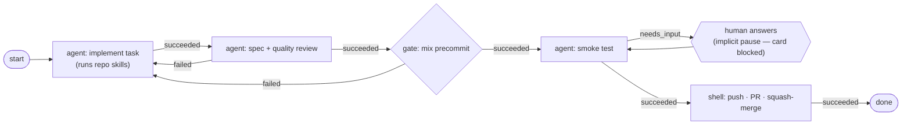

# The runner: how work physically gets done

**Today's system.** [ADR 0006](../adr/0006-workflow-orchestration.md) landed a server-side
flow engine + thin executor for every stage — Spec (RLY-136), Plan (RLY-138), and Code
(RLY-139, this doc's most recent cutover). The legacy board-runner (`relay watch`,
`relay_config.json`, `.claude/workflows/execute-plan.js`) is **deleted**; there is no
fallback dispatcher to describe. The executor lives on a developer machine — it needs the
checkout, git worktrees, and the `claude` CLI — and talks to the deployed app only through
the board-key REST API.

`bin/relay` (Python, single file) is two things:

1. **A CLI** for every card operation an agent needs (`card`, `move`, `comment`,
   `needs-input`, `approve`, …) — the surface documented in
   [`../agent-integration.md`](../agent-integration.md).
2. **`relay execute`** — the only runner mode: a poll loop that claims node-jobs from the
   server and runs them (see "Executor mode" below).

## Dispatch is server-side

A sketch of a Code flow in this model (edges labeled with the outcome that routes them):

A card in any AI-enabled stage is dispatched by `Relay.Runs.Scheduler` (folding over every
enabled `Flow` on the board, rightmost `works_in` stage position first) straight to the
node-job engine (`Relay.Runs`) — no per-stage config file, no board-runner poll loop.
`relay execute` claims the resulting `NodeJob` rows over the node-job REST API (below) and
runs whatever node it is handed; it knows nothing about stages, columns, or which flow a
job belongs to. Board-specific facts (stages, prompts, per-node budgets) live entirely in
`Flow`/`Flow.Node`/`Flow.Edge` rows, seeded from
[`docs/designs/flows/`](../designs/flows/README.md) and editable in Settings › Flows.

**Shared-budget arbitration: rightmost flow wins ties.** `Relay.Runs.Capacity` keys free
slots `executor_id => %{shared_clean: n, exclusive: n}` **per isolation class, not per
flow** (`capacity.ex:5-7`), and `Relay.Runs.Scheduler.plan/1` threads one shared capacity
accumulator through its fold, sorted rightmost `works_in` stage position first
(`scheduler.ex:38-45`, rule documented at `scheduler.ex:9-13`). So when two flows share an
isolation class and both have eligible cards under scarce capacity, the flow closer to Done
draws first — intended WIP discipline, not starvation, even though under real scarcity it
looks like the leftward flow is being starved. Pinned by
`test/relay/runs/scheduler_test.exs` and exercised live over the REST API by
`test/relay_web/api/plan_flow_e2e_test.exs` / `test/relay/runs/code_flow_e2e_test.exs`.

## Side channels

- **Log mirror**: every feed line is queued to a background `LogForwarder` thread that
  batches `POST /api/board/logs` (best-effort: drops on full queue, swallows all errors) —
  landing in `Activity.LogSink` → the card timeline, and `AgentLog` → the live log sheet.
- **Executor heartbeat (client-side only)**: `ExecutorHeartbeat` posts `{executor,
  running: [job-ids]}` to `POST /api/node-jobs/heartbeat` every `heartbeat_interval`s,
  expecting `{revoked: [job-ids]}` back so it can terminate each revoked job's live
  subprocess (see "Node-job transport" below) — but no server route exists yet
  (`router.ex` registers only `/node-jobs/claim` and `/node-jobs/:id/outcome`), so the
  POST 404s and no subprocess is ever terminated. Revoke is DB-state-only today
  (`Relay.Runs.NoopDispatcher.revoke/1` → `:ok`); wiring the response is a follow-up.
- **Run ids**: each executor worker tags its log lines with the claimed job's `run_id`
  (RLY-112) so a card's timeline can group lines by run.

## Observability surface (RLY-177)

Read-only endpoints answering "why isn't this card moving?" without an `fly ssh console`
Ecto query, board-scoped like every other `/api` route (a ref/id on another board 404s,
never 403s):

- `GET /api/cards/:ref/diagnosis` (`RelayWeb.Api.DiagnosisController.show/2`) — one verdict
  plus the evidence behind it, produced by `Relay.Runs.diagnose/3`, the boundary-safe facade
  the web layer calls (`Relay.Runs`' exports list is unchanged by this surface, so
  `docs/architecture/domain.md` needed no edit). It in turn calls
  `Relay.Runs.Scheduler.explain/2`, which **replays** `Scheduler.plan/1`'s real dispatch
  decision — sharing its predicate functions — rather than reimplementing it, so the verdict
  cannot drift from what actually dispatches.
- `GET /api/cards/:ref/runs` (`RelayWeb.Api.RunController.index/2`) — the card's runs
  newest-first with `node_executions` preloaded, composing `Relay.Runs.list_runs_for_card/1`.
  `detail` and `failure_detail` are serialized **in full, never truncated** — the exact text
  a failing review's findings need to be readable for.
- `GET /api/executors` (`RelayWeb.Api.ExecutorController.index/2`) — composes
  `Relay.Runs.list_executor_status/2` (no second executor read): advertised capacity per
  isolation class, last heartbeat, the tri-state `freshness` (`Relay.Runs.executor_freshness/2`;
  `stale?` is the `freshness != :fresh` convenience flag), `version`/`outdated`
  (`Relay.Runs.executor_outdated?/1` — orthogonal to freshness, since a refused executor can
  still be beating normally), and the jobs each executor currently holds.
- `GET /api/version` (`RelayWeb.Api.VersionController.show/2`) — the git SHA the running app
  was built from, baked in at image build time (`Dockerfile`'s `final` stage, fed by
  `.github/workflows/ci.yml`'s `flyctl deploy --build-arg`). Unauthenticated, on the plain
  `:api` pipeline — it leaks nothing a deploy does not.
- CLI: `bin/relay why REF` / `bin/relay runs REF` / `bin/relay executors` /
  `bin/relay version`, documented in [`../agent-integration.md`](../agent-integration.md).

## Bootstrap surface (RLY-181)

Three **public, unauthenticated** endpoints, served by
`RelayWeb.ScaffoldController`. They are the only Relay endpoints with no board key,
deliberately: a fresh project has none yet, and the payload is the same content as the
public repo.

- `GET /api/scaffold` (`.scaffold/2`) — one JSON document,
  `{scaffold_version, cli_version, files: [{path, mode, content}]}`, with **every file's
  content inline**. There is no `?path=` parameter, so the endpoint has no
  path-traversal surface. The file list is an explicit allowlist in the controller —
  the seven Code-flow agents, the `brainstorm` skill and `write-plan` command the Spec
  and Plan flows name, the four skills those invoke, `.relay/executor.json`, and a
  starter `AGENTS.md`/`CLAUDE.md`. Relay-only files do not ship.
- `GET /install/relay` (`.cli/2`) — `bin/relay` itself as `text/plain`, with an
  `X-Relay-CLI-Version` header taken from the script's own `VERSION` constant.
- `GET /install` (`.install/2`) — a POSIX `sh` bootstrap that curls the above into
  `bin/relay` and runs `bin/relay init`. The host is interpolated from the request's own
  URL, so a script fetched from a host always points back at that host.

The payload is embedded at compile time through the committed symlinks
`priv/scaffold/claude -> ../../.claude` and `priv/scaffold/relay -> ../../bin/relay`
(the pattern `priv/docs/architecture -> ../../docs/architecture` established), so the
repo's real files remain the single source of truth and there is no copy step.

## Node-job transport (RLY-134, ADR 0006 card 04)

The first slice of ADR 0006's target shape: a pure REST transport on top of the runs engine
(W5, `Relay.Runs`), board-key auth like the rest of `/api`, no scheduling/dispatch policy —
that stays server-side.

- `POST /api/node-jobs/claim` (`RelayWeb.Api.NodeJobController.claim/2`) — upserts the
  advertising executor (a claim doubles as a liveness touch, via
  `Relay.Runs.upsert_executor/2`) then atomically claims the oldest eligible `queued`
  `NodeJob` (`Relay.Runs.claim_next_job/1`, `SELECT … FOR UPDATE SKIP LOCKED`). Long-polls
  up to ~25s on the `board:<id>:runs` topic when nothing is immediately claimable (`?wait=0`
  short-polls instead); serialises the raw `run` + resolved `vars` W5 already stored, never
  a worktree path. **Eligibility respects exclusive affinity (ADR 0006 §5):** an *unpinned*
  job (`executor_name` nil) needs advertised free capacity in its isolation class, but a job
  *pinned* to the requesting executor (`executor_name` = its name) is claimable regardless of
  advertised capacity — the executor is already holding that run's bound worktree slot.
  Pinning is set at enqueue: `Relay.Runs.insert_job!/3` pins every job of an `exclusive` run
  after the first to the executor that claimed the first, so an `exclusive` run's later nodes
  and its needs-input **resume** always return to the machine holding its worktree (and a
  parked run whose holder advertises `exclusive: 0` can still be handed its own resume — the
  fix for the affinity deadlock; the executor keeps polling while it holds bound slots via
  `ExecutorPool.has_bound_slots/0`).
- **Version negotiation (RLY-184).** Every claim and heartbeat carries `executor.version`, the
  `EXECUTOR_VERSION` the running `bin/relay` declares. `claim/2` compares it against
  `Relay.Runs.min_executor_version/0` and answers **409 `executor_outdated`** (with `required`
  and `running`) instead of handing out work — claim is the only call that dispenses jobs, so
  that is the load-bearing check. `nil` counts as outdated: an executor sending no version
  predates the card. `heartbeat/2` deliberately still **succeeds** for an outdated executor —
  the beat is how it stays on the roster and how revokes still reach it — and its reply carries
  `executor_outdated` / `required_version`. A refused executor stays alive, advertises
  `{"shared_clean": 0, "exclusive": 0}` so nothing queues behind it, finishes in-flight work,
  and wears an `OUTDATED` badge on the runners view until a human restarts it.
- `POST /api/node-jobs/:id/outcome` (`.outcome/2`) — `Relay.Runs.get_claimed_job/2` (board-
  scoped, 409 `conflict` if the job isn't `claimed`/`running`), then
  `Relay.Runs.report_outcome/2` against the closed outcome set (422 `unknown_outcome`
  otherwise). The four outcomes and what each does to the run and the card are tabulated in
  the [state reference](state.md).
- **The wire contract is pinned by a fixture.** `test/fixtures/executor_contract.json` is
  generated from these routes by
  `test/relay_web/controllers/api/executor_contract_test.exs` (never hand-edited) and read by
  `bin/test_relay.py`, so both suites assert against one shape instead of each side's idea of
  the other (RLY-176). Renaming a claim field, or changing what the outcome/heartbeat bodies
  carry, breaks CI on the next run. Regenerate with
  `RELAY_WRITE_CONTRACT_FIXTURE=1 mix test test/relay_web/controllers/api/executor_contract_test.exs`,
  which rewrites the file and still fails so the diff gets reviewed.
- **Executor heartbeat superset.** `BoardController.heartbeat/2`'s `/api/board/heartbeat`
  route carries an independent, additive branch: a beat carrying `name` + `capacity` calls
  `Relay.Runs.upsert_executor/2`, writing/refreshing a durable `Schemas.Executor` row
  (`{board_id, name}`, capacity map, `last_heartbeat`). It still calls
  `Relay.RunnerPresence.beat/2` exactly as before, feeding the Runners view (RLY-141). A
  capacity-less beat never touches the `Executor` table.
- **Capability inventory (RLY-182).** The executor heartbeat may carry an optional
  `capabilities` payload — `{"agents": [...], "skills": [...]}`, the names this machine can
  actually resolve from its repo `.claude/`, the user-level `~/.claude/`, and the CLI's
  built-in agents. `bin/relay`'s `collect_capabilities()` enumerates BOTH `skills/<name>/SKILL.md`
  and `commands/<name>.md`, because a slash command can live in either (`/write-plan` lives
  only in `commands/`). It rides **send-on-change, not every beat**: the executor hashes the
  inventory each beat and includes the key only when the hash differs from the last
  successfully-acknowledged send, so a failed POST retries on the next beat. The server
  persists it on `executors.capabilities`, where **null means never reported** and is
  deliberately distinct from `{}` (reported, and empty). Because a beat that omits the key
  must never erase a stored value, `Relay.Runs.upsert_executor/2` builds its `on_conflict`
  replace list dynamically. For the case where the server genuinely has none (recreated row,
  or an executor predating this change), the heartbeat **response** carries
  `want_capabilities: true`; the executor clears its cached hash and resends on the next beat.
  `Relay.Runs.preflight_flow/1` reads the stored inventory.
- **Executor liveness + reclaim.** `Relay.Runs.ExecutorReaper` (supervised, see
  [`runtime.md`](runtime.md)) periodically calls `Relay.Runs.reclaim_stale_executors/0`:
  a stale executor's (`Relay.Runs.executor_stale?/2`) in-flight `shared_clean` jobs go back
  to `queued`; its `exclusive` runs are parked (`Relay.Runs.park_for_reclaim/1`,
  `parked_reason: :executor_gone`) rather than requeued, since exclusive runs are pinned to
  one executor's worktree.
- **Log `node_job_id` convergence.** `POST /api/board/logs` entries may carry an optional
  `node_job_id` alongside `run_id` — same nullable-string shape, not an FK. It rides through
  `Relay.AgentLog.stamp/1` → `Relay.Activity.LogSink.row/2` → `activities.node_job_id`, kept
  for W6's run panel to key log lines off a specific node-job.
- The full outcome-file contract (`RELAY_NODE_OUTCOME`) executors must honor is documented in
  [`../agent-integration.md`](../agent-integration.md#node-job-protocol-adr-0006).

## Run recovery surface (RLY-189)

A terminally `failed` run can be re-entered by a human — the branch, worktree, execution
history and executor pin all survive, because retry **revives the dead run in place** rather
than starting a new one. Re-entry (`RunServer.handle_continue({:reenter, _})`) never consults
the flow's start edge, so the Code flow's destructive `branch` node is unreachable from a
retry by construction, and finished commits cannot be thrown away.

- `POST /api/runs/:id/retry` (`RelayWeb.Api.RunController.retry/2`) — id-addressed.
- `POST /api/cards/:ref/retry` (`.retry_card/2`) — ref-addressed alias resolving the card's
  most recent run; what `relay retry <ref>` calls. Both take an optional `{"at": "<node_key>"}`
  body and funnel into `Relay.Runs.retry_run/2`.

Success is `200 {"data": {"status": "ok", "run_id", "node", "retries"}}`. A refusal is
`422 {"error": {"code", "message"}}` where `code` is one of `not_failed`, `active_run_exists`,
`no_flow`, `unknown_node`, `executor_unavailable` — the message names the specific status,
node key or executor that blocked it. An unknown run/card, another board's run, or a card
that has never run is `404`.

The guard is split, because worktrees and branches are executor-side state Phoenix cannot
see. Server-side, the endpoint refuses up front for the five reasons above — including an
`exclusive` run whose pinned executor is absent or stale per `Relay.Runs.executor_stale?/2`,
whose worktree is unreachable. Executor-side, branch existence stays with RLY-166's
`check_branch_attached` and RLY-173's `reattach_branch`; a retried job whose branch was
deleted fails there with a clear message. Neither half ever silently restarts from
`origin/main`.

CLI: `relay retry <ref> [--at NODE] [--json]`. On a refusal it prints the server's message to
stderr and exits non-zero.

## Executor mode (`relay execute`) (RLY-135, ADR 0006 card 05)

`bin/relay execute` is **the only runner mode**: a thin, board-agnostic client of the
node-job transport above. It knows the Relay REST API and how to execute a node-job;
nothing else — every board-specific fact lives server-side as flow data.

- **Config.** `.relay/executor.json` holds `name` (defaults to hostname), `namespace`
  (default `exec`), `capacity: {shared_clean, exclusive}`, `poll_timeout`,
  `heartbeat_interval`. Missing file → sensible defaults; capacity is the field a developer
  routinely edits.
- `bin/relay init [--url URL] [--force] [--dry-run] [--no-self-update]` scaffolds a
  project from `GET /api/scaffold`. It needs a **URL but no API key**. Idempotent:
  unchanged files are reported, edited ones are diffed and skipped unless `--force`.
  When the server's `cli_version` exceeds the script's `VERSION` constant it re-downloads
  `bin/relay` in place (upgrade-only) and says so.
- **Worktree namespace.** `ExecutorPool` maps every job's `isolation` onto worktrees under
  the `exec-*` namespace. `shared_clean` jobs share one reused `exec-clean` worktree (never
  reset per-job, only fast-forwarded to base when every shared slot is idle). `exclusive`
  jobs get a slot from a fixed `exec-work-1..N` pool, bound to a run from its first job
  until that run reaches a terminal `run_state` — the reset happens only on that first job,
  since a run's later nodes build on the diff its earlier nodes left in the worktree.
- **The claim/execute/report loop (`cmd_execute`).** Each iteration: advertise current free
  capacity per isolation class on a long-poll `POST /api/node-jobs/claim` (a read timeout is
  "no work", not an error); on a claim, hand the job to a worker thread bounded by the pool's
  free slots; the worker resets the slot if needed, runs the step (shell/gate via
  `_stream_shell`, agent via `_stream_claude_job`), and POSTs the typed outcome to
  `/api/node-jobs/:id/outcome`. `--once` drains a single claim→execute→report cycle and exits;
  `--dry-run` claims and mutates nothing (it only logs the capacity it would advertise);
  `--interval` overrides the configured poll timeout; SIGINT stops claiming new work and waits
  for in-flight workers to finish.
- **Heartbeat-borne revoke (not yet wired server-side).** `ExecutorHeartbeat` POSTs
  `{executor, running: [job-ids]}` to `POST /api/node-jobs/heartbeat` every
  `heartbeat_interval`s, expecting `{revoked: [job-ids]}` back so it can terminate each
  one's live subprocess via its `JobControl`. **In reality no server route exists yet** —
  the POST 404s, the client never sees a revoke list, and no subprocess is ever
  terminated. Revoke is DB-state-only (`Relay.Runs.NoopDispatcher.revoke/1` → `:ok`, the
  configured dispatcher per `config/config.exs:73`); the behavior described next is what
  happens once the response is wired, not what happens today. A
  revoked **exclusive** job resets its worktree (salvaging any leftovers via `git stash`,
  same as `reset_worktree` elsewhere), since that worktree is bound 1:1 to this job/run. A
  revoked **`shared_clean`** job leaves `exec-clean` untouched instead — that worktree is
  shared by other jobs still running concurrently, and resetting it would destroy their
  work; it's only ever fast-forwarded once every shared slot is idle. Either way, no outcome
  is reported for a revoked job — the server already knows a revoked job never finished.

### Agent node → `.claude/agents` definition

A flow node of type `agent` may name an `agent` (e.g. `plan-implementer`). The server
carries it in the job payload (`Relay.Runs.build_payload/4` → the claim response's
`agent`), and `bin/relay`'s `_stream_claude_job` appends `--agent <name>` to the
`claude -p` invocation: the agent file supplies the system prompt, the node's `run`
string stays the user prompt. An unknown name makes the CLI fail loudly rather than
silently fall back to the default agent (verified against CLI 2.1.214), which is the
property that makes this safe to depend on. A node with no `agent` invokes exactly as
it did before RLY-139.

**Fallback if `--agent` ever regresses:** delegate by name from the node's `run` prompt
— `"Use the spec-reviewer subagent to review …"`. It works today with zero new plumbing
and needs no schema change.

#### Escalating a plan-mandated finding (RLY-190)

A reviewer that finds a defect the code implements **faithfully because `plan.md` mandates it**
does not return `failed` into the fix loop. The implementer is instructed to follow the plan, so
neither side can yield: the loop burns its budget until `loop_budget_exhausted` or the circuit
breaker ends the run with a message describing the symptom and not the cause. Instead the
reviewer raises `needs-input` and stops **without declaring an outcome**, which parks the run for
a human. `spec-reviewer`, `quality-reviewer` and `final-reviewer` each carry this as a third
verdict beside Approve/Pass and Fix; `plan-implementer` uses the same route when the plan tells
it to build something it can see is wrong.

This needed **no engine change**. `needs_input` is decided before any edge is consulted
(`Relay.Runs.Engine`), so it consumes no `max_loops` budget, does not increment the visit count,
and is not degraded to `:failed`. The command itself reaches every agent node for free —
`bin/relay` appends its outcome contract, already rendered, to every agent prompt.

**The human's answer, not the plan, is authoritative for the remainder of the run.** This is a
deliberate decision, and the tempting alternative — have the human edit the card's plan and treat
the edited plan as authoritative — does not work:

- `plan.md` is materialized **once**, by the Code flow's `branch` node
  (`Relay.Flows.DefaultLibrary`), and no later node ever re-writes it.
- `sub_tasks` are seeded from `card.plan` at **run start only**, and are deliberately never
  re-materialized on re-entry so that done-state isn't wiped (`Relay.Runs`).
- Re-entry replays the **same node, same visit, fresh attempt** with the agent's claude session
  resumed (`RunServer.enter_same_node!`), and the prompt is byte-identical to the parked
  attempt's — `build_payload` exposes no `answer` variable.

So editing the plan mid-run changes nothing any node reads. The answer arrives as a **card
comment** (`Cards.answer_input/3`) and the resumed reviewer reads it with `relay card <ref>`.
`plan.md` and `card.plan` stay stale by design; any lasting plan correction is a **follow-up
card**, not a mid-run mutation.

Escalation is deliberately rare: Fix remains the default, and a reviewer may escalate only when
it can quote the plan text that mandates the defect — the test being *"can the implementer act on
this without contradicting the plan?"*. A reviewer that escalated because a finding was merely
hard would convert a self-healing loop into a human queue. On resume the reviewer resolves rather
than re-parking: "fix it anyway" returns Fix with the authorization quoted verbatim (which the
implementer is instructed to treat as outranking `plan.md` for that task), "waive it" returns
Approve with the waiver and follow-up recorded.

The contract lives inline in each of the four `.claude/agents/*.md` files rather than in a shared
reference file, because those files ship to other projects through the RLY-181 scaffold manifest
as single files with no `references/` siblings.
`test/relay/agents/escalation_contract_test.exs` pins the markers so an edit can't silently drop
the contract.

---
*Sources of truth: `bin/relay`, `.relay/executor.json`, `bin/test_relay.py`,
`lib/relay_web/controllers/api/node_job_controller.ex`, `lib/relay/runs.ex`,
`lib/relay_web/controllers/api/board_controller.ex`,
`lib/relay_web/controllers/scaffold_controller.ex`,
`lib/relay_web/controllers/api/run_controller.ex`,
`lib/relay_web/controllers/api/executor_controller.ex`.*
