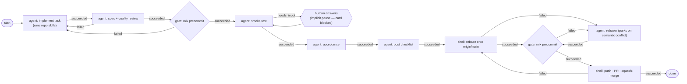

# The runner: how work physically gets done

**Today's system.** [ADR 0006](../adr/0006-workflow-orchestration.md) landed a server-side
flow engine + thin executor for every stage — Spec (RLY-136), Plan (RLY-138), and Code
(RLY-139, this doc's most recent cutover). The legacy board-runner (`relay watch`,
`relay_config.json`, `.claude/workflows/execute-plan.js`) is **deleted**; there is no
fallback dispatcher to describe. The executor lives on a developer machine — it needs the
checkout, git worktrees, and the `claude` CLI — and talks to the deployed app only through
the board-key REST API.

`bin/relay` (Python, single file) is two things:

1. **A CLI** for every card operation an agent needs (`card`, `move`, `comment`,
   `needs-input`, `approve`, …) — the surface documented in
   [`../../relay.md`](../../relay.md).
2. **`relay execute`** — the only runner mode: a poll loop that claims node-jobs from the
   server and runs them (see "Executor mode" below).

## Dispatch is server-side

A sketch of a Code flow in this model (edges labeled with the outcome that routes them):


```mermaid
flowchart LR
    start([start]) --> impl["agent: implement task<br/>(runs repo skills)"]
    impl -- succeeded --> review["agent: spec + quality review"]
    review -- failed --> impl
    review -- succeeded --> pre{"gate: mix precommit"}
    pre -- failed --> impl
    pre -- succeeded --> smoke["agent: smoke test"]
    smoke -- needs_input --> human{{"human answers<br/>(implicit pause — card blocked)"}}
    human --> smoke
    smoke -- succeeded --> acceptance["agent: acceptance"]
    acceptance -- succeeded --> post["agent: post checklist"]
    post -- succeeded --> resync["shell: rebase onto origin/main"]
    resync -- succeeded --> reverify{"gate: mix precommit"}
    resync -- failed --> resync_fix["agent: rebaser (parks on semantic conflict)"]
    resync_fix -- succeeded --> reverify
    reverify -- succeeded --> merge["shell: push · PR · squash-merge"]
    reverify -- failed --> resync_fix
    merge -- succeeded --> done([done])
    merge -- failed --> resync
```

A run rebases onto `origin/main` twice — once before the expensive review/smoke/acceptance
tail and once immediately before `merge`, each followed by `mix precommit` — so a busy board
moving `main` under a long run no longer strands the work at `merge` (RLY-192); real conflicts
route to the `rebaser` agent, which parks for a human on a semantic conflict.

A card in any AI-enabled stage is dispatched by `Relay.Runs.Scheduler` (folding over every
enabled `Flow` on the board, rightmost `works_in` stage position first) straight to the
node-job engine (`Relay.Runs`) — no per-stage config file, no board-runner poll loop.
`relay execute` claims the resulting `NodeJob` rows over the node-job REST API (below) and
runs whatever node it is handed; it knows nothing about stages, columns, or which flow a
job belongs to. Board-specific facts (stages, prompts, per-node budgets) live entirely in
`Flow`/`Flow.Node`/`Flow.Edge` rows, seeded from
[`docs/designs/flows/`](../designs/flows/README.md) and editable in Settings › Flows.

**Shared-budget arbitration: rightmost flow wins ties.** `Relay.Runs.Capacity` keys free
slots `executor_id => %{shared_clean: n, exclusive: n}` **per isolation class, not per
flow** (`capacity.ex:5-7`), and `Relay.Runs.Scheduler.plan/1` threads one shared capacity
accumulator through its fold, sorted rightmost `works_in` stage position first
(`scheduler.ex:38-45`, rule documented at `scheduler.ex:9-13`). So when two flows share an
isolation class and both have eligible cards under scarce capacity, the flow closer to Done
draws first — intended WIP discipline, not starvation, even though under real scarcity it
looks like the leftward flow is being starved. Pinned by
`test/relay/runs/scheduler_test.exs` and exercised live over the REST API by
`test/relay_web/api/plan_flow_e2e_test.exs` / `test/relay/runs/code_flow_e2e_test.exs`.

Because that capacity is global **by executor** rather than board-scoped, a stale or contended
view of it can over-assign — two boards' schedulers can both count the same free slot. The
executor's own live capacity is the final backstop, so an over-assigned job waits there rather
than double-booking (YAGNI: no multi-board reservation yet).

## Side channels

- **Log mirror**: every feed line is queued to a background `LogForwarder` thread that
  batches `POST /api/board/logs` (best-effort: drops on full queue, swallows all errors) —
  landing in `Activity.LogSink` → the card timeline, and `AgentLog` → the live log sheet.
- **Executor heartbeat**: `ExecutorHeartbeat` posts `{executor, capacity,
  running: [job-ids], held: [{ref, state}]}` to `POST /api/node-jobs/heartbeat` every
  `heartbeat_interval`s (RLY-164) and reads back `{revoked: [job-ids],
  release_held: [{ref, status}], want_capabilities, executor_outdated,
  required_version, latest_executor_version}`. It terminates each revoked job's live subprocess
  via its `JobControl` (see "Node-job transport" and "Executor mode" below). The advertised
  `capacity` is the executor's configured per-class total **and this route is its single writer
  (RE311)** — the claim's `capacity` is a live FREE count, passed to `Relay.Runs.claim_next_job/3`
  as an argument and never persisted, because one column carrying both meanings made the roster
  flip-flop between the total and the free count while the board sat deadlocked. `running` is the
  jobs the executor believes it holds, so the server can name the ones it no longer considers
  live. `held` (RE311) is every per-card worktree the executor holds, each with a `state` from
  `Schemas.Executor.holding_states/0` (`bound` | `retained` | `running` | `talk`); `release_held`
  is its ref-keyed analogue of `revoked` — the subset whose card's runs have all ended
  server-side, named with the status (`done`/`failed`/`cancelled`,
  `Relay.Runs.releasable_held/2`) that chooses remove vs retain. It **replaces** RLY-218's
  retired run-id-keyed release channel, which structurally could not see a worktree adopted
  by `recover()` after a restart — its `run_id` is unknown — so a run cancelled while the
  executor was down leaked its exclusive slot permanently. The same
  `running` list also refreshes card liveness (RLY-226, `Runs.refresh_running_card_liveness/2`):
  the server stamps `agent_heartbeat_at` on the cards whose reported job is still active, the
  positive complement of the revoke query, so a live-but-quiet agent never falsely reads `:stale`
  in `Cards.health/1`. `latest_executor_version` (RE185/RE304) is the `EXECUTOR_VERSION` of the
  `bin/relay` the app itself serves — `Relay.Runs.latest_executor_version/0`, delegating to
  `Relay.Scaffold.executor_version/0`, read from `priv/scaffold/bin/relay` at runtime. Truthful
  by construction. It is a **target**, distinct from `required_version`'s **floor**; an executor
  with `auto_update` on updates itself against it.
- **Run ids**: each executor worker tags its log lines with the claimed job's `run_id`
  (RLY-112) so a card's timeline can group lines by run.

## Observability surface (RLY-177)

Read-only endpoints answering "why isn't this card moving?" without an `fly ssh console`
Ecto query, board-scoped like every other `/api` route (a ref/id on another board 404s,
never 403s):

- `GET /api/cards/:ref/diagnosis` (`RelayWeb.Api.DiagnosisController.show/2`) — one verdict
  plus the evidence behind it, produced by `Relay.Runs.diagnose/3`, the boundary-safe facade
  the web layer calls (`Relay.Runs`' exports list is unchanged by this surface, so
  `docs/architecture/domain.md` needed no edit). It in turn calls
  `Relay.Runs.Scheduler.explain/2`, which **replays** `Scheduler.plan/1`'s real dispatch
  decision — sharing its predicate functions — rather than reimplementing it, so the verdict
  cannot drift from what actually dispatches.
- `GET /api/cards/:ref/runs` (`RelayWeb.Api.RunController.index/2`) — the card's runs
  newest-first with `node_executions` preloaded, composing `Relay.Runs.list_runs_for_card/1`.
  `detail` and `failure_detail` are serialized **in full, never truncated** — the exact text
  a failing review's findings need to be readable for.
- `GET /api/executors` (`RelayWeb.Api.ExecutorController.index/2`) — composes
  `Relay.Runs.list_executor_status/2` (no second executor read): advertised capacity per
  isolation class, last heartbeat, the tri-state `freshness` (`Relay.Runs.executor_freshness/2`;
  `stale?` is the `freshness != :fresh` convenience flag), `version`/`outdated`
  (`Relay.Runs.executor_outdated?/1` — orthogonal to freshness, since a refused executor can
  still be beating normally), and the jobs each executor currently holds.
- **Web: the Runners view** (`/board/:slug/runners`, `RelayWeb.BoardRunnersLive`) — the same
  `Relay.Runs.list_executor_status/2` roster rendered one panel per machine, plus (RE307) the
  board-wide **active queue** from `Relay.Runs.list_queue/2`: every `queued` or `claimed` node
  job on the board, both kinds (`:node` and `:talk`), claimed or not, ordered as
  `Relay.Runs.claim_next_job/1` will hand them out, with `Relay.Runs.stopped_work/2`'s verdict
  above the rows. It renders whether or not a runner is connected — an empty roster is exactly
  when a stacked queue matters. Read-only and deliberately **no** new endpoint and **no** new CLI
  verb: `POST /api/node-jobs/claim` stays the only path a job is handed out on, and
  `list_queue/2` is the function a future `relay queue` would render.
- `GET /api/version` (`RelayWeb.Api.VersionController.show/2`) — the git SHA the running app
  was built from, baked in at image build time (`Dockerfile`'s `final` stage, fed by
  `.github/workflows/ci.yml`'s `flyctl deploy --build-arg`). Unauthenticated, on the plain
  `:api` pipeline — it leaks nothing a deploy does not.
- `GET /api/flows/:key/metrics` (`RelayWeb.Api.FlowMetricsController.metrics/2`) — the per-node
  rollup for a flow over a `?window=7d|30d|all` window (default `30d`): a `summary` stat band and
  a `nodes` array (`runs`, `duration_p50/p95`, `cost_p50/p95` — `null` until executors report
  spend — `attempts_mean`, `verdict_split`, `loop_laps`). Read-only, board-scoped.
- `GET /api/flows/:key/audit` (`RelayWeb.Api.AuditController.audit/2`) — run-history health
  findings for a flow over a `?window=7d|30d|all` window (default `30d`), composing
  `Relay.Runs.audit/2` (`Relay.Runs.Audit.findings/2` over `Relay.Runs.recent_runs_for_flow/2`).
  Returns `flow_key`, the echoed `window`, the `runs` count examined, and a `findings` array of
  `severity` / `check` / `flow_key` / `node_key` / `run_id` / `summary` / `evidence` / `fix`.
  Two checks today: `findings_dropped` (a foreach cursor advanced past a failed review) and
  `verdict_flipped` (a retry turned `failed` into `succeeded` at the same `git_sha`). The
  other half of `relay audit` — CI parity — is computed in `bin/relay`, because the server has
  no checkout of any board's repo. Read-only, board-scoped, advisory.
- `GET /api/flows` (`RelayWeb.Api.FlowController.index/2`) — every flow on the board, fully
  serialized in stable `key` order. One round trip is all `relay doctor` (RLY-240) needs.
- `GET /api/flows/:key` (`RelayWeb.Api.FlowController.show/2`) — one flow as the canonical
  `Relay.Flows.Document` (RLY-241): `key`, `version`, `enabled`, `isolation`, the trigger as
  stage **names** (portable across boards), and the ordered `nodes`/`edges` arrays. Sparse —
  nil fields and schema defaults are omitted. 404s an unknown key.
- `PUT /api/flows/:key` (`RelayWeb.Api.FlowController.update/2`) — upsert a flow from a document
  via `Relay.Flows.upsert_from_document/3`, in one transaction: `Schemas.Flow.changeset/2`'s
  graph validation, `save_definition/2`'s version-bump semantics (an unchanged push bumps
  nothing — pull → push is a genuine no-op), and `enable_flow/1`/`disable_flow/1`'s arming rules.
  `201` on create, `200` on update. Refusals: `422 invalid_document` / `key_mismatch` /
  `unknown_stages` / `invalid`, and `409 stale_version` when the document carries a `version`
  that no longer matches (absent `version` = last-write-wins).
- CLI: `bin/relay why REF` / `bin/relay runs REF` / `bin/relay executors` /
  `bin/relay version` / `bin/relay flow-stats KEY` / `bin/relay flow [KEY]` /
  `bin/relay flow-push KEY FILE` / `bin/relay audit [KEY]`, documented in
  [`../../relay.md`](../../relay.md).

## Bootstrap surface (RE304, ADR 0010)

The board serves the scaffold again. Two routes on the **unauthenticated** `/api` pipeline,
alongside `/api/version`:

- `GET /api/scaffold` (`RelayWeb.Api.ScaffoldController.manifest/2`) — the manifest:
  `{"version": "<12 hex>", "items": [{"path", "sha256", "bytes"}, …]}`.
- `GET /api/scaffold/*path` (`.show/2`) — the raw bytes of one manifest entry, 404 for anything
  else. `Relay.Scaffold.fetch/1` checks a **static allowlist**, so this is not a general file
  server and traversal is impossible by construction.

Unauthenticated because `/relay-setup` downloads `bin/relay` before a project has minted a board
key, and because these files were published openly regardless.

**Exactly six files are Relay-owned** (`Relay.Scaffold.items/0`): `bin/relay`, the four
`.claude/skills/relay-{setup,update,doctor,onboard}/SKILL.md`, and `relay.md`. They are never
user-edited, which is what lets `bin/relay update` overwrite them unconditionally — no provenance
ledger, no per-file diff prompt. Everything else in a project (agents, other skills,
`AGENTS.md`/`CLAUDE.md`, `.relay/executor.json`, flow documents) is out of scope and is never
written by this surface;
wiring those is `/relay-onboard`'s job.

**The version is derived, never maintained.** `Relay.Scaffold.version/1` is the first 12 hex
characters of the sha256 of the sorted `"<path>:<sha256>"` lines, so it changes exactly when
content changes and cannot be forgotten. The client only compares it for equality; "N versions
behind" is deliberately unsupported.

`mix relay.build_scaffold` writes `priv/scaffold/` (a gitignored build artifact) — from `mix
setup`, from the `test` alias, and from the `Dockerfile` after `mix compile` and before
`mix release`, because a release ships `priv/` but ships neither `bin/` nor `.claude/`.

**Consequence, accepted deliberately:** publishing is coupled to deploying. A skill fix reaches
projects only when the app ships. In exchange, the whole publish/marker/drift apparatus is gone.

**`bin/relay update`** is the one mechanism for getting those files onto disk. **The work list is
the verdict:** every item is hashed against the manifest on every run, and "current" means
nothing needs writing — never a version comparison. That is what makes a deleted *or edited*
file come back, and what keeps the RE185 steady state honest, since auto-update rewrites
`bin/relay` in place without touching `.relay/scaffold.json`, so the marker legitimately lags the
bytes. Applying with an empty work list reconciles the marker; `--check` reports and writes
nothing, ever; `--json` on either. The executor rewrites itself through RE185's verified
installer (`verify_executor_source` + `install_executor`'s atomic `os.replace` and write ledger),
and every body is additionally checked against the manifest's sha256 before it touches disk.

## Node-job transport (RLY-134, ADR 0006 card 04)

The first slice of ADR 0006's target shape: a pure REST transport on top of the runs engine
(W5, `Relay.Runs`), board-key auth like the rest of `/api`, no scheduling/dispatch policy —
that stays server-side.

- `POST /api/node-jobs/claim` (`RelayWeb.Api.NodeJobController.claim/2`) — upserts the
  advertising executor (a claim doubles as a liveness touch, via
  `Relay.Runs.upsert_executor/2`) then atomically claims the oldest eligible `queued`
  `NodeJob` (`Relay.Runs.claim_next_job/1`, `SELECT … FOR UPDATE SKIP LOCKED`). Long-polls
  up to ~25s on the `board:<id>:runs` topic when nothing is immediately claimable (`?wait=0`
  short-polls instead); serialises the raw `run` + resolved `vars` W5 already stored, never
  a worktree path. **Eligibility is three-way (ADR 0006 §5, RE311):** a job is offered when it
  is *pinned* to the requesting executor (`executor_name` = its name), OR when that executor
  declares it *holds that card's worktree* (the job is `exclusive` and its `vars.ref` appears in
  the claim's `held` with a state in `Schemas.Executor.active_holding_states/0`), OR when it fits
  the *advertised free capacity* the claim carries. The middle clause exists because the pin is
  only a proxy for the holding and the proxy can go missing: `settle_retry_pin/3`'s `:readopted`
  branch releases a pin to a machine that is provably not answering (RE297), the job is inserted
  unpinned, and the machine then returns and adopts `<ns>-<ref>` — consuming the very slot the
  unpinned job needed to be offered through. The bypass is exclusive-only: a `shared_clean` job
  runs in the shared worktree and must still respect shared capacity.
  Pinning is persisted on the run: `runs.pinned_executor_name` is set when an executor claims
  an `exclusive` run's job (`Relay.Runs.maybe_pin_run/2`), **kept** through an
  `:executor_gone` park (so the resume returns to the holder), and **cleared** by a human-baton
  park (`Relay.Runs.park_claimed/1`, so the hand-back resume re-offers anywhere).
  `Relay.Runs.exclusive_holder/2` reads that column to pin each successive job, and
  `Relay.Runs.active_runs/1` resolves it to the executor row id so the **scheduler** resumes a
  parked exclusive run on its holder (RLY-199) — one column, two readers. **The executor's
  `name` is therefore a durable, run-affecting key, not a label:** renaming a running executor
  strands every run pinned to the old name (the resume targets a row nothing beats again, and
  `retry` refuses it as "not connected") because executor rows are never pruned. RE305 changed
  the *default* name from the bare hostname to `<checkout-dir>@<short-host>`, so a defaulted
  executor warns loudly at startup and names the legacy identity — see the Config bullet below.
  (A parked run whose
  holder advertises `exclusive: 0` can still be handed its own resume — the executor keeps
  polling while it holds bound slots via `ExecutorPool.has_bound_slots/0`.)
- **Version negotiation (RLY-184).** Every claim and heartbeat carries `executor.version`, the
  `EXECUTOR_VERSION` the running `bin/relay` declares. `claim/2` compares it against
  `Relay.Runs.min_executor_version/0` and answers **409 `executor_outdated`** (with `required`
  and `running`) instead of handing out work — claim is the only call that dispenses jobs, so
  that is the load-bearing check. `nil` counts as outdated: an executor sending no version
  predates the card. `heartbeat/2` deliberately still **succeeds** for an outdated executor —
  the beat is how it stays on the roster and how revokes still reach it — and its reply carries
  `executor_outdated` / `required_version`. A refused executor stays alive, advertises
  `{"shared_clean": 0, "exclusive": 0}` so nothing queues behind it, finishes in-flight work,
  and wears an `OUTDATED` badge on the runners view until a human restarts it. **Auto-update
  (RE185).** The heartbeat reply also carries `latest_executor_version`, and an executor with
  `auto_update` on downloads that version from the board's `/api/scaffold` (RE304) and re-execs
  at a job boundary, so being refused is normally self-healing. The fail-stop below is unchanged
  and remains the floor: when auto-update is off, refused, or does not take, the executor still
  stops loudly.
- `POST /api/node-jobs/:id/outcome` (`.outcome/2`) — `Relay.Runs.get_claimed_job/2` (board-
  scoped) returns a three-way result: a `claimed` job runs
  `Relay.Runs.report_outcome/2` against the closed outcome set (422 `unknown_outcome` on a bad
  value); an already-finalized (`:done`) job is **first-writer-wins** — 200 with the run's
  recorded `run_state`, ignoring the resent payload, so a retried outcome POST after a dropped
  response never turns finished work into a failure (RLY-202); and only a `:queued` (reassigned)
  or `:revoked` (zombie) job answers 409 `conflict`. The four outcomes and what each does to the
  run and the card are tabulated in the [state reference](state.md).
- **Talk rides the same claim, a different transport (RE268 / ADR 0009).** Every
  `POST /api/node-jobs/claim` reply now carries **`kind`** (`"node"` or `"talk"`), so the
  executor can branch without a second endpoint. A `"talk"` claim carries exactly
  `{id, kind, ref, turn_id, prompt, author, branch, seed, resume_session}` —
  `RelayWeb.Api.NodeJobController.claim_payload/1`'s talk-only clause — never the flow shape's
  `run_id`/`node_id`/`vars`. A talk turn's outcome does **not** go through
  `POST /api/node-jobs/:id/outcome`: that route finalises a job through the run lifecycle via
  `Relay.Runs.get_claimed_job/2`, which is flow-only (`kind in NodeJob.flow_kinds()`) and 404s a
  talk job on purpose. Instead `RelayWeb.Api.TalkController`, board-scoped by the same
  board-key auth, offers two routes: `POST /api/talk/turns/:id/events` appends a batch of
  transcript lines (at-least-once — a replayed `client_seq` is accepted and stored once, per
  `Relay.Talk.append_events/2`) and `POST /api/talk/turns/:id/outcome` ends the turn
  (`done`/`stopped`/`failed`, 422 `unknown_status` on anything else) via `Relay.Talk.finish_turn/3`.
- **The wire contract is pinned by a fixture.** `test/fixtures/executor_contract.json` is
  generated from these routes by
  `test/relay_web/controllers/api/executor_contract_test.exs` (never hand-edited) and read by
  `bin/test_relay.py`, so both suites assert against one shape instead of each side's idea of
  the other (RLY-176). Renaming a claim field, or changing what the outcome/heartbeat bodies
  carry, breaks CI on the next run. Regenerate with
  `RELAY_WRITE_CONTRACT_FIXTURE=1 mix test test/relay_web/controllers/api/executor_contract_test.exs`,
  which rewrites the file and still fails so the diff gets reviewed.
- **Executor heartbeat superset.** `BoardController.heartbeat/2`'s `/api/board/heartbeat`
  route carries an independent, additive branch: a beat carrying `name` + `capacity` calls
  `Relay.Runs.upsert_executor/2`, writing/refreshing a durable `Schemas.Executor` row
  (`{board_id, name}`, capacity map, `last_heartbeat`) — the durable row is what feeds the
  Runners view (RLY-167). A capacity-less beat never touches the `Executor` table.
- **Capability inventory (RLY-182).** The executor heartbeat may carry an optional
  `capabilities` payload — `{"agents": [...], "skills": [...]}`, the names this machine can
  actually resolve from its repo `.claude/`, the user-level `~/.claude/`, and the CLI's
  built-in agents. `bin/relay`'s `collect_capabilities()` enumerates BOTH `skills/<name>/SKILL.md`
  and `commands/<name>.md`, because a slash command can live in either (`/write-plan` lives
  only in `commands/`). It rides **send-on-change, not every beat**: the executor hashes the
  inventory each beat and includes the key only when the hash differs from the last
  successfully-acknowledged send, so a failed POST retries on the next beat. The server
  persists it on `executors.capabilities`, where **null means never reported** and is
  deliberately distinct from `{}` (reported, and empty). Because a beat that omits the key
  must never erase a stored value, `Relay.Runs.upsert_executor/2` builds its `on_conflict`
  replace list dynamically. For the case where the server genuinely has none (recreated row,
  or an executor predating this change), the heartbeat **response** carries
  `want_capabilities: true`; the executor clears its cached hash and resends on the next beat.
  `Relay.Runs.preflight_flow/1` reads the stored inventory.
- **Executor liveness + reclaim.** `Relay.Runs.ExecutorReaper` (supervised, see
  [`runtime.md`](runtime.md)) periodically calls `Relay.Runs.reclaim_stale_executors/0`:
  a stale executor's (`Relay.Runs.executor_stale?/2`) in-flight `shared_clean` jobs go back
  to `queued`; its `exclusive` runs are parked (`Relay.Runs.park_for_reclaim/1`,
  `parked_reason: :executor_gone`) rather than requeued, since exclusive runs are pinned to
  one executor's worktree. A `:gone` executor's advertised capacity is also dropped from the
  scheduler snapshot (`Scheduler.Server.build_snapshot/2`), so the planner never resumes a
  pinned run onto a machine the reaper has given up on — without this a parked exclusive run
  oscillates resume↔reap forever and `relay why` misreports it as "dispatchable" (RLY-199).
  The same reaper tick also calls `Relay.Runs.close_orphaned_runs/0` — a companion sweep, not
  an executor-liveness check — closing any run still active while its card already sits in a
  terminal-type stage (RLY-233). This is safe to treat as an unambiguous leak because run
  dispatch (`Relay.Runs.start_run/3`) now moves the card into the flow's work lane and inserts
  the run row in one transaction: no committed state ever has an active run sitting on a
  terminal-type stage except a genuine leak. The tick's third sweep,
  `Relay.Runs.abandon_unresumable_runs/0`, applies the clock to the refusals the scheduler
  recorded: a parked run whose resume has been refused continuously for
  `Relay.Runs.unresumable_after_s/0` (30 minutes) is failed, so a run the planner keeps
  allowing but can never place becomes a visible failure a human can `retry` rather than a
  silent forever-wait (RE297).
- **Log `node_job_id` convergence.** `POST /api/board/logs` entries may carry an optional
  `node_job_id` alongside `run_id` — same nullable-string shape, not an FK. It rides through
  `Relay.AgentLog.stamp/1` → `Relay.Activity.LogSink.row/2` → `activities.node_job_id`, kept
  for W6's run panel to key log lines off a specific node-job.
- The full outcome-file contract (`RELAY_NODE_OUTCOME`) executors must honor is
  [Declaring an outcome](#declaring-an-outcome) below.

## The foreach cursor (RE252)

A `foreach` node iterates the card's `sub_tasks`, and every execution under it carries the
`sub_task_id` of the iteration it belongs to (`node_executions.sub_task_id`). "Which task is
next" is **derived, never persisted**: `Relay.Runs.next_sub_task_id/1` returns the first
`sub_task` in position order whose `done` is false, so a crashed-and-resumed run recomputes the
same answer with no cursor column.

But `done` is not a private engine field. Three writers set it: the loop tail's check-off
(`RunServer.check_off_sub_task/3`), the card drawer's checkbox, and `relay check <ref> <id>`
(`PATCH /api/cards/:ref/sub-tasks/:id`) — which any agent in any node can call. So the derived
cursor advances on **exactly one thing: a `when: :foreach_remaining` edge**, the flow author's
explicit "next iteration". `RunServer.binding_for/5` keys off the guard the engine reports
(`Engine.decide/4` returns `{:transition, target, guard}`), never off the target node:

| Route into the next node | Binding |
| --- | --- |
| `when: :foreach_remaining` edge | the derived cursor — the loop tail already checked the finished task off inside the same transaction |
| `when: :foreach_exhausted` edge | `nil` — the run has left the loop |
| unguarded edge into the foreach head | **inherit**, falling back to the derived cursor when unbound (first entry from outside the loop, e.g. `branch → implement`) |
| anything else, including a `{:retry, node}` | inherit |

The third row is the one that matters. A review's failure loop-back
(`spec_review`/`quality_review` `--failed--> implement`) is **not** an advance: it re-enters the
**same** iteration with the reviewer's detail attached as `findings`, whatever any other writer
did to `done` in the meantime. Keying off the target node instead — as the engine did before
RE252 — made a failed review re-derive the cursor, so with the in-flight task already checked
off the re-run landed on the NEXT task, that task's findings were delivered to nothing, and the
run marched on to `final_review` and `smoke` with the branch looking clean.

`done` stays writable while a run is live, deliberately: a human un-checking a box mid-run is a
legitimate escape hatch. The residual risk is confined to the success path, where an external
write can make `Relay.Runs.remaining_sub_tasks/1` under-count and exit the loop early. The
failure path never consults `done` at all.

## Run recovery surface (RLY-189)

A terminally `failed` run can be re-entered by a human — the branch, worktree, execution
history and executor pin all survive, because retry **revives the dead run in place** rather
than starting a new one. Re-entry (`RunServer.handle_continue({:reenter, _})`) never consults
the flow's start edge, so the Code flow's destructive `branch` node is unreachable from a
retry by construction, and finished commits cannot be thrown away.

**Re-adoption (RE297).** Deleting a flow nils `runs.flow_id` on every run of that row, and the
reaper now fails such a run outright (D6 in [failures.md](failures.md)) — so retry is the hatch a
human reaches for on exactly that shape, and refusing it `no_flow` while the board plainly shows a
flow working the card's stage was the dead end's last link. When `flow_id` is nil, retry re-adopts
the enabled flow whose work lane is the card's current stage (`Relay.Flows.working_flow/1` — the
same lookup rejection re-entry uses) and re-enters at **that flow's start node**, since the node
this run died on need not exist in a replacement graph. Two things follow only in this case: the
run's `flow_id`/`flow_key` are rewritten to the adopted flow, and a pin to a **dead** executor is
released rather than refused on (`settle_retry_pin/3`) — honouring it would revive the run straight
back into `pinned_executor_absent`, refused every tick until the reaper failed it again. A pin whose
machine is alive is kept: the worktree really is still there. `no_flow` survives for the genuinely
unresolvable case — no enabled flow works the card's stage, so there is nothing to re-enter.

- `POST /api/runs/:id/retry` (`RelayWeb.Api.RunController.retry/2`) — id-addressed.
- `POST /api/cards/:ref/retry` (`.retry_card/2`) — ref-addressed alias resolving the card's
  most recent run; what `relay retry <ref>` calls. Both take an optional `{"at": "<node_key>"}`
  body and funnel into `Relay.Runs.retry_run/2`.
- `POST /api/board/restart-stalled` (`RelayWeb.Api.RunController.restart_stalled/2`) — bulk-revives
  every restartable run on the token's board (RLY-228), returning
  `200 {"data": {"status": "ok", "restarted", "refused"}}`. Board-scoped by the bearer token. Cards
  already in a terminal-type stage (`Relay.Schemas.Stage.terminal_types/0`) are excluded before
  this runs — a finished card is not stalled (RE247) — and are not counted `refused`.

Success is `200 {"data": {"status": "ok", "run_id", "node", "retries"}}`. A refusal is
`422 {"error": {"code", "message"}}` where `code` is one of `not_failed`, `awaiting_answer`,
`active_run_exists`, `no_flow`, `unknown_node`, `executor_unavailable` — the message names the
specific status, node key or executor that blocked it. An unknown run/card, another board's
run, or a card that has never run is `404`. RLY-228 widened retry to an **escalation park** —
a `:parked`/`needs_input` run that `Relay.Runs.park_kind/1` classifies `:escalation` (its latest
execution reported something other than `:needs_input`, so a node failure was routed to a human,
not a question asked of one). A `:question` park is refused `awaiting_answer` instead. See
"Telling A1 from A4" in [failures.md](failures.md) for the classifier — `park_kind/1` is the one
place that distinction lives; do not re-derive it here.

A successful retry also clears the card's block: `revive_run/4` calls `clear_card_block/2`, so a
card sitting `:failed` or `:needs_input` behind the retried run returns to its unblocked status
and the board stops showing a blocked card whose run is already live again.

The guard is split, because worktrees and branches are executor-side state Phoenix cannot
see. Server-side, the endpoint refuses up front for the six reasons above — including an
`exclusive` run whose pinned executor is absent or stale per `Relay.Runs.executor_stale?/2`,
whose worktree is unreachable. Executor-side, branch existence stays with RLY-166's
`check_branch_attached` and RLY-173's `reattach_branch`; a retried job whose branch was
deleted fails there with a clear message. Neither half ever silently restarts from
`origin/main`.

CLI: `relay retry <ref> [--at NODE] [--json]`. On a refusal it prints the server's message to
stderr and exits non-zero.

### Cancelling a run (RE309)

The stop half of the same surface. `Relay.Runs.cancel_run/2` stops the run server, revokes
any in-flight job (freeing the executor slot), transitions the run from
`Relay.Schemas.Run.active_statuses/0` to `:cancelled`, logs an `:action` timeline entry and
broadcasts `:run_finished`. Both `running` and `parked` runs cancel, with no extra flag —
restricting it would leave a wedged `running` run needing a production console, which is
the hole this exists to close.

- `POST /api/runs/:id/cancel` (`RelayWeb.Api.RunController.cancel/2`) — id-addressed.
- `POST /api/cards/:ref/cancel` (`.cancel_card/2`) — ref-addressed alias resolving the
  card's **active** run via `Relay.Runs.active_run/1` (retry's alias resolves the *newest*
  run instead, whatever its status); what `relay cancel <ref>` calls. Both take an optional
  `{"reason": "…"}` body and funnel into `Relay.Runs.cancel_run/2`.

Success is `200 {"data": {"status": "ok", "run_id", "ref", "previous_status", "node"}}`,
where `previous_status` and `node` are the run's values *before* the cancel. The single
refusal is `422 {"error": {"code": "no_active_run", "message"}}`, covering both shapes of
"nothing to cancel" — no run row at all, and a run that raced to terminal between lookup and
cancel — because they are the same fact to the caller. A card with no active run therefore
gets a named 422, **never a silent success**. An unknown ref or run id, or a run on another
board, is `404`.

A `:reason` is folded into the timeline text as `run cancelled — <reason>`, trimmed and
capped at `@max_cancel_reason` (200) characters; omitting it keeps the plain
`run cancelled`. The `:actor` (`:agent | {:user, id}`) is logged with the entry, so
"who killed this run?" is answerable: `BoardLive`'s confirm-move dialog passes the
signed-in user, the board-key API passes `:agent`, and the run `Listener` and
`ExecutorReaper` take the `:agent` default.

**Cancelling never moves the card.** A caller that wants the card elsewhere follows with
`POST /api/cards/:ref/move`, whose `409 would_strand_run` keeps meaning exactly what it
says. That two-call sequence — `relay cancel REF && relay move REF Review` — is the
supported way to unstick a card whose run must die.

CLI: `relay cancel <ref> [--reason TEXT] [--json]`. On a refusal it prints the server's
message to stderr and exits non-zero. Self-cancel is permitted and documented, not guarded:
a flow node cancelling its own ref revokes its own job, and the executor handles revocation
gracefully.

### Advancing past an already-committed task (RE310)

A `foreach` node re-entered onto a task whose work is **already committed** has no exit: the
commit guard rewrites its `succeeded` to `failed` (it cannot move HEAD — its own earlier commit
IS the work), the failure edge loops it back or parks it, and no answer a human can type changes
either. `Relay.Runs.advance_foreach/2` is the hatch: check the bound sub-task off through
`Relay.Cards.set_sub_task_done/3` and revive the run at the foreach head **re-bound to the next
task**, or — when that was the last one — at the flow's `when: :foreach_exhausted` target.

- `POST /api/runs/:id/advance` (`RelayWeb.Api.RunController.advance/2`) — id-addressed.
- `POST /api/cards/:ref/advance` (`.advance_card/2`) — ref-addressed alias; what
  `relay advance <ref>` calls. Same success and refusal shapes as retry, and the same board
  scoping (another board's run is a `404`).

Eligibility is deliberately **wider** than retry's: a `:failed` run, or a `:parked` run with
`parked_reason: :needs_input` — **either** park kind. RE306's actual state was a `:question` park,
which retry refuses `awaiting_answer`, so reusing retry's rule would leave this hatch unable to
open in the exact state it exists for. `:running`, `:parked/:executor_gone`, `:done` and
`:cancelled` are refused. The refusal codes add `not_advanceable`, `no_foreach`,
`no_exhausted_edge` and `not_bound` to retry's list, through the same
`Relay.Runs.retry_refusal_code/1` pair; every refusal is checked before the check-off, so a
refused advance writes nothing.

The engine change is one thing: `RunServer`'s re-entry takes a binding MODE. Every existing
re-entry **inherits** the node's current binding (which is what keeps a review-failed loop-back on
the SAME task, RE252); the new `{:advance_foreach, _}` start mode **re-derives** it from
`Runs.next_sub_task_id/1`, which — the stale task having just been checked off — is the next one.
It is the only caller allowed to re-derive it.

CLI: `relay advance <ref> [--json]`. UI: a `run-advance` button on the run panel's `:failed`,
`:circuit` and `:parked` banners, rendered only when `Relay.Runs.advance_foreach_available?/1`
holds — the LiveView computes that predicate and the component reads a boolean.

## Scheduler / Listener authority split (RLY-200)

Before either owner below gets a say, `Relay.Runs.Listener.reconcile_card/2` runs a first,
unconditional rule: a still-active run (`running`/`parked`, any `parked_reason`) that is a *leak* —
its card already sits in a terminal-type stage (`Schemas.Stage.terminal_types/0`) — is closed via
`Relay.Runs.cancel_run/2`, not resumed (RLY-233). This is what stops a parked `:needs_input`
run from being resumed after its card reached Done — closing pre-empts the resume rules below.
`Relay.Runs.ExecutorReaper`'s 30s sweep (`Relay.Runs.close_orphaned_runs/0`) is the companion
catch-up for anything the event path missed. Run dispatch (`Relay.Runs.start_run/3`) moves the
card into the flow's work lane and inserts the run row in one transaction, so no committed state
pairs an active run with a terminal pull stage — and the leak itself is judged from a single
`run → card → stage` snapshot (`Relay.Runs.leaked?/1`), never a card stage read apart from the
run, so a concurrent `Spec:Done → Plan` dispatch between two reads can't get a freshly-dispatched
run cancelled (RLY-233 / RE239). No grace window is needed.

A parked run has exactly one process allowed to resume it, keyed off `Schemas.Run`'s
`parked_reason`:

| `parked_reason`  | owner                    | resume shape                                |
| ----------------- | ------------------------ | -------------------------------------------- |
| `:needs_input`    | `Relay.Runs.Listener`    | same node, WITH the stored session (`--resume`) |
| `:claimed`        | `Relay.Runs.Listener`    | fresh (a human may have changed anything)     |
| `:executor_gone`  | `Relay.Runs.Scheduler`   | capacity-driven re-dispatch                   |
| `nil` / unknown   | nobody                   | left untouched (mirrors the Listener's own fallback) |

Resuming is not the only way a park can end. `Relay.Runs.ExecutorReaper` is the one process
allowed to end a park *without* resuming it: when the scheduler has refused to resume a run
continuously for `Relay.Runs.unresumable_after_s/0` (30 minutes),
`Relay.Runs.abandon_unresumable_runs/1` fails it (RE297). That give-up path is scoped to the
refusal clock — it never pre-empts the owner above, which still holds the resume itself.

`Relay.Runs.Scheduler.resume_runs/5` filters on this before its existing human/needs-input
guards, so it never even considers a Listener-owned park; `Scheduler.explain/2` mirrors the
same split, surfacing `:awaiting_listener_resume` instead of `:awaiting_capacity` for a
Listener-owned park so `relay why` stays honest. Without this split, both processes reacted
to the same card event and whichever won decided whether a resumed agent kept its Claude
session — the loser silently re-wrote the run underneath the winner.

Every `running ↔ parked` writer (`Relay.Runs.resume_run/2`, `park_for_reclaim/1`,
`park_claimed/1`) is a guarded `Repo.update_all` keyed on the run's current status (the same
pattern `transition_job/3` already used for job-state writes), so a lost race — whichever
process loses — returns a detected no-op (`{:error, :not_parked}` for resume) rather than a
second silent write.

**Listener boot sweep.** `Relay.Runs.Listener.init/1` reconciles every card holding a
`:parked` run at startup (`{:continue, :boot_reconcile}`), so an answer or hand-back that
arrived while the Listener was down is not lost — the scheduler is no longer a backstop for
`:needs_input`/`:claimed` parks the way it was before this split.

## Executor mode (`relay execute`) (RLY-135, ADR 0006 card 05)

`bin/relay execute` is **the only runner mode**: a thin, board-agnostic client of the
node-job transport above. It knows the Relay REST API and how to execute a node-job;
nothing else — every board-specific fact lives server-side as flow data.

Every iteration of the loop is the same three steps:

1. **Claim** the next node-job from the server (a long-poll — cheap when idle).
2. **Run** it — an agent node runs headless Claude; `shell`/`gate` nodes run shell.
3. **Report** the typed outcome back to the server, which advances the flow (moving the card to
   the next stage when the flow lands there).

Step 3 is a contract a node author has to honor — see
[Declaring an outcome](#declaring-an-outcome) below.

Agent steps run headless Claude, which uses whatever authentication the local Claude CLI has — a
**Claude subscription** (no `ANTHROPIC_API_KEY` needed) or, if `ANTHROPIC_API_KEY` is set, the
metered API. Subscription rate limits are the ceiling; when hit, the step is throttled, not
silently billed to the paid API.

- **Config.** `.relay/executor.json` holds `name` (defaults to
  `<checkout-dir>@<short-host>`, e.g. `relay@Jeremys-MBP`; override per invocation with
  `relay execute --name foo`). **Upgrading past RE305 changes that default**, and because the
  name is the exclusive-affinity pin key (see Node-job transport above), runs pinned under the
  old bare-hostname identity park `:executor_gone` instead of resuming. The hop happens
  unattended — auto-update re-execs at a *job* boundary, which is "nothing in flight", not "no
  run pinned to me" — so a defaulted executor prints a `WARNING:` at startup naming the
  pre-RE305 identity. It is **gated on evidence the identity actually moved on this machine**:
  an identity lock file for the bare hostname (`acquire_singleton_lock` writes one and never
  unlinks it), so a fresh install that never ran a pre-RE305 executor starts silent. Because
  that lock is never unlinked the gate stays true forever once it is true, so emitting also
  drops a `.re305-warned` marker beside the **new** identity's lock: the line is said **once**
  per (machine, board, *new* identity), not on every start and every re-exec. Keyed on the new
  name because the legacy one is the bare hostname and so machine-global — keyed there, the first
  checkout to start would eat the only telling and leave the others (often the one actually
  holding the pins) silent. A `--dry-run` prints the line but does not spend it. To adopt those pins,
  restart the one checkout that owns them with `--name <hostname>` — per invocation, **not** as
  a `"name"` key in `.relay/executor.json`, which is tracked in git and shared by every
  checkout, so a bare hostname there restores exactly the shared identity this default exists
  to split apart. Per run the recovery depends on where the run already is: while it is still
  **running**, a human baton clears the pin (`Runs.park_claimed/1` nils `pinned_executor_name`,
  and it transitions from `[:running]` only), so handing the baton back re-dispatches it
  anywhere; once it has parked `:executor_gone` nothing clears the pin in place — the listener
  leaves that shape untouched, the scheduler's resume still targets the gone executor, and
  `relay retry` refuses `executor_unavailable` — so the way out is cancelling the run and
  letting the card dispatch fresh, losing that run's worktree state. The board already says
  `Executor "X" is not currently connected.` on the parked run. Also `namespace`
  (default `exec`), `capacity: {shared_clean, exclusive}`, `base`, `poll_timeout`,
  `heartbeat_interval`, and three optional per-card-worktree keys (RLY-231):
  `cache_dir` (a warm dep/build cache dir passed to the prepare hook), `prepare` (path to a
  project-specific prepare hook, default `.relay/prepare-worktree.sh`), and
  `max_retained_failed` (how many failed-run worktrees to keep for post-mortem before the
  oldest is evicted, default 3), and two auto-update keys (RE185): `auto_update` (default
  `true`) and `auto_update_min_interval` (seconds between update attempts, default 300).
  Missing file → sensible defaults, including the auto-update keys; capacity is the field a
  developer routinely edits.

  > **`base` is the trunk every worktree is baselined to** — the ref a worktree is created at,
  > hard-reset to on re-baseline, refreshed to when the shared tree goes idle, and handed to the
  > prepare hook as `RELAY_BASE`. Default `origin/main`; set it to `origin/master`,
  > `upstream/main`, or a long-lived integration branch when that is your trunk. It does **not**
  > govern where a card's *branch* starts — that start point is written into the flow's `branch`
  > node (`git checkout -B {branch} origin/main`) and has to be changed in the flow.

  > **Running more than one `exclusive` slot?** Concurrent runs each work in their own
  > worktree, so make sure they don't share mutable state — most importantly, **give each run
  > its own test database** (or equivalent) so parallel test suites don't truncate each other.
  > How you do that depends on your project's toolchain (the prepare hook below is where a
  > project wires per-worktree isolation).
- **What the terminal tells you (RE305).** Startup prints ONE line naming the executor, its
  version, the **board** it reached (display name + key), the URL, and the capacity it
  advertises — so a key pointed at the wrong board is visible immediately instead of
  looking identical to a correct one. If the board cannot be reached at startup the line
  says `board UNREACHABLE`, a `WARNING:` line names the URL and the underlying error
  (exactly the diagnostic for a wrong or expired `RELAY_API_KEY`), and the executor
  **keeps polling** — a transient outage at startup must not kill a long-running process.

  In the loop it prints `claimed <REF> · <node> (run <id>, <isolation>)` (or `claimed talk
  turn for <REF>`) the moment work arrives, and two **throttled** `idle — …` lines for the
  paths that were silent: the board offering no work, and every slot being busy — the
  latter naming what holds them (`RE291 retained` is a failed run's worktree kept for
  post-mortem, which holds its exclusive slot until reclaimed). Both are capped at one line
  per reason per `IDLE_LOG_INTERVAL` (300s, a module constant, deliberately not a config
  key), and a claim re-arms them, so a quiet executor costs ~2 lines per 5 minutes.
- **Single-process guarantee (RLY-193).** Exactly one `relay execute` may run per `{server,
  name}` (the pair the server keys an `Executor` on, `name` defaulting to
  `<checkout-dir>@<short-host>` — RE305, so two checkouts of one project on one machine no
  longer collide on identity, *provided their directories are named differently*) and per
  worktree namespace. At startup `cmd_execute` takes two exclusive, non-blocking `fcntl.flock`
  locks — an *identity* lock under `$RELAY_EXECUTOR_LOCK_DIR` or `~/.relay/locks` keyed on
  `sha256(RELAY_URL + "\0" + name)` (since `name` embeds the checkout directory, two clones on
  one host **in differently-named directories** now hash to different lock paths — RE305;
  `default_executor_name/0` uses the directory's BASENAME, so same-named directories still
  collide and the identity lock refuses the second one by name), and a *namespace* lock at
  `<ROOT>/.claude/worktrees/.<namespace>.lock`
  — held for the life of the process by keeping their fds open. A second process for a
  colliding identity or a shared worktree namespace refuses to start (`relay: already
  running: …`, naming the holder's pid) rather than registering as the same executor. Because
  `flock` is released by the kernel on process death, a crashed executor leaves no stale lock
  (this is why a flock and not a pidfile). This is what makes the RLY-170 orphan recovery above
  sound: that recovery requeues a job the executor no longer reports running, which is only
  correct because a single identity can no longer be split across two live processes each
  beating a partial `running` list. Two executors on one host **are** supported when they are
  different checkouts — a distinct name gives a distinct identity lock, and a distinct `ROOT`
  gives a distinct namespace lock; what remains unsupported is two executors sharing one
  checkout and name.
- `bin/relay update [--check] [--json]` — non-interactive, writes only the six
  Relay-owned files, needs no TTY and no board key.
- **Worktree namespace (RLY-231: one worktree per card).** `ExecutorPool` maps every job's
  `isolation` onto worktrees under the `exec-*` namespace. `shared_clean` jobs share one
  reused `exec-clean` worktree (never reset per-job, only fast-forwarded to base when every
  shared slot is idle) — unchanged. `exclusive` jobs no longer draw from a fixed
  `exec-work-1..N` pool; each **card** gets its own worktree named `<ns>-<ref>` (e.g.
  `exec-RLY-231`), created on the card's first exclusive job and torn down when its run
  reaches a terminal `run_state`. Since the worktree's identity is the card's branch,
  cross-contamination between two cards is impossible by construction, and the binding is
  derivable from `git worktree list` rather than an in-memory map, so a restart re-derives
  it (`ExecutorPool.recover/0`) instead of losing it.
  - **Capacity is reinterpreted, not reshaped:** `capacity.exclusive` is `max_worktrees` —
    the max number of concurrent *active* per-card worktrees an executor holds, not a fixed
    slot count. Advertised free `exclusive` = `max_worktrees − active_count`.
    The runners view's `used` for the `exclusive` chip is now derived from the executor's
    **declared holdings** (`executors.held`, RE311) rather than from its active jobs — which is
    exactly `total − free` as `ExecutorPool.capacity()` computes it, so the two sides agree by
    construction. Counting active jobs made a bound-but-idle, talk-attached or retained worktree
    invisible, and that is what reported "runner available" while the executor had zero free
    exclusive slots.
  - **Two states.** *Active*: bound to a non-terminal run, counts toward `max_worktrees`,
    holds a `MIX_TEST_PARTITION` index. *Retained*: a `failed` run's leftover kept on disk
    (marked with the gitignored `.relay-retained` sentinel at its root) for post-mortem, up
    to `max_retained_failed` (default 3, oldest evicted first by mtime past that), not
    counted against capacity. `done`/`cancelled` remove the worktree immediately; a revoke
    (`run_state == nil`) touches nothing.
  - **Never-detach.** Once the run's `branch` node attaches `refs/heads/{branch}`, the
    executor never re-detaches that worktree again — the old mid-run reset-on-revoke path
    (below) is gone. A revoked exclusive job now just stops its subprocess and leaves the
    worktree active and bound, ready for the pinned resume to continue in it.
  - **Prepare hook.** On a reset (first job of a card, or reclaiming a retained worktree for
    a new run), `ExecutorPool.create_or_rebaseline/1` makes the worktree clean at base, then
    `run_prepare_hook/3` warms it: it runs `.relay/prepare-worktree.sh` if present and
    executable, else the `prepare` command from `executor.json`, else it is a no-op (a cold
    build, not an error). The hook receives `[worktree, ref, branch, base, cache_dir]` as
    both argv and env (`RELAY_WORKTREE`/`RELAY_REF`/`RELAY_BRANCH`/`RELAY_BASE`/
    `RELAY_CACHE_DIR`) with `cwd` set to the new worktree; **a nonzero exit fails the run
    fail-fast** (its stderr becomes the node's failure detail) rather than silently running
    against a half-warmed tree. Relay's own hook, `.relay/prepare-worktree.sh`, is a boring
    first cut: it copies `deps/`, `_build/`, and `assets/node_modules/` from `cache_dir` (or
    else the main checkout) into the fresh worktree via APFS clonefile copy-on-write
    (`cp -Rc`, falling back to plain `cp -R`), so `mix deps.get` is a no-op and `mix compile`
    only rebuilds the diff.
  - **Shared `.git`.** Worktrees never get their own clone; `git worktree add/remove/prune`
    routes through `git_worktree_with_retry`, the same bounded-retry discipline as
    `git fetch` (RLY-224 §6), since concurrent per-card creates/teardowns race on the one
    shared ref db.
- **Per-node scratch (RLY-214).** Alongside the worktree itself, every node gets
  `RELAY_NODE_SCRATCH` (`scratch_path` in `bin/relay`): `tmp/<REF>/<node>.md` inside that same
  worktree, keyed only on `(ref, node)` so a re-queued job after an executor restart resolves
  the identical path. It sits under the checkout's own `.gitignore`, so it survives
  `reset_worktree`'s salvage/stash/clean untouched and never gets committed. See
  [`../../relay.md`](../../relay.md#the-relay_node_scratch-contract) for the
  full contract, including why agents must not invent their own scratch path (RLY-177).
- **Test database per slot (RLY-213).** Worktree isolation keeps two concurrent runs' files
  apart, but `mix test` for both would otherwise hit the same Postgres database — Ecto's SQL
  sandbox only isolates concurrent tests *within* one BEAM, not across two OS processes.
  `ExecutorPool.partition_for(slot)` (`bin/relay`) derives `MIX_TEST_PARTITION` from a
  free-list index held by the worktree's registry record at the single point where a node's
  command launches (both `_stream_shell` and `_stream_claude_job`), so every step of a run —
  including the `precommit` gate — sees the same database: each active per-card worktree
  (e.g. `exec-RLY-231`) holds its own index for the run's lifetime, recycled on teardown; the
  shared `exec-clean` is always partition `0`. `config/test.exs` already keys the database
  name off `MIX_TEST_PARTITION`.
- **The claim/execute/report loop (`cmd_execute`).** Each iteration: advertise current free
  capacity per isolation class on a long-poll `POST /api/node-jobs/claim` (a read timeout is
  "no work", not an error); on a claim, hand the job to a worker thread bounded by the pool's
  free slots; the worker resets the slot if needed, runs the step (shell/gate via
  `_stream_shell`, agent via `_stream_claude_job`), and POSTs the typed outcome to
  `/api/node-jobs/:id/outcome`. `--once` drains a single claim→execute→report cycle and exits;
  `--dry-run` claims and mutates nothing (it only logs the capacity it would advertise);
  `--interval` overrides the configured poll timeout; SIGINT stops claiming new work and waits
  for in-flight workers to finish.
- **Heartbeat-borne revoke.** `ExecutorHeartbeat` POSTs `{executor, capacity,
  running: [job-ids], held: [{ref, state}]}` to `POST /api/node-jobs/heartbeat` every
  `heartbeat_interval`s and reads `{revoked: [job-ids],
  release_held: [{ref, status}], latest_executor_version}` back (RLY-164, ref keying RE311),
  terminating each revoked job's live subprocess via its `JobControl`. `release_held` is the
  ref-scoped analogue of `revoked`: the executor advertises every per-card worktree it holds
  (`held`), and the server names the subset whose card has at least one run and no run left in
  `Schemas.Run.active_statuses/0` — with the status needed to choose remove vs retain
  (`Relay.Runs.releasable_held/2`) — so `ExecutorPool.release_held/2` disposes of them within one
  heartbeat. A card with **zero** runs is a talk-only worktree and is never named (ADR 0009 §2:
  a talk session's tree spans runs and must outlive them), and a `retained` tree is the human's
  post-mortem, the executor's own to evict. This is how taking the baton (ADR 0004, via
  `park_claimed/1`) or cancelling from the run panel stops a running agent without waiting on its
  next outcome POST — and, unlike the retired run-id-keyed channel, it also reaches a worktree
  the executor re-derived from disk after a restart. **Never-detach (RLY-231):** a revoked job of either isolation class
  leaves its worktree exactly as it was — an exclusive worktree is bound 1:1 to its card and
  stays active + attached to the branch for the pinned resume to continue in, and a revoked
  `shared_clean` job already left `exec-clean` untouched (it's shared by other concurrently
  running jobs and only ever fast-forwarded once every shared slot is idle). The old
  reset-on-revoke for exclusive jobs is gone: no reset is ever needed mid-run now that a
  worktree's identity is the card itself. Either way, no outcome is reported for a revoked
  job — the server already knows a revoked job never finished.
- **Auto-update (RE185).** When the beat's `latest_executor_version` exceeds the running
  `EXECUTOR_VERSION`, `maybe_auto_update` fires from the claim loop — but only at a **job
  boundary** (nothing in flight), never under `--once`, and never more often than
  `auto_update_min_interval`, and never again after three *failed* updates in one process's
  life (a refused download or a failed install — a successful one never counts, so an executor
  that has been up for months and picked up ten releases is unaffected). It downloads
  `bin/relay` from the board's scaffold endpoint (`$RELAY_URL/api/scaffold/bin/relay`) through
  `download_executor`, which shares `verify_executor_source` with `relay update` — HTTPS, UTF-8,
  a leading `#!`, an `EXECUTOR_VERSION` parsed **from the downloaded bytes** (authoritative — a
  board ahead of what it serves is then harmless, not a chase), a `compile()` syntax check, and
  (for auto-update only) strictly newer. Verification is deliberately HTTPS + parse only: no
  checksum, no signature. Any rejection logs why and the running version keeps serving; a bad
  update can never leave a machine with a broken executor.

  The install writes the **tracked** `bin/relay` in place (`os.replace`, so a concurrent
  `bin/relay card …` never reads a half-written file). `_safe_to_overwrite` is what makes that
  tolerable: untracked or not-a-repo is fine, tracked-and-clean is fine, and tracked-and-dirty is
  allowed **only** when the file's sha256 matches a write recorded in `~/.relay/auto-update.json`
  — otherwise the dirt is a human's uncommitted edit and the update is skipped with a one-time
  log line. That ledger is not a nicety: after the first auto-update the file is permanently
  dirty against HEAD, so a clean-only rule would wedge every later update. The accepted cost is
  that `bin/relay` shows as modified in `git status` on the machine running the executor.

  The restart stops the heartbeat and the log forwarder, calls `release_executor_locks()` —
  **required**, because RLY-193's flocks belong to open file descriptions that survive `execv`
  while the re-exec'd image opens new descriptors and would die "already running" — then
  `os.execv`s with `RELAY_UPDATED_FROM`/`RELAY_UPDATE_ATTEMPTS` set. On the way back up
  `check_update_handshake` compares: newer, and it logs the transition **and clears the failure
  count** (the update took, so nothing before it was thrash); same or older, and auto-update is
  disabled for that process, leaving RLY-184's fail-stop as the behaviour. Three failed attempts
  disable it the same way. Opt out with `"auto_update": false`.

### Talk turns (RE268, ADR 0009)

The claim loop's `worker()` branches on `job.get("kind")`: a `"talk"` job runs `execute_talk`
instead of `execute_one`, and `reject()` reports a rejected talk job through
`report_talk_outcome` (`POST /api/talk/turns/:id/outcome`) rather than the node-job outcome
route — a talk job has no `run_id` for that route to accept. No second thread: it is the same
claim/execute/report loop, one more branch.

- **Worktree.** A talk turn always runs in the card's own exclusive per-card worktree
  `<ns>-<ref>` — **never** the shared `<ns>-clean` tree, which other cards' jobs are using.
  `ExecutorPool.assign_talk/1` attaches to a live worktree a node job already holds (dirty
  reads are the point — the tree may be mid-edit, and that is often exactly what is being asked
  about), reuses a retained failed one as-is (post-mortem is what people ask about), or creates
  one on demand for a card the flow engine would never itself dispatch.

  A node job and a talk turn can occupy the SAME worktree record at once, so occupancy is
  tracked **per occupant**: `live` for the node job, and a `talk_users` **count** for talk
  turns — a count, not a flag, because two turns can legitimately overlap on one tree: Stop
  finalises a turn server-side at once, but the executor only learns of the revoke on its next
  heartbeat (15s), so a person who hits Stop and immediately retypes has turn 1 still running
  when turn 2 is claimed into the same tree. A flag did not count the second occupant, and
  turn 1's release then stashed and force-removed the tree turn 2 was answering in.
  `ExecutorPool.assign_talk/1` and `release_talk/1` only ever touch `talk_users`, never `live` —
  an earlier version shared one `live` flag between both occupants, which let either tear the
  tree down (or believe it idle) out from under the other: a node job's `release()` finishing
  while a talk turn was still streaming would run `git worktree remove --force` mid-answer and
  stash the person's uncommitted edits; a talk turn ending would clear `live` under a still-
  running node job, defeating the release path's "never touch a worktree with a live job"
  guarantee. `release()`/`release_held/2` (which replaced the run-id-keyed `release_run/2` in
  RE311, keeping both of its guards verbatim) DEFER a terminal disposition (`pending_finish`)
  while any other occupant (`live`, or `talk_users > 0`) is still present; `release_talk/1`
  finishes it once the last one leaves — last occupant out tears down. The deferred disposition
  is read only after those early returns, so a non-final release cannot discard it.

  A talk-created worktree carries `run_id: None`, but so does a worktree `recover()` re-derives
  after a restart — the exact case `release_held/2`'s ref keying exists to reach (RE311) — so
  `run_id` alone can no longer gate the skip. `release_held/2` instead checks the `talk` marker:
  a talk-created record is skipped outright, because its tree spans runs and must outlive them,
  while a recovered one is not, so a `release_held` entry can still tear down a tree bound to
  nothing that was never talk-only. Once such a tree goes fully
  idle (its talk turn ends and no node job ever adopted it), `release_talk/1` **retires** it —
  releasing its partition and marking it `retained`, evictable oldest-first exactly like a
  failed run's leftover — so a card that was only ever talked to, never run, does not
  permanently consume an exclusive slot (and keep the poller from ever idling). A retained tree
  a talk turn has reattached to is excluded from that eviction while it is live.

  Retirement is gated on the record's own `talk` marker, **not** on `run_id is None` alone
  (RE268): `recover()` rebuilds every restart-adopted per-card worktree as
  `{"run_id": None, "state": "active", ...}` too — the identical shape, with no
  `talk` marker. Retiring on `run_id` alone mistook a recovered worktree for talk-only and
  retired (stashed + hard-reset) it out from under its resuming job.

  `ExecutorPool.assign/1` (the node-job path) likewise refuses to reclaim a **retained** tree a
  talk turn has reattached to (`talk_users > 0`) rather than re-baselining it out from under that
  turn's still-reading claude process — the same "refuse rather than steal a live
  worktree" precedent it already applies to a tree bound to a different live run.

  **Restart durability of the `talk` marker (accepted gap, RE311).** That marker is in-memory
  only: `recover()` rebuilds every adopted tree with no `talk` key, so after a restart a
  talk-created tree on a card that HAS runs (all terminal) is named by the server and torn down,
  which ADR 0009 §2 otherwise forbids. The exposure is narrow — an idle talk-only tree has
  already been `retained` by `_retire_talk_only_locked`, and `retained` IS disk-marked and
  survives — so it takes a talk turn that was live at crash time, whose `claude` process died
  with the executor anyway; teardown stashes any dirty edits (`_teardown` salvages via
  `git stash push -u`) rather than discarding them. Marking `talk` on disk the way
  `RETAINED_MARKER` is would close it, but the marker would have to be written after the tree is
  created (in the talk worker, not `assign_talk/1`) and CLEARED the moment a run adopts the tree
  — a stale marker would make `release_held/2` skip that tree forever, which is the very slot
  leak this card removed. Left as a documented gap rather than a half-durable marker.

  **Adopting the card's own tree (RE311).** `assign/1` reuses an `active` record when it is
  bound to this run, has an unknown binding (`run_id: None`, the `recover()` shape), OR is
  **idle and bound to an earlier run of the same card** — the last case is cancel-then-retry: a
  revoke deliberately leaves the tree `active`, idle and bound to the cancelled run, and the
  release channel only frees it on a later beat (~15s). Refusing there placed nothing for the
  bounded retry window and then failed the retry with a misleading "no free 'exclusive' slot
  advertised", so a card's retry could fail for holding its own worktree. The refusal is now
  exactly what its comment always claimed: a genuinely LIVE run, or a deferred `pending_finish`.

  **Bounded, and retried:** while a node job's terminal disposition sits deferred
  (`pending_finish`), the record stays `state="active"` bound to the OLD run_id. If a NEW run
  for the same card is dispatched before the talk turn ends, `assign/1` refuses it — a deferred
  disposition still owns the tree, and adopting it would let `release_talk/1` tear the tree down
  under the new run. (This is now the ONLY reason `assign/1` refuses an idle tree: since RE311
  an idle `active` record bound to an EARLIER run of the same card is adopted, because the
  tree's identity is the card's branch. See "Adopting the card's own tree" below.) That refusal used to be reported as a
  **failed job**, so someone asking "why did this fail?" during a retry failed the retry. The
  claim loop now retries placement for a bounded window (`PLACEMENT_ATTEMPTS` ×
  `PLACEMENT_RETRY_S`, ~10s, `bin/relay`) before rejecting, which covers one talk turn handing
  the tree back; only a persistent miss is treated as genuine capacity exhaustion. See
  [failures.md](failures.md) E2t.

  A talk turn that creates its own worktree fresh (the card's run is done/cancelled and was
  torn down, or the card was never run) lands **on the card's own branch** when one exists, via
  `checkout_talk_branch/2` right after `create_or_rebaseline` — not left detached at
  `origin/main`. Falls back to the existing detached-at-base state when there is no branch yet
  or it has not reached the remote. It prefers the LOCAL branch when one already exists and
  never resets it — `checkout -B <branch> origin/<branch>` force-moves the branch ref to the
  remote tip, which would silently discard commits a run made and never got to push — and falls
  back to creating the local branch from the remote only when there is no local ref to lose. A
  failed checkout (e.g. the branch is already checked out in another worktree) is logged rather
  than swallowed, so it doesn't silently fall back to a detached tree describing none of the
  card's work.
- **Prompt.** `talk_prompt(job)` is built in **product code**, not a `.claude/agents/*.md`
  definition — a recorded exception to ADR 0006 (ADR 0009 §5): Talk is a property of Relay
  itself and must behave identically on every connected repo. It is the preamble (names the
  pane, the read-only rule, and `bin/relay why`/`runs`/`card`) + the card's seed fields + the
  human's text, spliced in **verbatim and last** — never passed through `render()`, so a
  person's `{ref}`-shaped typing can never reach into the var namespace.
- **Event mapping.** `_stream_claude_job` gained an `on_event=None` callback, invoked with each
  parsed stream-json event as it arrives — this is what lets a turn's transcript stream *while
  the turn is still working*, not all at once at the end. `talk_events_from(ev)` maps one event
  to the transcript lines it produces: assistant text → an `:out` line, a `tool_use` block → one
  dim `:tool` line naming its target, an errored `result` → an `:error` line. Anything else
  (including an unrecognised event type) produces nothing — a mangled or unfamiliar event must
  never cost the turn. The tool-use "brief" (command/file_path/path/pattern/description,
  truncated to 140 chars) is one shared `_tool_brief` helper, used by both this and the
  console/board-log renderer (`_print_claude_event`).

  `_stream_claude_job` also gained `mirror=True`; a talk turn passes `mirror=False` so its
  events print locally but are never also forwarded to the ref-keyed board-log mirror. Two
  things make that necessary: the tag `run_talk_job` builds is ref-clean (`f"[{ref}] (talk) "`,
  "talk" outside the brackets — an earlier `f"[{ref} talk] "` made `_ref_from_tag` extract a ref
  that does not exist, e.g. "DE3 talk", spamming `POST /api/board/logs` under a phantom card),
  and a talk job is deliberately **not** registered in `NODE_JOB_IDS`/`RUN_IDS` (also ref-keyed):
  registering it would clobber a concurrently-running node job's own attribution for the same
  card while the talk turn ran, and popping it in the `finally` would erase that node job's
  attribution outright.
- **Delivery.** `TalkEventSender` batches and POSTs lines to `/api/talk/turns/:id/events`
  at-least-once — deliberately unlike `LogForwarder`, which drops by construction (`enqueue` on
  a full queue, swallowed `_send` errors). Each line's `client_seq` is per-turn and
  monotonic from 1, which is what makes a retried batch idempotent server-side
  (`Relay.Talk.append_events/2` dedupes on it). A failed POST retries with backoff up to
  `max_attempts` (no sleep after the last attempt — the decision to give up is already made by
  then); exhausting the budget sets `failed` and `run_talk_job` calls `send_best_effort` to
  re-arm and try once more to deliver a single visible `:error` line saying the transcript could
  not be fully delivered, then reports the turn `failed` rather than silently reporting a `done`
  turn with missing output.

  `batch=40` is a size cap, not a delay: a typical short turn (a couple of tool lines, a couple
  of text blocks) never reaches it, so without a second trigger every turn's transcript arrived
  in one POST at the very end — defeating the point of the `on_event` streaming hook (RE268).
  `enqueue` also flushes whatever is already pending once it has
  waited `flush_interval` (default 1s), checked *before* the new line joins it, so a slow
  trickle of events posts as it arrives instead of all landing in one batch together.
- **Stop.** Arrives as an ordinary revoke on the existing heartbeat — `ExecutorHeartbeat`
  already terminates a revoked job's subprocess via its `JobControl`; `run_talk_job` checks
  `control.cancelled()` after the process exits and reports `stopped` (not `failed`) with
  whatever partial output was already delivered. No talk-specific channel was added.

`EXECUTOR_VERSION` 33 → 39 for this change (34 shipped the initial worker, 35 the occupancy/
retirement/attribution hardening above, 36 the recovery/retained-tree/streaming/branch fixes
from a follow-up review, 37 the branch-checkout non-destructiveness fix above, 38 the
failure-line-into-the-transcript fix from the whole-branch review, 39 the `talk_users`
occupancy count, the bounded placement retry, and the rejected-turn transcript line).

**Two version floors.** `Relay.Runs.min_executor_version/0` was **not** raised for Talk (it was
21 at the time; RE311 has since raised it to 57 for the reshaped release channel) — an executor
without Talk is not worse than a stopped one for the flow work it still does correctly. Talk gets
its own, higher floor instead: `Relay.Runs.min_talk_executor_version/0` (38 then; it now returns
`max(@min_talk_executor_version, min_executor_version/0)`, so raising the base floor carries it
along), applied by
`talk_capable?/1` inside `claim_next_job/1`, which narrows the claim to `NodeJob.flow_kinds()`
for anything below it. Without that second floor a pre-Talk executor would happily claim the
first (deliberately unpinned, capacity-exempt) turn on a card, `KeyError` on the `isolation` key
a talk payload does not carry, and reject it to the flow-only outcome route — a 404 that leaves
the turn `claimed` forever and wedges Talk for the whole board ([failures.md](failures.md) D4t).

### Declaring an outcome

An agent node **must declare its verdict** before it exits, by running:

```
relay outcome <outcome> [--detail TEXT|@file]
```

`bin/relay` writes the JSON to `$RELAY_NODE_OUTCOME` (set per node; the verb refuses to run
outside a node), so a `detail` containing quotes or newlines cannot corrupt the file. `detail`
becomes the context handed to the next node. Which outcomes exist and what each one does to the
run and the card is [state.md](state.md#node-outcomes)'s "Node outcomes" table — the schema owns
that set, not this page.

Four rules sit on top of it:

- **Silence is failure — but silence is not nothing.** A node that exits without declaring is
  reported `failed` whatever its exit code: a node that did nothing is indistinguishable from one
  that exited early, so it must never route past its own gate. The *detail*, however, names any
  uncommitted work the node left in its worktree (RE298), because "did not declare" and "did
  nothing" are different failures and the retry receives this detail as its findings. Without it
  the work is invisible — the retry redoes it from scratch and the next job on that slot sweeps it
  into a stash.
- **A success claim must be backed by a commit — or by proof the commit already exists.** On a
  node marked `expects_commits`, a `succeeded` that left HEAD unmoved is rewritten to `failed`
  before finalize ([failures.md](failures.md) A6). The one way out is `relay outcome succeeded
  --no-changes` (RE310): an ASSERTION that the work was already committed, which the engine
  honours only when it can show from this run's own history that this node already produced a
  commit for the thing it is bound to — the same node and, under a `foreach`, the same sub-task.
  On a node's first visit for that binding the two baselines coincide, so the claim is always
  rejected and default-deny survives. The claim is recorded on the execution (`no_changes`)
  whether accepted or rejected, and a rejected one fails with `(no_changes_unproven: <node>)`.
- **A declared card write must actually land.** On a node declaring `writes`, a `succeeded` that
  left one of those card fields blank is rewritten to `failed` before finalize
  ([failures.md](failures.md) A10). `reads` is never checked at run time — it is advisory.
- **Asking a human wins.** If the node moved the card to `needs_input`, that is the outcome even
  if the node also declared something else.

The reminder is appended to every agent node's prompt automatically, so the requirement travels
with every invocation. `shell` and `gate` nodes are exempt — their exit status is already an
unambiguous verdict.

### What an agent node's prompt is made of

`bin/relay` composes an agent node's prompt from up to three parts, in this order
(`compose_node_prompt`):

1. **the node's own `run`**, rendered — `{ref}`, `{branch}`, `{relay}` and the rest substituted
   from the job's `vars`;
2. **the findings block**, appended only when the job carries a non-blank `vars["findings"]`
   (RE251);
3. **the outcome contract**, rendered, appended to every agent node.

`shell` and `gate` nodes get part 1 only: their `run` is a command line, not a prompt.

#### The findings block (RE251)

On a loop-back the engine sets `findings` on the next job's payload — the reviewer's detail on a
transition, and the ORIGINATING findings plus this attempt's failure detail on a retry
(`RunServer.apply_decision/4`). Substitution alone was never enough to deliver it: it only fires
for placeholders a template contains, and no shipped flow node contains `{findings}`, so every fix
node in the system was told to fix findings it was never handed. Appending the block in the
executor makes it universal — every agent node, every flow, every repo, and nothing for a flow
author to remember.

The block states that this is a loop-back and the findings are the subject of the run, carries the
findings, requires the node to account for every one of them in its outcome detail (fixed, or
rebutted with a reason), and makes "no finding needs a change" an escalation (`needs-input`)
rather than a `succeeded`. It points at the outcome contract below it for the exact commands, so
there is one rendered copy of each command per prompt.

**The findings text is spliced verbatim and never rendered.** Findings are free-form reviewer
prose: a reviewer who writes `{ref}` must see those characters reach the model, and reviewer text
must never be able to reach into the var namespace. The static wrapper carries no placeholders.

### Agent node → `.claude/agents` definition

A flow node of type `agent` may name an `agent` (e.g. `plan-implementer`). The server
carries it in the job payload (`Relay.Runs.build_payload/4` → the claim response's
`agent`), and `bin/relay`'s `_stream_claude_job` appends `--agent <name>` to the
`claude -p` invocation: the agent file supplies the system prompt, the node's `run`
string stays the user prompt. An unknown name makes the CLI fail loudly rather than
silently fall back to the default agent (verified against CLI 2.1.214), which is the
property that makes this safe to depend on. A node with no `agent` invokes exactly as
it did before RLY-139.

**Fallback if `--agent` ever regresses:** delegate by name from the node's `run` prompt
— `"Use the spec-reviewer subagent to review …"`. It works today with zero new plumbing
and needs no schema change.

#### Escalating a plan-mandated finding (RLY-190)

A reviewer that finds a defect the code implements **faithfully because `plan.md` mandates it**
does not return `failed` into the fix loop. The implementer is instructed to follow the plan, so
neither side can yield: the loop burns its budget until `loop_budget_exhausted` or the circuit
breaker ends the run with a message describing the symptom and not the cause. Instead the
reviewer raises `needs-input` and stops **without declaring an outcome**, which parks the run for
a human. `spec-reviewer`, `quality-reviewer` and `final-reviewer` each carry this as a third
verdict beside Approve/Pass and Fix; `plan-implementer` uses the same route when the plan tells
it to build something it can see is wrong.

This needed **no engine change**. `needs_input` is decided before any edge is consulted
(`Relay.Runs.Engine`), so it consumes no `max_loops` budget, does not increment the visit count,
and is not degraded to `:failed`. The command itself reaches every agent node for free —
`bin/relay` appends its outcome contract, already rendered, to every agent prompt (see
[What an agent node's prompt is made of](#what-an-agent-nodes-prompt-is-made-of)).

**The human's answer, not the plan, is authoritative for the remainder of the run.** This is a
deliberate decision, and the tempting alternative — have the human edit the card's plan and treat
the edited plan as authoritative — does not work:

- the plan is materialized **once**, to the per-ref `$RELAY_PLAN` path, by the Code flow's
  `branch` node (`Relay.Flows.DefaultLibrary`), and no later node ever re-writes it.
- `sub_tasks` are seeded from `card.plan` at **run start only**, and are deliberately never
  re-materialized on re-entry so that done-state isn't wiped (`Relay.Runs`).
- Re-entry replays the **same node, same visit, fresh attempt** with the agent's claude session
  resumed (`RunServer.enter_same_node!`), and the prompt is byte-identical to the parked
  attempt's — `build_payload` exposes no `answer` variable.

So editing the plan mid-run changes nothing any node reads. The answer arrives as a **card
comment** (`Cards.answer_input/3`) and the resumed reviewer reads it with `relay card <ref>`.
`plan.md` and `card.plan` stay stale by design; any lasting plan correction is a **follow-up
card**, not a mid-run mutation.

Escalation is deliberately rare: Fix remains the default, and a reviewer may escalate only when
it can quote the plan text that mandates the defect — the test being *"can the implementer act on
this without contradicting the plan?"*. A reviewer that escalated because a finding was merely
hard would convert a self-healing loop into a human queue. On resume the reviewer resolves rather
than re-parking: "fix it anyway" returns Fix with the authorization quoted verbatim (which the
implementer is instructed to treat as outranking `plan.md` for that task), "waive it" returns
Approve with the waiver and follow-up recorded.

The contract lives inline in each of the four `.claude/agents/*.md` files rather than in a shared
reference file, because an agent definition IS its system prompt: the file is loaded whole at
invocation and has no mechanism for pulling in a sibling, so a shared `references/` file would
simply never reach the model. (This rationale used to rest on those files shipping to other
projects through the RLY-181 scaffold manifest. RE304 deleted that manifest, and
`Relay.Scaffold.items/0` ships no agents at all — every agent is now the repo's own, per ADR
0010 — but the single-file constraint is a property of how agents load, so it is unchanged. The
same constraint does still apply for the shipping reason to the four `relay-*` skills, which is
why `relay-onboard/SKILL.md` restates it there.)
`test/relay/agents/escalation_contract_test.exs` pins the markers so an edit can't silently drop
the contract.

## Operating invariants

If you build your own runner or your own node behavior, honor these — break one and cards corrupt
each other's work:

1. **One agent per working directory at a time.** A `git checkout` (or branch/file edit) is
   global to the directory — two agents on two branches in one directory overwrite each other.
   Serialize (one card at a time), or give each agent its own clone or `git worktree`. Don't run
   the executor and an interactive session in the same working tree at once.
2. **State lives on the board, never in the working tree.** Many cards are in flight, moving back
   and forth between stages; a card may be specced now and planned days later while others pass
   through. Nothing durable may depend on what's currently checked out or on a shared repo-root
   scratch file.
3. **Each card owns its branch — check it out at the start of a step, commit at the end.** Every
   step must be self-contained: begin by checking out the card's branch (from its `branch`
   field), end by committing (never leave uncommitted changes for the next card to inherit).
4. **Work travels with the card.** The spec is the card's `spec`; the acceptance criteria its
   `acceptance_criteria`; the plan its `plan` field. Materialize these into the branch
   just-in-time (at the per-card `$RELAY_PLAN` path), never via a shared file another card would
   clobber.

Readiness, ordering, WIP and failure routing are **not** on this list: they are decided
server-side by the scheduler and the engine (see "Dispatch is server-side" above,
[state.md](state.md) and [failures.md](failures.md)). An executor that tries to decide them
locally will disagree with the server.

---
*Sources of truth: `bin/relay`, `.relay/executor.json`, `bin/test_relay.py`,
`lib/relay_web/controllers/api/node_job_controller.ex`, `lib/relay/runs.ex`,
`lib/relay_web/controllers/api/board_controller.ex`,
`lib/relay_web/controllers/api/run_controller.ex`,
`lib/relay_web/controllers/api/executor_controller.ex`,
`lib/relay_web/controllers/api/flow_metrics_controller.ex`,
`lib/relay_web/controllers/api/flow_controller.ex`,
`lib/relay_web/controllers/api/talk_controller.ex`, `lib/relay/talk.ex`,
`lib/relay/scaffold.ex`, `lib/relay_web/controllers/api/scaffold_controller.ex`.*
