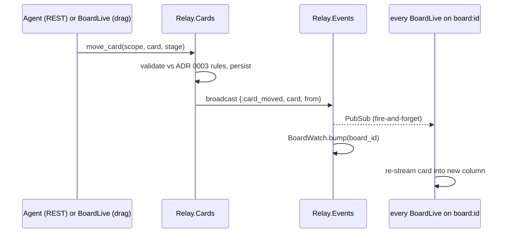
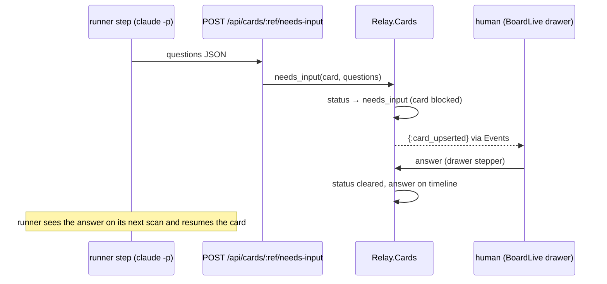

# Runtime: processes, topics, real-time flow

## Supervision tree

One flat `one_for_one` supervisor (`Relay.Supervisor`, started by `Relay.Application`):

| Child | Purpose |
| --- | --- |
| `RelayWeb.Telemetry` | telemetry metrics/poller |
| `Relay.Repo` | Ecto → Postgres |
| `DNSCluster` | Fly multi-node discovery (no-op locally) |
| `Phoenix.PubSub` (`Relay.PubSub`) | all topics below |
| `RelayWeb.ApiLog` | in-memory recent API request log for the admin page |
| `Relay.BoardWatch` | ETS owner for per-board version counters (RLY-12) |
| `Relay.RunnerPresence` | ETS owner for per-board runner heartbeat snapshots (RLY-141); 10-min sweep prunes runners silent >24h |
| `Relay.Activity.LogSink` | debounces runner log lines into one `insert_all` per burst (RLY-112) |
| `Relay.Activity.Pruner` | ages `:action` chatter out after 14 days; first sweep one interval after boot |
| `Task.Supervisor` (`Relay.Push.TaskSupervisor`) | push dispatch off the caller's process (RLY-81) |
| `Finch` (`Relay.Push.APNSFinch`) | dedicated HTTP/2 pool — APNs requires h2; Req's default pool is h1-first |
| `Relay.Runs.Supervisor` | runs engine (RLY-132): run-id `Registry`, `DynamicSupervisor` with one transient `RunServer` per `:running` run, the card-event `Listener`, and a boot task that resumes unfinished runs from Postgres (revokes orphaned jobs, re-dispatches the current node). Not started in test. |
| `RelayWeb.Endpoint` | Bandit HTTP server, WebSockets |

## PubSub topics

| Topic | Broadcaster | Events | Subscribers |
| --- | --- | --- | --- |
| `board:<board_id>` | `Relay.Events` — contexts only, after successful mutations | `{:card_upserted, card}`, `{:card_moved, card, from_stage_id}`, `{:card_archived, card}`, `{:timeline_appended, card_id, entry}`, `{:card_log_appended, card_id, entries}`, `{:stages_changed, board_id}`, `{:board_updated, board}` | every open `BoardLive` for that board |
| `board:<board_id>:logs` | `Relay.AgentLog` | `{:agent_log, entry}` — live runner feed lines | the board's log sheet, only while open (no backfill by design) |
| `board:<board_id>:runners` | `Relay.RunnerPresence` | `{:runner_beat, runner}` — a runner's latest heartbeat snapshot | `BoardRunnersLive` (which also refetches on its own ~10s tick, since a dead runner emits no events) |
| `board:<board_id>:runs` | `Relay.Runs` | `{:run_started, run}`, `{:node_started, run, execution}`, `{:node_finished, run, execution}`, `{:run_parked, run}`, `{:run_resumed, run}`, `{:run_finished, run}`, `{:run_changed, card_id}` | run UI (card 07/W8) and tests. Does NOT bump `BoardWatch`. The engine's fine-grained events above are internal; `{:run_changed, card_id}` (`Relay.Runs.broadcast_run_changed/2`, RLY-137) is the read side's coarse public contract — a subscriber refetches the card's runs/summary rather than patching state from a payload. |
| `events:firehose` | `Relay.Events` — mirrors every board event as `{board_id, event}` | every `board:<board_id>` event, tagged with its board id | `Relay.Runs.Listener` (reconciles card events against runs — RLY-132) |
| `api_log` | `RelayWeb.ApiLog` | `{:api_log, entry}` | `Admin.ApiLive` |

Two invariants make the seam trustworthy: **only contexts broadcast** domain events (so
LiveView and REST mutations share one path), and broadcasting is **fire-and-forget** (a
PubSub failure can never fail the mutation). Every `Events.broadcast/2` also bumps the
board's `BoardWatch` version, which the CLI polls to avoid refetching unchanged boards.

## Load-bearing sequences

A card move fanning out to every open board (same path for REST and LiveView writers):

The needs-input round trip (the baton passing to a human and back):

---
*Sources of truth: `lib/relay/application.ex`, `lib/relay/events.ex`,
`lib/relay/agent_log.ex`, `lib/relay/board_watch.ex`, `lib/relay/runner_presence.ex`,
`lib/relay_web/api_log.ex`, `lib/relay/runs.ex`, `lib/relay/runs/supervisor.ex`,
`lib/relay/runs/listener.ex`.*
