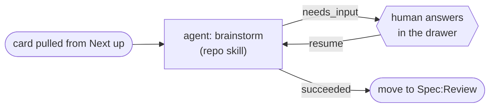

# State reference

Four state machines drive a card through a flow. They live in four different modules, and
the seams between them are where the bugs are. This page brings them together.

| Machine | Values | Owner |
| --- | --- | --- |
| Card status | `ready · queued · working · needs_input · in_review · failed` | `Relay.Cards` |
| Run status | `running · parked · done · failed · cancelled` | `Relay.Runs` |
| Node-job state | `queued · claimed · running · done · revoked` | `Relay.Runs.Dispatcher` |
| Node outcome | `succeeded · failed · partial · needs_input` | the node itself |

## Card status

A card's status says whose turn it is and whether anything is holding it. Which statuses are
valid depends on the **stage type** it sits on (ADR 0003) — the stage type also fixes the
status a card takes on entry.

| Stage type | Valid statuses | Default on entry |
| --- | --- | --- |
| `queue` | `ready`, `queued` | `ready` |
| `work` / `planning` | `working`, `ready`, `needs_input`, `failed` | `working` |
| `review` | `in_review`, `ready` | `in_review` |
| `done` | `ready`, `queued` | `ready` |

| Status | Meaning | Typical transition into it |
| --- | --- | --- |
| `ready` | Nothing is running; the card is available. | A run finishes, or a human drops the card on a queue stage. |
| `queued` | The scheduler has picked the card but no run has started yet. | The scheduler admits the card on a `queue` or `done` stage. |
| `working` | A run is executing a node against this card. | The run starts, or resumes after a park. |
| `needs_input` | Blocked on a human. The card shows in the "needs you" rollup. | A node reports the `needs_input` outcome. |
| `in_review` | Waiting at a review gate for a human to approve or reject. | The card lands on a `review` stage. |
| `failed` | A run ended terminally. Set by `Relay.Cards.mark_failed/3`, never by a human. Valid in `work`/`planning` stages only. Distinct from `needs_input`: answering cannot resume a dead run, so the drawer offers no composer. `blocked_since` is not stamped; `needs_you?/2` counts it anyway. | A run fails terminally (no route left for its outcome, loop budget exhausted, visit cap exceeded, or the circuit breaker trips). |

`needs_input` is the only status that both blocks the card **and** parks its run; the
scheduler skips `needs_input` and `failed` cards by rule, so nothing else can pick the card up
while a question is outstanding or a run has died.

## Run status

A run is one traversal of a flow for one card.

| Status | Meaning | Leaves it by |
| --- | --- | --- |
| `running` | A node is executing, or the next one is about to be dispatched. | Any of the four below. |
| `parked` | Suspended, carrying a `parked_reason`. Resumable. | The reason clearing — a human answers, an executor claims, an executor returns. |
| `done` | The flow reached its `done` target. Terminal. | — |
| `failed` | The engine decided the run cannot continue. Terminal. | — |
| `cancelled` | A human stopped the run. Terminal. | — |

`parked_reason` says *why* a parked run is waiting:

| `parked_reason` | Waiting on |
| --- | --- |
| `needs_input` | A human to answer the node's question in the card drawer. |
| `claimed` | An executor that has claimed the node-job to report its outcome. |
| `executor_gone` | An executor that stopped heartbeating; the reaper parks the run so it can be re-dispatched rather than lost. |

## Node-job state

A node-job is one unit of work handed to an executor. The engine writes the job; an executor
claims it, runs it, and reports back.

| State | Meaning | Next |
| --- | --- | --- |
| `queued` | Written by the engine; no executor holds it. | `claimed` (an executor takes it) or `revoked`. |
| `claimed` | An executor has taken the job but has not started. | `running` or `revoked`. |
| `running` | The executor is executing the node. | `done` or `revoked`. |
| `done` | The executor reported a typed outcome. Terminal. | — |
| `revoked` | Withdrawn — the run was cancelled, or the executor stopped heartbeating and the reaper took the job back for re-dispatch. Terminal. | — |

A revoked job never produces an outcome; the engine re-queues the node instead.

## Node outcomes

Every node declares exactly one outcome. This is the contract between a node and the engine:
an agent node writes it to the file named by `$RELAY_NODE_OUTCOME`, a shell/gate node's exit
status maps onto it. **A node that declares nothing is reported as `failed`** — a node that
declared nothing cannot be distinguished from one that did nothing.

| Outcome | What it does to the run | What it does to the card |
| --- | --- | --- |
| `succeeded` | Routes on the `{from, on: :succeeded}` edge. A target of `done` finishes the run. | Follows the target node's stage; stays `working` while the run continues. |
| `failed` | Retries the same node while its `max_retries` budget lasts, then routes on the `failed` edge; with no `failed` edge, and when the circuit breaker trips on a repeated failure signature, the run **fails**. | Left where it is; on run failure the card is marked `failed` with the failure detail recorded on it. |
| `partial` | Routes on the `{from, on: :partial}` edge like any other outcome — it is *not* a failure and does not consume retry budget. | As for `succeeded`. |
| `needs_input` | **Parks immediately — no edge is consulted.** The run becomes `parked` with `parked_reason: :needs_input` and resumes at the same node once answered. | Set to `needs_input`, which blocks it and surfaces it in the "needs you" rollup. |

An outcome with no matching edge **degrades onto the node's `failed` edge** and follows it
exactly as a real `failed` would, including that edge's `max_loops` budget — so a node that
never declares a `partial` edge does not kill the run the first time it reports one. Only a
`failed` outcome that is itself unrouted — nowhere left to fall back to — fails the run.
`partial` is reportable but unrouted by default; a flow that wants a genuine three-way branch
must declare a `partial` edge explicitly.

Two engine-level guards sit above per-node routing, and both **fail the run** rather than
loop it: the **failure-signature circuit breaker** (the same failure detail repeating N times
fails the run even when retries or loops technically remain) and the **visit cap** on an edge
target (the backstop under unlimited loops). Under a `foreach`, retry and loop budgets are
accounted **per iteration**, so a churny plan task cannot spend a later task's budget; the
breaker deliberately keeps the whole run's history.

A `needs_input` park and resume, shown against the Plan flow's brainstorm node:

## Where these meet

- A node reporting `needs_input` moves **two** machines at once: the run parks and the card
  blocks. Reconciliation self-heals either ordering, so neither write depends on the other
  landing first.
- A run reaching `failed` marks the card `failed` (`Relay.Cards.mark_failed/3`) — a dead run
  always ends up in front of a human, never silently, but never as an unanswerable question
  either. This is a different path from `needs_input`: `ensure_card_blocked/2` handles the
  genuine question, `card_fail_effects/2` handles the terminal failure, and the two never
  overlap.
- A revoked node-job produces no outcome at all, so the run's history stays clean and the
  node is simply re-dispatched.

See also: [Runner](runner.md) for how node-jobs reach an executor, and
[Domain model](domain.md) for the schemas these fields live on.
