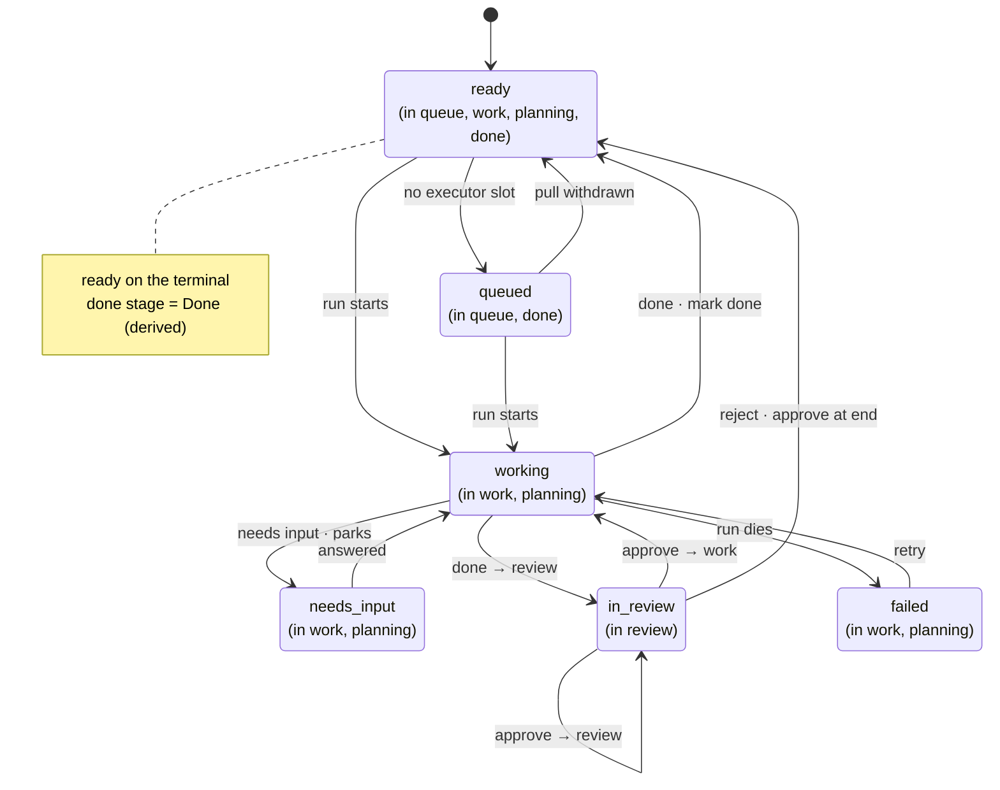
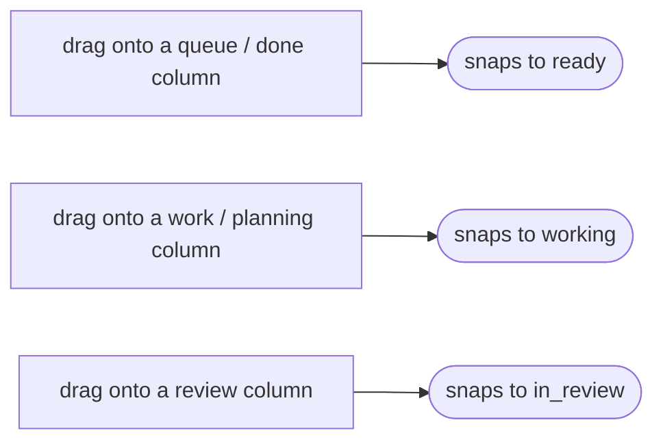
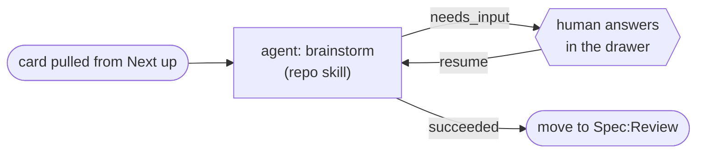

# State reference

Four state machines drive a card through a flow. They live in four different modules, and
the seams between them are where the bugs are. This page brings them together.

## Closed vocabularies

The closed sets that move a card and its run through a flow, generated from the schema that owns
each one by `mix relay.gen_vocab` (a stale block fails `mix precommit`). **This table is the
authority on what values these sets take.** [`../glossary.md`](../glossary.md) is the authority on
what each term *means*; the sections below say what each value *does*.

<!-- BEGIN generated: vocabularies -->
| Vocabulary | Values | Owner |
| --- | --- | --- |
| Card status | `ready` · `working` · `needs_input` · `in_review` · `queued` · `failed` | `Schemas.Card.statuses/0` |
| Node outcome | `succeeded` · `failed` · `partial` · `needs_input` | `Schemas.NodeExecution.outcomes/0` |
| Node-job kind | `node` · `talk` | `Schemas.NodeJob.kinds/0` |
| Node-job state | `queued` · `claimed` · `done` · `revoked` | `Schemas.NodeJob.states/0` |
| Run parked reason | `needs_input` · `claimed` · `executor_gone` | `Schemas.Run.parked_reasons/0` |
| Run resume-refusal reason | `no_isolation` · `pin_unresolved` · `pinned_executor_absent` · `no_free_slot` | `Schemas.Run.resume_refusal_reasons/0` |
| Run status | `running` · `parked` · `done` · `failed` · `cancelled` | `Schemas.Run.statuses/0` |
| Stage category | `unstarted` · `planning` · `in_progress` · `complete` | `Schemas.Stage.categories/0` |
| Stage type | `queue` · `work` · `planning` · `review` · `done` | `Schemas.Stage.types/0` |
| Talk event kind | `user` · `tool` · `out` · `error` | `Schemas.TalkEvent.kinds/0` |
| Talk turn status | `queued` · `claimed` · `done` · `stopped` · `failed` | `Schemas.TalkTurn.statuses/0` |
<!-- END generated: vocabularies -->

These are the *runtime* vocabularies, not every closed set in the codebase. The flow-**definition**
vocabularies — isolation class (`Schemas.Flow.isolation_classes/0`), node type and edge condition
(`Schemas.Flow.Node`, `Schemas.Flow.Edge`) — describe a flow rather than a card in motion; they are
owned exactly the same way, by one accessor or `Ecto.Enum` on their schema, and are documented in
[`runner.md`](runner.md). The rule does not vary: the schema owns the set, nothing re-types it.

The board's **shared story-map view settings** are a closed key set of the same kind:
`Relay.StoryMap.view_defaults/0` owns both the keys and their defaults —

| key | default | shape | written by |
|---|---|---|---|
| `tray_open` | `true` | boolean | `toggle_view/2` |
| `zoom` | `"compact"` | string | `put_view/3` |
| `hide_tasks` | `false` | boolean | `toggle_view/2` |
| `owner_filter` | `[]` | list of `RelayWeb.StoryMapFilter` owner keys | `toggle_view_member/4` |
| `needs_input_filter` | `false` | boolean | `toggle_view/2` |
| `collapsed` | `[]` | list of `story_activity` ids | `toggle_view_member/4` |
| `focus` | `nil` | one `story_activity` id or nil | `merge_view/2` |
| `hide_complete` | `true` | boolean | `toggle_view/2` |

— `view/1` drops any stored key outside the set, and every writer refuses one. The **shape
of a key's default is load-bearing**: `toggle_view/2` refuses a key whose default is not a
boolean (`{:error, :not_a_toggle}`) and `toggle_view_member/4` one whose default is not a
list (`{:error, :not_a_list}`), so a wrong call site cannot replace the `collapsed` list
with `true` and break every viewer's map. All three writers compose the single
`merge_view/2`, which validates every key, re-reads the committed row, writes once and
broadcasts once — so a multi-key change ("expand this activity **and** turn Hide tasks
off") is atomic. They live in the `boards.story_map_view` jsonb column — a bag rather than
a column per setting, which is why RE259 (filter & focus) added four keys and RE276
(`hide_complete`) an eighth, all with no migration. Values are jsonb, so `zoom` is stored as
a string and read back through `RelayWeb.StoryMapComponents.parse_zoom/1`.

Three of the eight are **filters** — `Relay.StoryMap.filter_keys/0` owns that subset
(`owner_filter`, `needs_input_filter`, `hide_complete`), so `Clear` resets exactly them by
merging `Map.take(view_defaults(), filter_keys())` rather than re-typing a literal.
`hide_complete` defaults to **`true`**, which is why "is a filter on" is
`Relay.StoryMap.filters_active?/1` — *do these keys differ from the defaults* — rather than
"is any of them truthy": with a default-on filter, "off" and "default" are different places
and the default is the one `Clear` returns to.

## Card status

A card's status says whose turn it is and whether anything is holding it. Which statuses are
valid depends on the **stage type** it sits on (ADR 0003) — the stage type also fixes the
status a card takes on entry.

Every arrow below is a status change, and each goes through one writer — `Relay.Cards.set_status/3`
— **never as a silent side effect of a move**. A cross-stage move re-snaps status only when the
carried value is *invalid* for the destination stage type (`snap_status/3`, `cards.ex:1174`); a
status still valid for the new stage rides across unchanged. That **valid-but-stale** branch is the
seam where a card arrives in a new stage still reading `working`, `needs_input`, or `failed` from
the last one. Only three writers correct status around a move: `start_run` forces `working` on
entering the work lane (`runs.ex:711`), `reject` forces `ready` on sending a card back
(`cards.ex:1334`), and `approve_in_place` forces `ready` in place at the terminal stage
(`cards.ex:1670`). The non-terminal `approve` and every plain drag trust the snap alone.

Each box's second line is the **stage types** that status is valid on (`Stage.valid_status?/2`).

```mermaid
stateDiagram-v2
    direction TB
    state "ready<br/>(in queue, work, planning, done)" as ready
    state "queued<br/>(in queue, done)" as queued
    state "working<br/>(in work, planning)" as working
    state "needs_input<br/>(in work, planning)" as needs_input
    state "in_review<br/>(in review)" as in_review
    state "failed<br/>(in work, planning)" as failed

    [*] --> ready

    ready --> queued: no executor slot
    queued --> ready: pull withdrawn
    ready --> working: run starts
    queued --> working: run starts

    working --> needs_input: needs input · parks
    working --> failed: run dies
    working --> in_review: done → review
    working --> ready: done · mark done

    needs_input --> working: answered
    failed --> working: retry
    in_review --> working: approve → work
    in_review --> in_review: approve → review
    in_review --> ready: reject · approve at end

    note right of ready
        ready on the terminal
        done stage = Done (derived)
    end note
```

### Manual moves and the other triggers

The run flow above isn't the only thing that moves a card's status. A human **dragging a card
between columns** changes status through the *same* snap rule: if the carried status is invalid for
the destination stage type it snaps to that type's default; if it is still valid, the card just
moves and its status is untouched. Because the snap only ever writes a stage type's *default*, the
result depends solely on the destination:

```mermaid
flowchart LR
    Q["drag onto a queue / done column"] --> R(["snaps to ready"])
    W["drag onto a work / planning column"] --> K(["snaps to working"])
    V["drag onto a review column"] --> I(["snaps to in_review"])
```

So a drag produces edges the lifecycle diagram doesn't: `failed → in_review` or
`needs_input → in_review` (dropped on Review), `working → ready` or `in_review → ready` (dropped on
a queue/done column), `in_review → working` (dropped on a work stage). A `failed` card dropped on
another work/planning stage **stays `failed`** — the status is valid there, so nothing snaps (the
seam above). The snap never yields `needs_input`, `failed`, or `queued`; those come only from their
own writers.

Two more triggers complete the set:

- **Editing a stage's type** re-snaps every card already sitting in it (`snap_cards_in/1`,
  `cards.ex:1230`) — the same rule fired by an admin change instead of a move.
- **The untrusted API write** `PATCH /api/cards/:ref` (`set_status_snapped/3`, `cards.ex:536`)
  coerces the requested status to one valid for the card's *current* stage type — so `failed` can
  be set directly on a card in a work/planning stage, making `failed` reachable from
  `ready`/`needs_input`, not only from `working`.

That is the whole set. A card's status changes through exactly these paths — the run engine
(start / park / finish / fail), the review gate (approve / reject), a human answer / retry /
mark-done, the scheduler's capacity marking (`ready ↔ queued`), a manual drag or a stage-type edit
(the snap rule), and the untrusted API write. Nothing else writes `card.status`.

| Stage type | Valid statuses | Default on entry |
| --- | --- | --- |
| `queue` | `ready`, `queued` | `ready` |
| `work` / `planning` | `working`, `ready`, `needs_input`, `failed` | `working` |
| `review` | `in_review` | `in_review` |
| `done` | `ready`, `queued` | `ready` |

| Status | Meaning | Typical transition into it |
| --- | --- | --- |
| `ready` | Nothing is running; the card is available. | A run finishes, or a human drops the card on a queue stage. |
| `queued` | Capacity-blocked: the scheduler would start a run but no executor has a free isolation slot. Still pullable — the moment a slot frees it dispatches to `working`. | The scheduler finds the card eligible with WIP room but no free executor slot (`Scheduler.place_fresh/4`). A WIP-full column leaves the card `ready`, not `queued`. |
| `working` | A run is executing a node against this card. | The run starts, or resumes after a park. |
| `needs_input` | Blocked on a human. The card shows in the "needs you" rollup. | A node reports the `needs_input` outcome. |
| `in_review` | Waiting at a review gate for a human to approve or reject. | The card lands on a `review` stage. |
| `failed` | A run ended terminally. Set by `Relay.Cards.mark_failed/3`, never by a human. Valid in `work`/`planning` stages only. Distinct from `needs_input`: answering cannot resume a dead run, so the drawer offers no composer. `blocked_since` is not stamped; `needs_you?/2` counts it anyway. | A run fails terminally (no route left for its outcome, loop budget exhausted, visit cap exceeded, or the circuit breaker trips). |

`needs_input` is the only status that both blocks the card **and** parks its run; the
scheduler skips `needs_input` and `failed` cards by rule, so nothing else can pick the card up
while a question is outstanding or a run has died.

## Run status

A run is one traversal of a flow for one card.

| Status | Meaning | Leaves it by |
| --- | --- | --- |
| `running` | A node is executing, or the next one is about to be dispatched. | Any of the four below. |
| `parked` | Suspended, carrying a `parked_reason`. Resumable. | The reason clearing — a human answers, an executor claims, an executor returns — or the reaper giving up on an unresumable refusal (`Relay.Runs.abandon_unresumable_runs/1`, RE297), which fails it. |
| `done` | The flow reached its `done` target. Terminal. | — |
| `failed` | The engine decided the run cannot continue. | A human retry (`Relay.Runs.retry_run/2`, RLY-189) — the only way back to `running`. |
| `cancelled` | A human stopped the run, or it was closed as a leak. Terminal. | — |

`failed` is the one non-terminal-looking terminal: nothing in the engine ever leaves it, but a
human can. A retry revives the SAME run row rather than starting a new one, so the history rows
stay append-only and "it failed here, then a human retried" is fully reconstructable from
`node_executions` plus the `retries` counter.

A run is closed `:cancelled` — never relabelled `:done` — when its card reaches a terminal-type
stage (`Schemas.Stage.terminal_types/0`) while the run is still active (`running`/`parked`,
RLY-233): the card-event `Relay.Runs.Listener`'s first reconcile rule closes it within one event,
and the `Relay.Runs.ExecutorReaper`'s 30s sweep (`Relay.Runs.close_orphaned_runs/0`) catches
anything the event path missed. A legitimately completed run is already `:done` before its card
moves off the stage, so it is never selected by either path and never relabelled. Run dispatch
(`Relay.Runs.start_run/3`) moves the card into the flow's work lane and inserts the run row in one
transaction, so no committed state ever has an active run sitting on a terminal-type stage except
a genuine leak. Both paths judge that leak from a single `run → card → stage` snapshot
(`Relay.Runs.leaked?/1`, the reaper's join) — never a card stage read apart from the run — so a
concurrent `Spec:Done → Plan` dispatch landing between two reads can't make the Listener mistake a
freshly-dispatched run for a leak and cancel it (RLY-233 / RE239). No grace window or time
threshold is needed to tell the two apart.

The from → to edges of that machine — the source of truth is `Relay.Runs.Transitions`'
`@transitions` data, and this table is generated from it by `mix relay.gen_state` (a stale block
fails `mix precommit`). Every run-status write goes through `Relay.Runs.Transitions.transition/4`,
a guarded `UPDATE` that refuses (and logs) a transition from an unexpected state.

<!-- BEGIN generated: run-transitions -->
| From | To | Meaning |
| --- | --- | --- |
| `failed` | `running` | human retry / `revive_run` (RLY-189) |
| `parked` | `cancelled` | human cancelled a parked run |
| `parked` | `failed` | scheduler gave up on an unresumable parked run (RE297) |
| `parked` | `running` | resume |
| `running` | `cancelled` | human cancelled a live run |
| `running` | `done` | flow reached its `done` target |
| `running` | `failed` | engine gave up (no route / caps / breaker) |
| `running` | `parked` | park (reason: `needs_input` \| `claimed` \| `executor_gone`) |
<!-- END generated: run-transitions -->

`parked_reason` says *why* a parked run is waiting:

| `parked_reason` | Waiting on |
| --- | --- |
| `needs_input` | A human to answer the node's question in the card drawer. |
| `claimed` | An executor that has claimed the node-job to report its outcome. |
| `executor_gone` | An executor that stopped heartbeating; the reaper parks the run so it can be re-dispatched rather than lost — and fails it if the resume stays refused past `Relay.Runs.unresumable_after_s/0` (RE297). |

Whether an agent may work a card at all — the human-baton gate, the fresh-pull gate, and the
`:executor_gone` resume gate — is decided by `Relay.Runs.Policy` (`agent_may_hold?/1`,
`pullable?/1`, `resumable?/2`), one shared definition the scheduler, the run listener, and the
board card face all call. It is a set of predicates, not a closed data table, so there is nothing
to generate; the drift protection there is the shared-predicate test suite.

## Node-job state

A node-job is one unit of work handed to an executor. The engine writes the job; an executor
claims it, runs it, and reports back.

| State | Meaning | Next |
| --- | --- | --- |
| `queued` | Written by the engine; no executor holds it. | `claimed` (an executor takes it) or `revoked`. |
| `claimed` | An executor holds the job and is executing the node — it claims and starts its worker in one step, so there is no separate started state (RE255). | `done` or `revoked`. |
| `done` | The executor reported a typed outcome. Terminal. | — |
| `revoked` | Withdrawn — the run was cancelled, or the executor stopped heartbeating and the reaper took the job back for re-dispatch. Terminal. | — |

A revoked job never produces an outcome; the engine re-queues the node instead.

### Node-job kind

RE268 / ADR 0009: `node_jobs` is the dispatch table for two dispatchers, distinguished by
`kind`. `:node` is written by the flow engine and always carries a `run_id` and
`node_execution_id`. `:talk` is one turn of a person-driven Talk session — it carries neither,
because a talk turn deliberately synthesises no `Run` (a `Run` would make every card with an
open conversation read as having an active run).

`card_id` is set on **every** row, flow or talk, backfilled from the run for existing rows — it
is the one board-scoping join both kinds share, the same deliberate denormalisation
`story_tasks.board_id` already uses.

A talk job never refreshes the card's `agent_heartbeat_at` (a talk turn is not the agent
working the card — the baton does not move) and is never requeued by the orphan reaper (a
resumed `claude` session must land back on the executor that holds it, never a different
machine); it ends only when a human presses Stop or it reports an outcome.

## Talk turn status

A talk turn is one human message and the work it caused (RE268 / ADR 0009), tracked separately
from the `node_jobs` row that carries it to an executor.

| Status | Meaning | Next |
| --- | --- | --- |
| `queued` | Written when the person hits Enter; no executor holds the turn's job yet. | `claimed` (an executor takes it) or `stopped` (the person hits Stop before it is claimed). |
| `claimed` | An executor is running `claude -p --resume` for this turn. | `done`, `stopped` or `failed`. |
| `done` | The turn finished normally; the executor's `claude_session_id` is persisted so the next turn resumes it. Terminal. | — |
| `stopped` | The person hit Stop. A normal, **non-error** end state — the job is revoked and the turn's partial output stays in the transcript. Terminal. | — |
| `failed` | The executor reported an error. Terminal. | — |

`queued` and `claimed` are the turn's *active* statuses (`Schemas.TalkTurn.active_statuses/0`):
the pane shows Stop **in place of** the composer, which is removed while a turn is live, and a
second `post_message/3` on the same session is refused while one is active.

`queued → claimed` is written by `RelayWeb.Api.NodeJobController` (via `Relay.Talk.mark_claimed/1`)
off the claim it just granted, not by `Relay.Runs.claim_next_job/1` — the run lifecycle claims a
job and only Talk knows a job can carry a turn. Only a `:queued` turn moves, so a claim landing
just after Stop cannot drag a `:stopped` turn back to live.

## Node outcomes

Every node declares exactly one outcome. This is the contract between a node and the engine:
an agent node writes it to the file named by `$RELAY_NODE_OUTCOME`, a shell/gate node's exit
status maps onto it. **A node that declares nothing is reported as `failed`** — a node that
declared nothing cannot be distinguished from one that did nothing.

| Outcome | What it does to the run | What it does to the card |
| --- | --- | --- |
| `succeeded` | Routes on the `{from, on: :succeeded}` edge. A target of `done` finishes the run. | Follows the target node's stage; stays `working` while the run continues. |
| `failed` | Retries the same node while its `max_retries` budget lasts, then routes on the `failed` edge; with no `failed` edge, and when the circuit breaker trips on a repeated failure signature, the run **fails**. | Left where it is; on run failure the card is marked `failed` with the failure detail recorded on it. |
| `partial` | Routes on the `{from, on: :partial}` edge like any other outcome — it is *not* a failure and does not consume retry budget. | As for `succeeded`. |
| `needs_input` | **Parks immediately — no edge is consulted.** The run becomes `parked` with `parked_reason: :needs_input` and resumes at the same node once answered. | Set to `needs_input`, which blocks it and surfaces it in the "needs you" rollup. |

An outcome with no matching edge **degrades onto the node's `failed` edge** and follows it
exactly as a real `failed` would, including that edge's `max_loops` budget — so a node that
never declares a `partial` edge does not kill the run the first time it reports one. Only a
`failed` outcome that is itself unrouted — nowhere left to fall back to — fails the run.
`partial` is reportable but unrouted by default; a flow that wants a genuine three-way branch
must declare a `partial` edge explicitly.

Two engine-level guards sit above per-node routing, and both **fail the run** rather than
loop it: the **failure-signature circuit breaker** (the same failure detail repeating N times
fails the run even when retries or loops technically remain) and the **visit cap** on an edge
target (the backstop under unlimited loops). Under a `foreach`, retry and loop budgets are
accounted **per iteration**, so a churny plan task cannot spend a later task's budget; the
breaker deliberately keeps the whole run's history.

A `needs_input` park and resume, shown against the Plan flow's brainstorm node:

```mermaid
flowchart LR
    start([card pulled from Next up]) --> b["agent: brainstorm<br/>(repo skill)"]
    b -- needs_input --> h{{"human answers<br/>in the drawer"}}
    h -- resume --> b
    b -- succeeded --> r([move to Spec:Review])
```

## Where these meet

- A node reporting `needs_input` moves **two** machines at once: the run parks and the card
  blocks. Reconciliation self-heals either ordering, so neither write depends on the other
  landing first.
- A run reaching `failed` marks the card `failed` (`Relay.Cards.mark_failed/3`) — a dead run
  always ends up in front of a human, never silently, but never as an unanswerable question
  either. This is a different path from `needs_input`: `ensure_card_blocked/2` handles the
  genuine question, `card_fail_effects/2` handles the terminal failure, and the two never
  overlap.
- A revoked node-job produces no outcome at all, so the run's history stays clean and the
  node is simply re-dispatched.

See also: [Runner](runner.md) for how node-jobs reach an executor, and
[Domain model](domain.md) for the schemas these fields live on.
