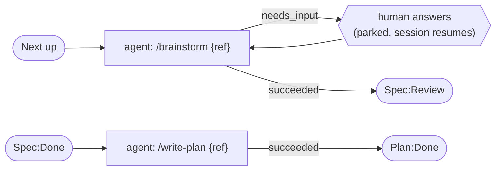
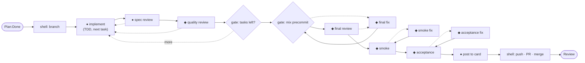

# The default flow library

The three flows Relay ships under [ADR 0006](../../adr/0006-workflow-orchestration.md) —
[`spec.jsonc`](spec.jsonc) · [`plan.jsonc`](plan.jsonc) · [`code.jsonc`](code.jsonc) —
expressed as real files. This is the seed data for **W2 (RLY-131)** and the faithful
translation of today's pipeline (`relay_config.json` + `execute-plan.js`). Fabro's own
dogfood workflows (`../fabro/.fabro/workflows/implement-issue` + `implement-plan`) are the
third column: same job, their vocabulary.

## File inventory — where each piece lives

| What | Today (Relay) | Fabro's version | ADR 0006 |
| --- | --- | --- | --- |
| Macro pipeline (stage → stage) | `relay_config.json` `pipeline` | board is derived; graph chains via `house` sub-workflow nodes | the board itself + each flow's `trigger` |
| Spec behavior | `.claude/skills/brainstorm` | first half of `implement-issue`'s `plan` node | [`spec.jsonc`](spec.jsonc) → same repo skill |
| Plan behavior | `.claude/skills/write-plan` (via `.claude/commands`) | second half of the same `plan` node (writes `plan.md`) | [`plan.jsonc`](plan.jsonc) → same repo skill |
| Code orchestration | `execute-plan.js` (485 lines, Claude Workflow engine) | `implement-plan/workflow.fabro` (35 lines of DOT) | [`code.jsonc`](code.jsonc) (~100 lines of data) |
| Code node behaviors | `.claude/agents/*.md` (implementer, reviewers, smoke, acceptance…) | inline `prompt=` attrs + `@prompts/*.md` files | `run` prompts in `code.jsonc`, overridable per repo (W11) |
| Merge/PR mechanics | 4 shell steps in `relay_config.json` + `tmp/exec-plan-status` gate | `project.toml` `[run.pull_request]` | the `merge` node — unreachable unless every gate passed |
| Model assignment | `execute-plan.js` `meta.phases[].model` | `model_stylesheet` (CSS-like) + per-node `model=` | per-node `model` attr |
| Isolation / env | worktree pools in `relay_config.json` | Daytona cloud sandbox (`project.toml [environments]`) | `isolation` requirement; executor owns the mapping |

## Spec and Plan — one agent node each

## Code — execute-plan.js's nine phases as one graph

Models on the nodes (⚡ haiku · ● sonnet · ◆ opus). Solid edges = `succeeded`,
dashed = `failed`.

## Node-by-node — Code flow, three ways

| `code.jsonc` node | Type / model | Today's mechanism | Fabro's analog (`implement-plan`) |
| --- | --- | --- | --- |
| `branch` | shell | `relay_config.json` shell step 1 | `toolchain` + `preflight_*` parallelograms |
| *(gone)* | — | **Execute phase** — a haiku agent picks the next unchecked task | *(none — plan handled whole)* |
| `implement` | agent · sonnet/high | **Implement** — `plan-implementer` agent, TDD | `implement` (gpt-55, `reasoning_effort=xhigh`, TDD) |
| `spec_review` | agent · sonnet | **Spec review** — `spec-reviewer` agent | *(no analog — they simplify instead of judge)* |
| `quality_review` | agent · opus | **Quality review** — `quality-reviewer` agent | `simplify_opus` → `simplify_gpt` (mutating, two models) |
| `next_task` | gate | implicit in execute-plan's `while` loop | *(none — single pass over the plan)* |
| `precommit` | gate | **Final check** — a *haiku agent* runs `mix precommit` | `verify` parallelogram, `goal_gate=true` |
| `final_review` | agent · opus | **Final review** — `final-reviewer` agent | *(folded into `verify`)* |
| `final_fix` | agent · opus | **Final review's** bounded fix loop → `final-fixer` | `fixup` (`max_visits=3`, `retry_target`) |
| `smoke` / `smoke_fix` | agent · opus | **Smoke** — `smoke-tester` + bounded fix loop | *(no analog)* |
| `acceptance` / `acceptance_fix` | agent · opus | **Acceptance** — `acceptance-tester` + fix loop | *(no analog — no card to hold criteria)* |
| `post` | agent · sonnet | **Post** — checklist + screenshots comment | run analysis is engine-generated |
| `merge` | shell | config shell steps 3–6 + `tmp/exec-plan-status` gate | `project.toml [run.pull_request]` |

## What this translation deletes

- the `tmp/exec-plan-status` scratch-file gate → unreachable-`merge` routing
- the haiku task-picker agent → the `next_task` gate + a sharper implement prompt
- the haiku precommit *agent* → a plain `gate` node
- `CLAUDE_CODE_PRINT_BG_WAIT_CEILING_MS` → no long-lived `claude -p` wrapping a workflow
- `execute-plan.js` itself — orchestration becomes data the board can render

## Open modeling questions (settle in W2/W3)

1. **Per-task loops.** `next_task` as a grep-gate over `plan.md` works but is crude; the
   cleaner alternatives are context-conditioned edges (Fabro's approach) or a sub-flow
   node iterated per task (Fabro's `house`). Start with the gate; upgrade if it chafes.
2. **Reviewer findings reaching the implementer.** Today the workflow engine threads
   findings into the next implement prompt; here the failed review's detail must travel
   with the `failed` edge (node output as re-entry context — W3's contract).
3. **Mid-run rebase.** Today a sync agent + `rebaser` handle origin/main drift per task;
   the flow above rebases only at `branch`. If drift bites, add a `rebase` agent node on
   `merge` failure.
