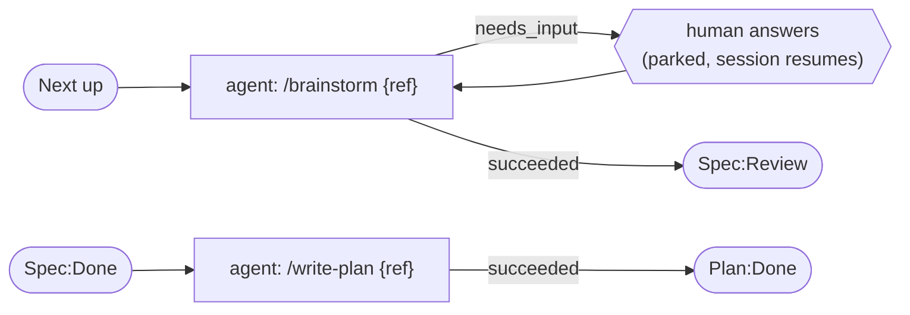
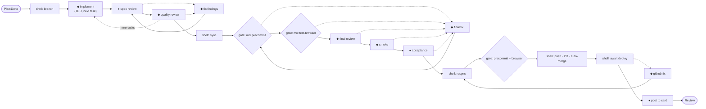

# The default flow library

The three flows Relay ships under [ADR 0006](../../adr/0006-workflow-orchestration.md) —
[`spec.json`](spec.json) · [`plan.json`](plan.json) · [`code.json`](code.json) —
expressed as real files. This is the seed data for **RLY-131** and the faithful
translation of today's pipeline (`relay_config.json` + `execute-plan.js`). Fabro's own
dogfood workflows (`../fabro/.fabro/workflows/implement-issue` + `implement-plan`) are the
third column: same job, their vocabulary.

> **These files are the source.** `Relay.Flows.DefaultLibrary` *loads*
> [`spec.json`](spec.json) · [`plan.json`](plan.json) · [`code.json`](code.json) at compile
> time (RLY-241, `@external_resource`) — there is no hand-kept Elixir mirror any more. Edit
> the JSON and recompile; `mix relay.flows.sync_defaults` pushes the change to existing
> boards. The same document shape is what `GET`/`PUT /api/flows/:key` speaks.

> **Historical design record.** This doc was written for RLY-131/132, before the ADR 0006
> columns below were real. All three stages are now cut over (RLY-139 retired `relay_config.json`,
> `execute-plan.js` and `/exec-plan`) — the **ADR 0006** column is what actually runs today; the
> **Pre-cutover (Relay)** column is deleted history, kept here for the design rationale. See
> [`docs/architecture/runner.md`](../../architecture/runner.md) for the current state.

## File inventory — where each piece lives

| What | Pre-cutover (Relay) | Fabro's version | ADR 0006 |
| --- | --- | --- | --- |
| Macro pipeline (stage → stage) | `relay_config.json` `pipeline` | board is derived; graph chains via `house` sub-workflow nodes | the board itself + each flow's `trigger` |
| Spec behavior | `.claude/skills/brainstorm` | first half of `implement-issue`'s `plan` node | [`spec.json`](spec.json) → same repo skill |
| Plan behavior | `.claude/skills/write-plan` (via `.claude/commands`) | second half of the same `plan` node (writes the plan to the card) | [`plan.json`](plan.json) → same repo skill |
| Code orchestration | `execute-plan.js` (485 lines, Claude Workflow engine) | `implement-plan/workflow.fabro` (35 lines of DOT) | [`code.json`](code.json) (157 lines of data) |
| Code node behaviors | `.claude/agents/*.md` (implementer, reviewers, smoke, acceptance…) | inline `prompt=` attrs + `@prompts/*.md` files | `run` prompts in `code.json`, overridable per repo (W11) |
| Merge/PR mechanics | 4 shell steps in `relay_config.json` + `tmp/exec-plan-status` gate | `project.toml` `[run.pull_request]` | the `merge` node — unreachable unless every gate passed |
| Model assignment | `execute-plan.js` `meta.phases[].model` | `model_stylesheet` (CSS-like) + per-node `model=` | per-node `model` attr |
| Isolation / env | worktree pools in `relay_config.json` | Daytona cloud sandbox (`project.toml [environments]`) | `isolation` requirement; runner owns the mapping |

## Spec and Plan — one agent node each

```mermaid
flowchart LR
    s1([Next up]) --> b["agent: /brainstorm {ref}"]
    b -- needs_input --> h{{"human answers<br/>(parked, session resumes)"}}
    h --> b
    b -- succeeded --> s2([Spec:Review])
    s3([Spec:Done]) --> w["agent: /write-plan {ref}"]
    w -- succeeded --> s4([Plan:Done])
```

## Code — execute-plan.js's nine phases as one graph

Models on the nodes (⚡ haiku · ● sonnet · ◆ opus). Solid edges = `succeeded`,
dashed = `failed`.

```mermaid
flowchart LR
    A([Plan:Done]) --> BR["shell: branch"]
    BR --> I["◆ implement<br/>(TDD, next task)"]
    I --> SR["● spec review"]
    SR -.-> FX["◆ fix findings"]
    FX --> SR
    SR --> QR["◆ quality review"]
    QR -.-> FX
    QR -. more tasks .-> I
    QR --> SY["shell: sync"]
    SY --> PC{"gate: mix precommit"}
    PC -.-> FF["◆ final fix"]
    PC --> BG{"gate: mix test.browser"}
    BG -.-> FF
    BG --> FR["◆ final review"]
    FR -.-> FF
    FF --> PC
    FR --> SM["◆ smoke"]
    SM -.-> FF
    SM --> AC["● acceptance"]
    AC -.-> FF
    AC --> RS["shell: resync"]
    RS --> RV{"gate: precommit + browser"}
    RV --> MG["shell: push · PR · auto-merge"]
    MG --> DP["shell: await deploy"]
    DP -.-> GF["◆ github fix"] --> RS
    DP --> PO["● post to card"]
    PO --> Z([Review])
```

## Node-by-node — Code flow, three ways

| `code.json` node | Type / model | Pre-cutover mechanism | Fabro's analog (`implement-plan`) |
| --- | --- | --- | --- |
| `branch` | shell | `relay_config.json` shell step 1 | `toolchain` + `preflight_*` parallelograms |
| *(gone)* | — | **Execute phase** — a haiku agent picks the next unchecked task | *(none — plan handled whole)* |
| `implement` | agent · opus/high | **Implement** — `plan-implementer` agent, TDD | `implement` (gpt-55, `reasoning_effort=xhigh`, TDD) |
| `spec_review` | agent · sonnet | **Spec review** — `spec-reviewer` agent | *(no analog — they simplify instead of judge)* |
| `quality_review` | agent · opus | **Quality review** — `quality-reviewer` agent | `simplify_opus` → `simplify_gpt` (mutating, two models) |
| `next_task` | gate | implicit in execute-plan's `while` loop | *(none — single pass over the plan)* |
| `precommit` | gate | **Final check** — a *haiku agent* runs `mix precommit` | `verify` parallelogram, `goal_gate=true` |
| `final_review` | agent · opus | **Final review** — `final-reviewer` agent | *(folded into `verify`)* |
| `fix_findings` | agent · opus | the per-task reviewers' fix loop, via `implement` | *(no analog)* |
| `browser` / `rebrowser` | gate | CI's Playwright job, after the fact | *(folded into `verify`)* |
| `final_fix` | agent · opus | **Final review's** bounded fix loop → `final-fixer` | `fixup` (`max_visits=3`, `retry_target`) |
| `smoke` | agent · opus | **Smoke** — `smoke-tester` + bounded fix loop | *(no analog)* |
| `acceptance` | agent · sonnet | **Acceptance** — `acceptance-tester` + fix loop | *(no analog — no card to hold criteria)* |
| `merge` | shell | config shell steps 3–6 + `tmp/exec-plan-status` gate | `project.toml [run.pull_request]` |
| `deploy` / `github_fix` | shell · agent (opus) | *(none — a card reached Review at merge)* | *(none)* |
| `post` | agent · sonnet | **Post** — checklist + screenshots comment | run analysis is engine-generated |

## What this translation deletes

- the `tmp/exec-plan-status` scratch-file gate → unreachable-`merge` routing
- the haiku task-picker agent → the `next_task` gate + a sharper implement prompt
- the haiku precommit *agent* → a plain `gate` node
- `CLAUDE_CODE_PRINT_BG_WAIT_CEILING_MS` → no long-lived `claude -p` wrapping a workflow
- `execute-plan.js` itself — orchestration becomes data the board can render

## Why the graphs look like this

The rationale that used to live in `code.jsonc`'s comments, relocated here when the files
became comment-free JSON (RLY-241). Keyed by node.

- **`branch`** — also materializes the card's `plan` into the per-ref `$RELAY_PLAN` path
  (what `/exec-plan` used to do before RLY-139) for `implement` to read. RLY-224 routed its
  fetch through the single retrying `{relay} git-fetch` helper, and, last in the chain, records
  the branch on the card with `{relay} branch {ref} {branch}` (RE244 §5 — last deliberately: if
  the plan is missing, the node fails and no branch is recorded). `post` likewise records the
  structured `ai_result` with `{relay} result {ref}` alongside its comment, and already has a
  `failed → needs_input` edge, so a malformed result parks for a human rather than merging blind.
- **`post`'s house style** — the prompt is long on purpose, because `ai_result` is the only thing
  a human reads before approving. Its reader is a busy product owner who knows the product but
  not the code's names for it, so `summary` is 3-5 markdown bullets of 1-2 sentences pointed at
  what to go *look at* — biggest behavior change, riskiest part, the UX least likely to match its
  artboard — and `changes` is short user-facing verb phrases, scannable at a glance, because the
  drawer renders them as a checked list. Without that, the node writes a restatement of its own
  comment ("all criteria pass") and the summary section earns nothing. Pinned by
  `test/relay/flows/default_library_test.exs`.
- **`implement`** — execute-plan's per-task loop as a real engine `foreach`: each entry begins
  one iteration bound to one of the card's sub_tasks. The `next_task` grep-gate is **gone** —
  "which task is next" is derived server-side, and `{sub_task}` names it in the prompt.
- **`agent` on a node** — names a `.claude/agents/<name>.md` definition: the runner appends
  `--agent <name>` to `claude -p`, so the file supplies the system prompt while `run` stays the
  user prompt. `post` has no agent file and keeps a bare prompt. `final-fixer` backs two nodes:
  `fix_findings` (one task's reviewer findings) and `final_fix` (everything after the task loop).
- **`fix_findings`** — a rejected per-task review used to loop back to `implement`, whose job is
  "build this task from the plan". It would re-read the plan, decide the task was already built,
  and report success having changed nothing. The fix node's only job is the reviewer's findings,
  on the code already committed, and it returns to `spec_review` so both reviewers see the fix.
- **One fixer after the task loop** — `precommit`, `browser`, `final_review`, `smoke` and
  `acceptance` all route `failed` to `final_fix`, which then goes back through the gates and
  every check after them. The per-check fixers (`smoke_fix`, `acceptance_fix`) are gone: each
  was a bare prompt with no agent file, and a fix that only re-ran its own check could break
  what an earlier gate had proven.
- **`browser` / `rebrowser`** — CI runs the Playwright journeys as their own job, so a flow that
  gated only on `mix precommit` found a red browser suite after the merge. Each precommit gate is
  now followed by a `mix test.browser` gate, and the fixers they feed keep both green.
- **`deploy` / `github_fix`** — `merge` only *queues* an auto-merge, so a card used to reach
  Review with nothing shipped if CI then went red. `deploy` runs `bin/await_deploy.sh`: it waits
  for the PR to merge and for main's CI to run its deploy job on a commit containing it,
  re-running failed jobs once to absorb a flake. On failure `github_fix` (the `ci-fixer` agent)
  leaves the right commits on the branch and the card re-lands through resync → gates → merge →
  deploy. `post` runs after `deploy`, so its summary describes what actually shipped. A repo
  whose CI names its workflow or deploy job differently sets `AWAIT_CI_WORKFLOW` /
  `AWAIT_DEPLOY_JOB`.
- **`sync` / `sync_fix`, `resync` / `resync_fix` / `reverify`** — RLY-192's two rebase sync
  points. A cheap rebase onto `origin/main` before the expensive review/smoke/acceptance tail,
  and once more immediately before `merge` (gated by `reverify`, because two green branches
  don't always merge into a green branch), so a busy board moving `main` under a long run no
  longer strands the work at `merge`. Both abort a conflicted rebase **before** exiting nonzero
  so the branch is left clean and attached for the next node (RLY-166).
- **`branch` resumes an open PR** — when the card's PR is still open (a card sent back from
  Review before its PR merged), the branch is checked out from `origin/{branch}` rather than
  reset onto `origin/main`, so the unmerged commits survive.
- **`precommit` / `reverify`** — plain `gate` nodes. These were haiku *agents* before the
  cutover; a gate needs no agent.
- **`quality_review`'s two `succeeded` edges** — this is the one place two edges leave a node on
  the same outcome, which is exactly what the `when` guard exists for: `foreach_remaining` loops
  back to `implement` for the next task, `foreach_exhausted` advances to `sync`. Ungraded
  duplicates on one `{from, on}` are still rejected by `Schemas.Flow`'s routing validation.
- **`merge`** — replaces relay_config's four trailing shell steps *and* the `tmp/exec-plan-status`
  scratch-file gate: the node is simply **unreachable unless every gate above routed
  `succeeded`**. Routing is the gate. It short-circuits only when a merged PR's head **is this
  HEAD** (TH-116): a state-only "the branch's PR is MERGED" check let a card rejected after its
  first merge skip the push, and its new commits never reached origin.
- **`needs_input` as an OUTCOME has no edge** — the engine parks before consulting any edge
  (`Engine.decide/4` rule 1). The `needs_input` **edges** in these files are the *other* kind of
  park: an edge target reached when a node reports `failed` (RLY-194). Every agent node parks on
  a hard `failed` instead of dead-ending — `implement` carries `max_retries: 1` so it retries
  once *then* parks; the fixers, `post` and the rebasers park on their first hard failure (a
  fixer already sits under a `max_loops` fix cycle; a rebaser already escalates judgement calls
  via needs-input). RLY-224 added the same park edge to `branch`, a `shell` node, so a fetch race
  surviving the bounded retries parks instead of dead-ending. `merge` / `sync` / `resync` stay
  deliberately unrouted.
- **`expects_commits`** — RLY-194 marks the commit-producing nodes (`implement`,
  `fix_findings`, `final_fix`): `RunServer` may override a reported `succeeded`
  back to `failed` when HEAD didn't move.
- **`reads` / `writes`** — RE244's **card-field contract**: which card fields a node consumes and
  which it must fill, drawn from `Schemas.Card.contract_fields/0`. Valid on **every** node type
  (unlike `agent`/`expects_commits`) — `branch` is a `shell` node that writes `branch`. `writes`
  is **enforced at run time**: a node reporting `succeeded` with a declared field still blank has
  its outcome rewritten to `failed` before finalize
  ([failures.md](../../architecture/failures.md) A10), then routes like any other failure.
  `reads` is **advisory only** (doctor-only) — plenty of legitimate cards carry a title and no
  description, so a read precondition would fail the Spec flow on every one of them. This is a
  *separate* contract from `expects_commits`, which stays the commit guard's own field;
  `commits` is not a legal contract value. What the shipped flows declare: `spec·brainstorm`
  reads `description`, writes `spec` + `acceptance_criteria`; `plan·write_plan` reads `spec` +
  `acceptance_criteria`, writes `plan`; `code·branch` reads `plan`, writes `branch`;
  `code·post` writes `ai_result`; `code·merge` writes `pr_url`. Every other node declares
  neither — its output is commits. `sub_tasks` is never declared: it is seeded server-side at
  Code-run start from `card.plan` (RLY-165). Existing boards pick the contract up automatically:
  `Relay.Flows.sync_defaults!/0` runs at deploy (`Relay.Release.migrate/0`) and re-syncs every
  **library-managed** (`version == 1`) flow to the new default, so the contract and the run
  strings that satisfy it land together in one transaction. A **hand-customized** flow
  (`version > 1`) is skipped and keeps its undeclared nodes — `/relay-doctor`'s establish
  dialogue is the upgrade path for those. An undeclared node never fires the guard, so a skipped
  flow behaves exactly as it does today.

## Open modeling questions (settle in RLY-131/132)

1. **Per-task loops.** `next_task` as a grep-gate over `plan.md` works but is crude; the
   cleaner alternatives are context-conditioned edges (Fabro's approach) or a sub-flow
   node iterated per task (Fabro's `house`). Start with the gate; upgrade if it chafes.
2. **Reviewer findings reaching the implementer.** Today the workflow engine threads
   findings into the next implement prompt; here the failed review's detail must travel
   with the `failed` edge (node output as re-entry context — RLY-132/134 contract).
3. **Mid-run rebase.** Pre-cutover, a sync agent + `rebaser` handled origin/main drift per
   task; the flow above rebases only at `branch`. If drift bites, add a `rebase` agent node on
   `merge` failure. **Still unresolved post-RLY-139** — no Code node names `rebaser` yet.

**Resolved by RLY-139:** question 1 above shipped as a real engine `foreach` loop head +
guarded edges (`quality_review`'s two `succeeded` edges keyed on `foreach_remaining` /
`foreach_exhausted`), not the `next_task` grep-gate this doc originally proposed — see
[`code.json`](code.json) and [`docs/architecture/domain.md`](../../architecture/domain.md)
for what actually shipped. Question 2 shipped as node output carried on the `failed` edge into
the next `implement` iteration's prompt, per the plan-implementer agent's contract.
