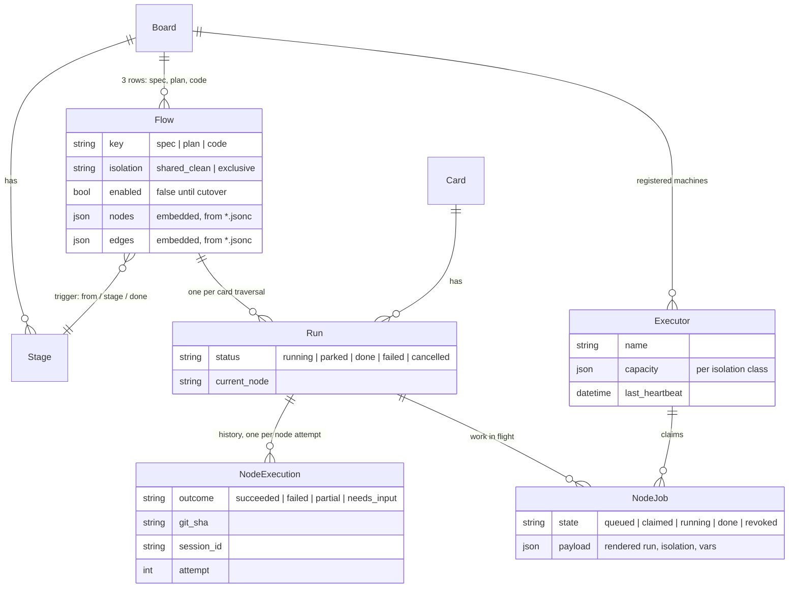

# The whole system, literally — today vs. tomorrow

Companion to [ADR 0006](../../adr/0006-workflow-orchestration.md)'s inventory: the actual
file trees, the actual file contents, and the actual database rows, so the complexity is
visible instead of asserted. **Today** = the system running right now. **Tomorrow** =
after W1–W11.

## The file trees, side by side

```text
TODAY — repo files that make the flow      TOMORROW — repo files that make the flow
─────────────────────────────────────      ─────────────────────────────────────────
bin/relay                    995 lines     bin/relay              ~600 lines (est.)
relay_config.json             42           .relay/executor.jsonc   ~10
.claude/workflows/
  execute-plan.js            485           (gone — rows in the Flow table,
.claude/commands/                           seeded from docs/designs/flows/*.jsonc,
  exec-plan.md               119            130 lines of data for all three flows)
.claude/agents/
  plan-implementer.md         57           (optional — prompts absorbed into flow
  spec-reviewer.md            67            nodes; keep any you want to override)
  quality-reviewer.md         74
  final-reviewer.md           60
  final-fixer.md              27
  smoke-tester.md            127
  acceptance-tester.md        82
  rebaser.md                  39
─────────────────────────────────────      ─────────────────────────────────────────
flow machinery:            2,174 lines     repo-side:            ~610 lines
                                           server-side data:      3 Flow rows
UNCHANGED IN BOTH WORLDS: .claude/skills/* (brainstorm, TDD, debugging, …),
.claude/commands/write-plan.md, CLAUDE.md/AGENTS.md, board stages, API key.
```

## Per AI-enabled stage: the actual configuration

| Stage | What it does | Today's configuration | Tomorrow's configuration |
| --- | --- | --- | --- |
| **Spec** | Reads the card, asks the human clarifying questions (needs-input stepper), writes the spec + acceptance criteria back to the card | [pipeline entry ↓](#spec-stage) + [`brainstorm` skill](../../../.claude/skills/brainstorm/SKILL.md) | [Flow row ↓](#spec-stage) (22 lines) |
| **Plan** | Turns the approved spec into the implementation plan stored on the card | [pipeline entry ↓](#plan-stage) + [`write-plan` command](../../../.claude/commands/write-plan.md) (135 lines) | [Flow row ↓](#plan-stage) (18 lines) |
| **Code** | Implements the plan task-by-task with TDD + two reviews each, then precommit, whole-branch review, smoke, acceptance, and PR + squash-merge | [pipeline entry ↓](#code-stage) + [`exec-plan` command](../../../.claude/commands/exec-plan.md) (119) + [`execute-plan.js`](../../../.claude/workflows/execute-plan.js) (485) + 8 agent files (533) | [Flow row ↓](#code-stage) (90 lines) |

### Spec stage

**Today** — `relay_config.json` pipeline entry, verbatim:

```json
{
  "stage": "Spec",
  "from": "Next up",
  "done": "Spec:Review",
  "pool": "clean",
  "action": [
    { "claude": "You are the AI working Relay card {ref} at the SPEC stage. Run /brainstorm {ref} to completion — headless, no human to dialogue with. It reads the card (honoring any CHANGES REQUESTED block), asks the human any clarifying questions it would normally ask first — asked in ONE {relay} needs-input {ref} --questions @<tmpfile> call carrying a JSON array of `{prompt, options, allow_text}` objects, NOT a hand-numbered question string — the drawer only renders its one-question-at-a-time stepper for the structured form, and a string falls back to a wall of text (RLY-109) — and otherwise designs the feature and writes the spec back to the card. This is authorized; proceed without asking. Then STOP. Do not touch git or other cards." }
  ]
}
```

Files it pulls in: [`.claude/skills/brainstorm/`](../../../.claude/skills/brainstorm/SKILL.md)
(the behavior — stays in both worlds, developer-owned).

**Tomorrow** — the `Flow` row (trigger stored as stage ids; names shown for readability):

```jsonc
{ "key": "spec", "board_id": 1, "enabled": false, "origin": "default", "version": 1,
  "isolation": "shared_clean",
  "trigger": { "from": "Next up", "stage": "Spec", "done": "Spec:Review" },
  "nodes": {
    "brainstorm": { "type": "agent", "run": "/brainstorm {ref}", "max_retries": 1 }
  },
  "edges": [
    { "from": "start", "to": "brainstorm" },
    { "from": "brainstorm", "to": "done", "on": "succeeded" }
  ] }
```

Note what evaporated: the 9-line prompt above shrinks to `/brainstorm {ref}` because its
other 8 lines are workarounds — "ask in ONE structured call" becomes the `needs_input`
outcome contract; "then STOP, don't touch git" becomes node boundaries the engine enforces.

### Plan stage

**Today** — `relay_config.json` entry, verbatim:

```json
{
  "stage": "Plan",
  "from": "Spec:Done",
  "done": "Plan:Done",
  "pool": "clean",
  "action": [
    { "claude": "You are the AI working Relay card {ref} at the PLAN stage. Run /write-plan {ref} to completion — it reads the approved spec from the card and writes the implementation plan back to the card. This is authorized; proceed without asking. Then STOP. Do not touch git or other cards." }
  ]
}
```

Files it pulls in: [`.claude/commands/write-plan.md`](../../../.claude/commands/write-plan.md)
(135 lines — stays, developer-owned).

**Tomorrow** — the `Flow` row:

```jsonc
{ "key": "plan", "board_id": 1, "enabled": false, "origin": "default", "version": 1,
  "isolation": "shared_clean",
  "trigger": { "from": "Spec:Done", "stage": "Plan", "done": "Plan:Done" },
  "nodes": {
    "write_plan": { "type": "agent", "run": "/write-plan {ref}", "max_retries": 1 }
  },
  "edges": [
    { "from": "start", "to": "write_plan" },
    { "from": "write_plan", "to": "done", "on": "succeeded" }
  ] }
```

### Code stage

**Today** — `relay_config.json` entry, verbatim (the orchestration itself lives elsewhere —
this entry only wraps it in shell):

```json
{
  "stage": "Code",
  "from": "Plan:Done",
  "done": "Review",
  "pool": "work",
  "action": [
    { "shell": "git fetch origin --prune && git checkout -B {branch} origin/main && rm -f tmp/exec-plan-status" },
    { "claude": "You are the AI working Relay card {ref} at the CODE stage. Run /exec-plan {ref} on the current branch to completion — it materializes the plan from the card into a transient plan.md, runs the workflow, and cleans up after itself. This is authorized — proceed without asking for confirmation. Do not push or merge yourself; the shell steps that follow push the branch, open the PR, and squash-merge it." },
    { "shell": "test \"$(cat tmp/exec-plan-status 2>/dev/null)\" = ready || { echo \"exec-plan did not reach 'ready' (review/smoke not passed) — refusing to push or merge\"; exit 1; }" },
    { "shell": "git push -u origin {branch}" },
    { "shell": "url=$(gh pr create --fill --head {branch} --base main) && {relay} branch {ref} {branch} && {relay} pr {ref} \"$url\" && echo \"PR: $url\"" },
    { "shell": "git checkout --detach && gh pr merge {branch} --squash && { git push origin --delete {branch} || true; git branch -D {branch} || true; }" }
  ]
}
```

Files it pulls in:
[`exec-plan.md`](../../../.claude/commands/exec-plan.md) (119) →
[`execute-plan.js`](../../../.claude/workflows/execute-plan.js) (485) → the agents:
[`plan-implementer`](../../../.claude/agents/plan-implementer.md) (57) ·
[`spec-reviewer`](../../../.claude/agents/spec-reviewer.md) (67) ·
[`quality-reviewer`](../../../.claude/agents/quality-reviewer.md) (74) ·
[`final-reviewer`](../../../.claude/agents/final-reviewer.md) (60) ·
[`final-fixer`](../../../.claude/agents/final-fixer.md) (27) ·
[`smoke-tester`](../../../.claude/agents/smoke-tester.md) (127) ·
[`acceptance-tester`](../../../.claude/agents/acceptance-tester.md) (82) ·
[`rebaser`](../../../.claude/agents/rebaser.md) (39).

**Tomorrow** — the `Flow` row is [`code.jsonc`](code.jsonc) **in its entirety** (90 lines:
14 nodes, 22 edges, models per node) plus the record wrapper:

```jsonc
{ "key": "code", "board_id": 1, "enabled": false, "origin": "default", "version": 1,
  "isolation": "exclusive",
  "trigger": { "from": "Plan:Done", "stage": "Code", "done": "Review" },
  "nodes": { /* the 14 nodes of code.jsonc — branch, implement, spec_review,
                quality_review, next_task, precommit, final_review, final_fix,
                smoke, smoke_fix, acceptance, acceptance_fix, post, merge */ },
  "edges": [ /* its 22 outcome-routed edges, fix loops bounded by max_loops */ ] }
```

The 8 agent files' *prompts* become the nodes' `run` strings; the files themselves become
optional repo-side overrides. The 4 trailing shell steps and the `tmp/exec-plan-status`
gate become the `merge` node + routing.

## Tomorrow's repo files, in full

**`.relay/executor.jsonc`** — the only *new* required repo file; replaces
`relay_config.json`'s `pools` block (its `pipeline` block has no successor — that's the
point):

```jsonc
{
  "worktree_root": ".claude/worktrees/exec",   // never shares the legacy watcher's dirs
  "capacity": { "shared_clean": 3, "exclusive": 1 },
  "base": "origin/main"
}
```

**`.relay/flows.json`** — optional, only if this repo overrides the shipped library (W11):

```jsonc
{
  "code": {
    "nodes": { "implement": { "run": "/exec-task {ref}" } }
  }
}
```

**The flow definitions** are not repo files at all — they're rows in the `Flow` table,
seeded from [`spec.jsonc`](spec.jsonc) (22 lines), [`plan.jsonc`](plan.jsonc) (18), and
[`code.jsonc`](code.jsonc) (90). Those three files ARE the literal contents; open them.

## The domain objects and how they stick together



## The rows, mid-flight

A concrete moment: imaginary card **RLY-150 "CSV export of the board"** is in the Code
flow; the quality review just refuted task 2's implementation and the engine looped back.
Every row involved (abridged JSON; timestamps trimmed):

```jsonc
// Flow — one of the three seeded rows (nodes/edges = code.jsonc, not repeated here)
{ "key": "code", "board_id": 1, "enabled": true, "origin": "default", "version": 1,
  "isolation": "exclusive",
  "trigger": { "from_stage_id": 41, "stage_id": 47, "done_stage_id": 51 } }

// Executor — one registered machine (was: relay_config.json's pools block)
{ "id": 3, "name": "jeremy-mbp", "board_id": 1,
  "capacity": { "shared_clean": 3, "exclusive": 1 },
  "last_heartbeat": "…T18:42:07Z", "status": "online" }

// Run — RLY-150's traversal of the code flow
{ "id": "run_7f3a", "card_id": 150, "flow_key": "code", "flow_version": 1,
  "status": "running", "current_node": "implement", "started_at": "…T17:55:02Z" }

// NodeExecution — the history so far (what W8 renders on the card)
{ "run": "run_7f3a", "node": "branch",         "attempt": 1, "outcome": "succeeded", "git_sha": "9c01d4e", "duration_s": 2 }
{ "run": "run_7f3a", "node": "implement",      "attempt": 1, "outcome": "succeeded", "git_sha": "5e2f90c", "session_id": "s_a41…", "duration_s": 861 }
{ "run": "run_7f3a", "node": "spec_review",    "attempt": 1, "outcome": "succeeded", "git_sha": "5e2f90c", "duration_s": 173 }
{ "run": "run_7f3a", "node": "quality_review", "attempt": 1, "outcome": "failed",    "git_sha": "5e2f90c", "duration_s": 244,
  "detail": "export test asserts on private struct internals; assert on the CSV bytes instead" }

// NodeJob — the work in flight right now (loop 1 of 3 back into implement,
// carrying the finding; session resumes so the implementer keeps its context)
{ "id": "nj_c88", "run": "run_7f3a", "node": "implement", "state": "claimed",
  "executor_id": 3, "claimed_at": "…T18:41:55Z",
  "payload": { "isolation": "exclusive", "resume_session": "s_a41…",
               "run": "Implement the NEXT unchecked task … If reviewer findings are attached, address them.",
               "vars": { "ref": "RLY-150", "branch": "rly-150-csv-export",
                         "findings": "export test asserts on private struct internals; …" } } }
```

That's the entire state: **3 Flow rows per board (written once), 1 Executor row per
machine, and ~1 Run + ~15 NodeExecution rows + transient NodeJobs per card worked.**

## The complexity ledger

| | Today | Tomorrow |
| --- | --- | --- |
| Repo-side flow machinery | 2,174 lines across 12 files | ~610 lines across 2 files (executor + its config) |
| Orchestration logic | `execute-plan.js` (485 lines of JS) + `bin/relay watch` dispatch (~400 of the 995) | engine code in `Relay.Flows`/`Relay.Runs` (new, W2–W4 — the cost moved here, written once for every project) |
| Flow *definitions* | implicit in JS + config + 8 agent files | 130 lines of data, 3 files, renderable as graphs |
| Per-project setup | copy 12 files, keep them in sync by hand | `relay init` + one executor config |
| State when idle | none (stateless watcher) | 3 Flow rows + 1 Executor row |
| State per worked card | scattered: card timeline + runner stdout | 1 Run + ~15 NodeExecution rows, queryable |

The honest reading: total complexity doesn't vanish — the 485 lines of `execute-plan.js`
become engine code in Elixir (W2–W4). What changes is *where it lives* (in the product,
tested, shared by every project) and *what a project carries* (2,174 lines → ~610 + data).
