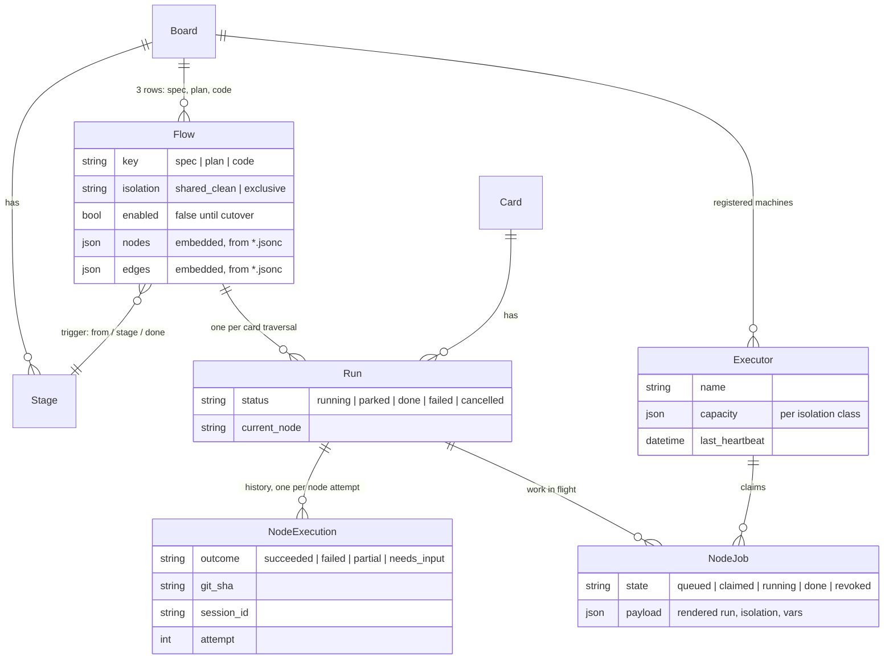

# The whole system, literally — today vs. tomorrow

Companion to [ADR 0006](../../adr/0006-workflow-orchestration.md)'s inventory: the actual
file trees, the actual file contents, and the actual database rows, so the complexity is
visible instead of asserted. **Today** = the system running right now. **Tomorrow** =
after W1–W11.

## The file trees, side by side

```text
TODAY — repo files that make the flow      TOMORROW — repo files that make the flow
─────────────────────────────────────      ─────────────────────────────────────────
bin/relay                    995 lines     bin/relay              ~600 lines (est.)
relay_config.json             42           .relay/executor.jsonc   ~10
.claude/workflows/
  execute-plan.js            485           (gone — rows in the Flow table,
.claude/commands/                           seeded from docs/designs/flows/*.jsonc,
  exec-plan.md               119            130 lines of data for all three flows)
.claude/agents/
  plan-implementer.md         57           (optional — prompts absorbed into flow
  spec-reviewer.md            67            nodes; keep any you want to override)
  quality-reviewer.md         74
  final-reviewer.md           60
  final-fixer.md              27
  smoke-tester.md            127
  acceptance-tester.md        82
  rebaser.md                  39
─────────────────────────────────────      ─────────────────────────────────────────
flow machinery:            2,174 lines     repo-side:            ~610 lines
                                           server-side data:      3 Flow rows
UNCHANGED IN BOTH WORLDS: .claude/skills/* (brainstorm, TDD, debugging, …),
.claude/commands/write-plan.md, CLAUDE.md/AGENTS.md, board stages, API key.
```

## Tomorrow's repo files, in full

**`.relay/executor.jsonc`** — the only *new* required repo file; replaces
`relay_config.json`'s `pools` block (its `pipeline` block has no successor — that's the
point):

```jsonc
{
  "worktree_root": ".claude/worktrees/exec",   // never shares the legacy watcher's dirs
  "capacity": { "shared_clean": 3, "exclusive": 1 },
  "base": "origin/main"
}
```

**`.relay/flows.json`** — optional, only if this repo overrides the shipped library (W11):

```jsonc
{
  "code": {
    "nodes": { "implement": { "run": "/exec-task {ref}" } }
  }
}
```

**The flow definitions** are not repo files at all — they're rows in the `Flow` table,
seeded from [`spec.jsonc`](spec.jsonc) (22 lines), [`plan.jsonc`](plan.jsonc) (18), and
[`code.jsonc`](code.jsonc) (90). Those three files ARE the literal contents; open them.

## The domain objects and how they stick together



## The rows, mid-flight

A concrete moment: imaginary card **RLY-150 "CSV export of the board"** is in the Code
flow; the quality review just refuted task 2's implementation and the engine looped back.
Every row involved (abridged JSON; timestamps trimmed):

```jsonc
// Flow — one of the three seeded rows (nodes/edges = code.jsonc, not repeated here)
{ "key": "code", "board_id": 1, "enabled": true, "origin": "default", "version": 1,
  "isolation": "exclusive",
  "trigger": { "from_stage_id": 41, "stage_id": 47, "done_stage_id": 51 } }

// Executor — one registered machine (was: relay_config.json's pools block)
{ "id": 3, "name": "jeremy-mbp", "board_id": 1,
  "capacity": { "shared_clean": 3, "exclusive": 1 },
  "last_heartbeat": "…T18:42:07Z", "status": "online" }

// Run — RLY-150's traversal of the code flow
{ "id": "run_7f3a", "card_id": 150, "flow_key": "code", "flow_version": 1,
  "status": "running", "current_node": "implement", "started_at": "…T17:55:02Z" }

// NodeExecution — the history so far (what W8 renders on the card)
{ "run": "run_7f3a", "node": "branch",         "attempt": 1, "outcome": "succeeded", "git_sha": "9c01d4e", "duration_s": 2 }
{ "run": "run_7f3a", "node": "implement",      "attempt": 1, "outcome": "succeeded", "git_sha": "5e2f90c", "session_id": "s_a41…", "duration_s": 861 }
{ "run": "run_7f3a", "node": "spec_review",    "attempt": 1, "outcome": "succeeded", "git_sha": "5e2f90c", "duration_s": 173 }
{ "run": "run_7f3a", "node": "quality_review", "attempt": 1, "outcome": "failed",    "git_sha": "5e2f90c", "duration_s": 244,
  "detail": "export test asserts on private struct internals; assert on the CSV bytes instead" }

// NodeJob — the work in flight right now (loop 1 of 3 back into implement,
// carrying the finding; session resumes so the implementer keeps its context)
{ "id": "nj_c88", "run": "run_7f3a", "node": "implement", "state": "claimed",
  "executor_id": 3, "claimed_at": "…T18:41:55Z",
  "payload": { "isolation": "exclusive", "resume_session": "s_a41…",
               "run": "Implement the NEXT unchecked task … If reviewer findings are attached, address them.",
               "vars": { "ref": "RLY-150", "branch": "rly-150-csv-export",
                         "findings": "export test asserts on private struct internals; …" } } }
```

That's the entire state: **3 Flow rows per board (written once), 1 Executor row per
machine, and ~1 Run + ~15 NodeExecution rows + transient NodeJobs per card worked.**

## The complexity ledger

| | Today | Tomorrow |
| --- | --- | --- |
| Repo-side flow machinery | 2,174 lines across 12 files | ~610 lines across 2 files (executor + its config) |
| Orchestration logic | `execute-plan.js` (485 lines of JS) + `bin/relay watch` dispatch (~400 of the 995) | engine code in `Relay.Flows`/`Relay.Runs` (new, W2–W4 — the cost moved here, written once for every project) |
| Flow *definitions* | implicit in JS + config + 8 agent files | 130 lines of data, 3 files, renderable as graphs |
| Per-project setup | copy 12 files, keep them in sync by hand | `relay init` + one executor config |
| State when idle | none (stateless watcher) | 3 Flow rows + 1 Executor row |
| State per worked card | scattered: card timeline + runner stdout | 1 Run + ~15 NodeExecution rows, queryable |

The honest reading: total complexity doesn't vanish — the 485 lines of `execute-plan.js`
become engine code in Elixir (W2–W4). What changes is *where it lives* (in the product,
tested, shared by every project) and *what a project carries* (2,174 lines → ~610 + data).
